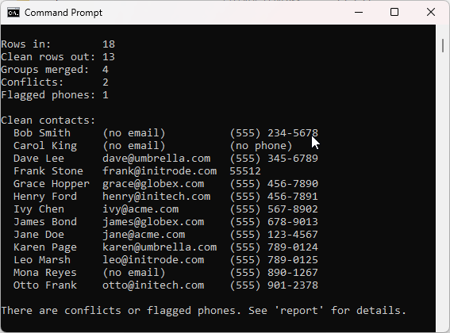
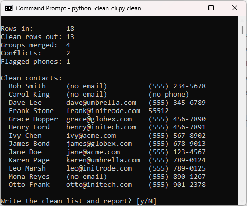
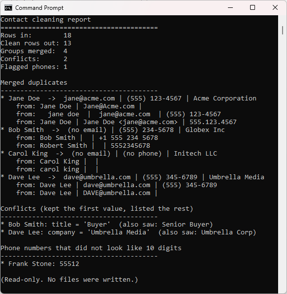
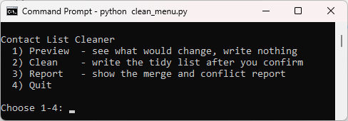
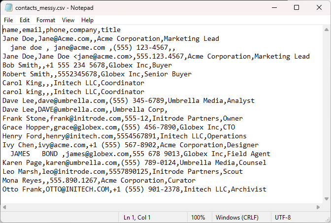

# Contact List Cleaner

A small command line tool that takes a messy contact list and turns it into one
clean, de-duplicated CSV. Safely.

If you have ever exported contacts from a few different places and pasted them
together, you know the problem: the same person shows up three times, names are
typed `JOHN DOE` in one row and `john doe` in the next, phone numbers come in
every format a human can invent, and one email is written `Jane@Acme.com` while
another hides inside `Jane Doe <jane@acme.com>`. This tool reads each row, tidies
every field, works out which rows are really the same person, and merges them
into a single clean record:

```
Jane Doe, jane@acme.com, (555) 123-4567, Acme Corporation, Marketing Lead
```

It never changes your original file. It writes a fresh clean copy plus a plain
report of everything it merged and anything that looked contradictory, so you can
check its judgement before you trust it.

> This is another small, beginner-friendly Python project. It uses only the Python
> standard library, so there is nothing to install and no account to sign up for.
> All the sample data in this repo is made up, there is no real contact data
> anywhere.

## What it does

- Cleans every field:
  - **name**: collapses extra spaces and fixes casing, so `  JOHN   DOE ` becomes
    `John Doe`.
  - **email**: lowercases and trims it, and pulls the address out of
    `Jane Doe <jane@acme.com>`.
  - **phone**: strips it to digits, drops a leading US `1`, and reformats the ten
    digits as `(555) 123-4567`. Anything that is not ten digits is kept but
    flagged, so a typo cannot masquerade as a real number.
- Finds duplicates with a reliability ladder, most trustworthy first:
  1. same **email** means same person (the strongest signal), then
  2. same **phone** when an email is missing, then
  3. same **name** as a last resort.
- Merges each set of duplicates into one record, filling blank fields from the
  other rows. When two rows disagree on a real fact (two different companies, for
  example), it keeps the first and records the disagreement instead of guessing.
- Writes a clean CSV sorted by name, plus a report of every merge and conflict.
- Leaves your input file completely untouched.

## Requirements

- Python 3.8 or newer. Check with `python --version`.
- Nothing else.

## Getting started

From inside the project folder:

```bash
# 1. Create the sample data (a deliberately messy contact list)
python generate_samples.py

# 2. See what the tool WOULD do. This writes nothing.
python clean_cli.py preview

# 3. Do it for real. It shows the preview again, then asks you to confirm.
python clean_cli.py clean

# 4. Want just the merge and conflict report? 
python clean_cli.py report
```

The clean list is written to `contacts_clean.csv` and the report to
`merge_report.txt`, both next to the script. Your input file in `samples/` is
never modified, so you can run this as many times as you like.

## Two ways to use it

This repo ships with two front ends that do the same thing. Pick whichever you
like; they share all their logic.

### 1. Command line (`clean_cli.py`)

```bash
python clean_cli.py preview     # show what would change, write nothing
python clean_cli.py clean       # write the clean list after you confirm
python clean_cli.py report      # show the merge and conflict report
```

`preview` shows a summary and the tidied list without writing anything:



Running `clean` shows the same preview, then waits for you to confirm before it
writes anything:



The `report` command shows just the merges and the disagreements it could not
settle on its own, so you can check its judgement:



Useful flags:

```bash
# Work on your own file instead of the sample
python clean_cli.py preview --input "C:\path\to\your\contacts.csv"

# Choose where the outputs go
python clean_cli.py clean --out clean.csv --report report.txt

# Allow overwriting an existing output file
python clean_cli.py clean --force
```

Your input CSV needs these five columns: `name, email, phone, company, title`.
If your export uses different headings, rename them to these in your spreadsheet
first.

### 2. Menu (`clean_menu.py`)

If you would rather not remember commands, run the menu and type a number:

```bash
python clean_menu.py
```

```
1) Preview  - see what would change, write nothing
2) Clean    - write the tidy list after you confirm
3) Report   - show the merge and conflict report
4) Quit
```



## Example

Here is the kind of list this is meant for, the same people entered several ways:



The same rows written out:

```
Jane Doe,    Jane@Acme.com,             ,                Acme Corporation, Marketing Lead
  jane doe , jane@acme.com,             (555) 123-4567,                  ,
Bob Smith,   ,                          +1 555 234 5678, Globex Inc,       Buyer
Robert Smith,,                          5552345678,      Globex Inc,       Senior Buyer
Dave Lee,    dave@umbrella.com,         (555) 345-6789,  Umbrella Media,   Analyst
Dave Lee,    DAVE@umbrella.com,         ,                Umbrella Corp,
```

becomes this:

```
Bob Smith,  ,                  (555) 234-5678, Globex Inc,       Buyer
Dave Lee,   dave@umbrella.com, (555) 345-6789, Umbrella Media,   Analyst
Jane Doe,   jane@acme.com,     (555) 123-4567, Acme Corporation, Marketing Lead
```

The two Janes collapse into one (the phone from the second row fills the blank in
the first). Bob and Robert merge on their shared phone number, and the clash
between `Buyer` and `Senior Buyer` is written to the report. The two Daves merge
on their email, and the `Umbrella Media` versus `Umbrella Corp` disagreement is
flagged for you to settle rather than silently picked.

## How it stays safe

- **Your input is read-only.** The tool never writes back to the file you give it.
- **Preview first.** Both `preview` and `clean` show the full result before
  anything is saved.
- **Confirm before writing.** `clean` will not write until you type `y`.
- **No silent overwrites.** It refuses to overwrite an existing output file unless
  you pass `--force`.
- **No silent guessing.** When two rows disagree on a fact, the conflict goes in
  the report instead of being quietly resolved.

## Project layout

```
contact-list-cleaner/
  README.md             This file
  LICENSE               MIT license
  core.py               All the logic: clean, match, merge, report
  clean_cli.py          Command line front end
  clean_menu.py         Menu front end
  generate_samples.py   Creates the sample data
  samples/
    contacts_messy.csv  A messy sample list (sample data)
  images/               Screenshots used in this README
  tests/
    test_core.py        Tests for the cleaning and merging functions
```

`core.py` holds the real work, and both front ends call into it. That is a common
and useful pattern: keep your logic in one place and let different interfaces sit
on top of it.

## Running the tests

```bash
python -m unittest discover tests
```

The tests check the trickiest parts: cleaning each field, choosing the right
match key, and merging duplicates without losing a conflict. If you change those
rules later, the tests tell you right away whether you broke anything.

## Ideas for extending it

- Accept your export's own column names with a small mapping, instead of renaming
  columns by hand first.
- Treat names more cleverly, so `Bob` and `Robert` can be recognised as the same
  person.
- Add a `--strict` mode that refuses to merge when any conflict is present.
- Support international phone numbers instead of assuming a 10-digit US format.
- Add a column to the report counting how many sources each merged contact came
  from.
