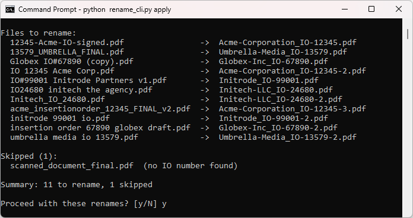
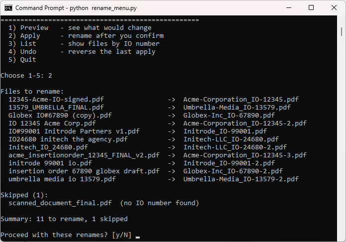
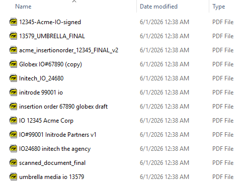

# Insertion Order Renamer

A small command line tool that cleans up messy insertion order (IO) file names
and turns them into one consistent, tidy convention. Safely.

If you receive insertion orders from media buyers (agencies and advertisers),
you know the problem: every sender names their files differently, so your folder
fills up with things like `IO 12345 Acme Corp.pdf`, `acme_insertionorder_12345_FINAL_v2.pdf`,
and `12345-Acme-IO-signed.pdf`. This tool reads each name, figures out the IO
number and the sender, and renames the file to:

```
Acme-Corporation_IO-12345.pdf
```

It never renames anything without showing you a full preview first, and every
run can be undone with one command.

> This is my first beginner Python micro project. It uses only the Python standard library,
> so there is nothing to install and no account to sign up for. All the sample
> files in this repo are made up, there is no real client data anywhere.

## What it does

- Reads the IO number out of a messy file name, even when it is written as
  `IO 12345`, `IO#12345`, `IO_12345`, or `12345-...-IO`.
- Finds the sender's clean, official name two ways:
  1. a lookup table you control (`companies.csv`), tried first because it is the
     most reliable, then
  2. a best guess from the file name itself, used when the IO number is not in
     the table.
- Builds a consistent name: `Company_IO-#####.pdf`. The IO number is padded with
  leading zeros so the files also sort in true number order.
- Shows a preview of every change and only renames after you type `y`.
- Skips and reports anything it cannot confidently parse, instead of guessing.
- Writes an undo log so a whole run can be reversed instantly.

## Requirements

- Python 3.8 or newer. Check with `python --version`.
- Nothing else.

## Getting started

From inside the project folder:

```bash
# 1. Create the sample data (a lookup table and a folder of messy files)
python generate_samples.py

# 2. See what the tool WOULD do. This changes nothing.
python rename_cli.py preview

# 3. Do it for real. It shows the preview again, then asks you to confirm.
python rename_cli.py apply

# 4. Changed your mind? Undo the last run.
python rename_cli.py undo
```

The tool works on a safe copy of the samples (a folder called `samples_work`)
that it creates for you, so you can run it over and over without using up the
originals in `samples/`.

## Two ways to use it

This repo ships with two front ends that do the same thing. Pick whichever you
like; they share all their logic.

### 1. Command line (`rename_cli.py`)

```bash
python rename_cli.py preview     # show what would change
python rename_cli.py apply       # rename after you confirm
python rename_cli.py list        # list files in IO-number order
python rename_cli.py undo        # reverse the last apply
```

Running `apply` shows the full preview, then waits for you to confirm before it touches anything:



Useful flags:

```bash
# Work on your own folder instead of the samples
python rename_cli.py preview --folder "C:\path\to\your\IOs"

# Use your own lookup table
python rename_cli.py apply --lookup "C:\path\to\my_companies.csv"
```

### 2. Menu (`rename_menu.py`)

If you would rather not remember commands, run the menu and type a number:

```bash
python rename_menu.py
```

```
1) Preview   - see what would change
2) Apply     - rename after you confirm
3) List      - show files by IO number
4) Undo      - reverse the last apply
5) Quit
```

Pick option 2 and it previews the changes, then asks before renaming:



## Example

Here is the kind of folder this is meant for, full of insertion orders named every which way:



The same names written out:

```
IO 12345 Acme Corp.pdf
acme_insertionorder_12345_FINAL_v2.pdf
Globex IO#67890 (copy).pdf
Initech_IO_24680.pdf
scanned_document_final.pdf
```

becomes this:

```
Acme-Corporation_IO-12345.pdf
Acme-Corporation_IO-12345-2.pdf
Globex-Inc_IO-67890.pdf
Initech-LLC_IO-24680.pdf
scanned_document_final.pdf        (skipped: no IO number found)
```

When two files would end up with the same name, the tool adds `-2`, `-3`, and so
on, so nothing is ever overwritten. Files it cannot parse are left untouched and
listed for you to handle by hand.

## Using it on your own files

1. Open `companies.csv` and list the IO numbers and clean company names you know.
   The format is two columns:

   ```csv
   io_number,company
   12345,Acme Corporation
   67890,Globex Inc
   ```

2. Run a preview against your folder before applying:

   ```bash
   python rename_cli.py preview --folder "C:\path\to\your\IOs"
   ```

3. When the preview looks right, run `apply`. If anything goes wrong, run `undo`.

## How it stays safe

- **Preview first.** Every command shows the full old-to-new list before touching
  anything.
- **Confirm before applying.** `apply` will not rename until you type `y`.
- **No overwrites.** Name collisions get a numeric suffix.
- **One-command undo.** Each apply writes `undo_log.json`; `undo` reads it and puts
  every name back.
- **Works on a copy.** The samples are renamed inside `samples_work`, leaving the
  originals in `samples/` intact.

## Project layout

```
insertion-order-renamer/
  README.md            This file
  LICENSE              MIT license
  core.py              All the logic: parsing, lookup, renaming, undo
  rename_cli.py        Command line front end
  rename_menu.py       Menu front end
  generate_samples.py  Creates the sample data
  companies.csv        IO number -> company lookup table (sample data)
  samples/             Messy sample files (sample data)
  tests/
    test_core.py       Tests for the parsing functions
```

`core.py` holds the real work, and both front ends call into it. That is a common
and useful pattern: keep your logic in one place and let different interfaces sit
on top of it.

## Running the tests

```bash
python -m unittest discover tests
```

The tests check the trickiest part, pulling the IO number and company out of
messy names. If you change those rules later, the tests tell you right away
whether you broke anything.

## Ideas for extending it

- Add a `--folder` watch mode that renames new files as they arrive.
- Support more file types beyond PDF (the code already keeps the extension).
- Add a column to `companies.csv` and include the campaign name in the output.
- Switch the name format to put the IO number first by editing one line
  (`NAME_FORMAT` at the top of `core.py`).
