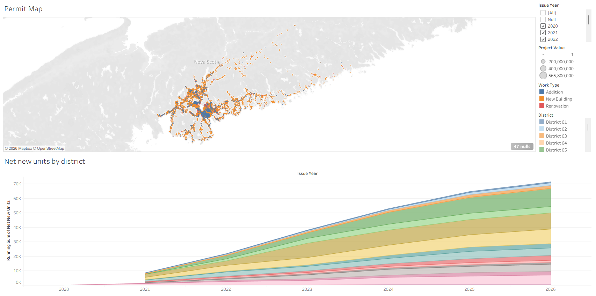
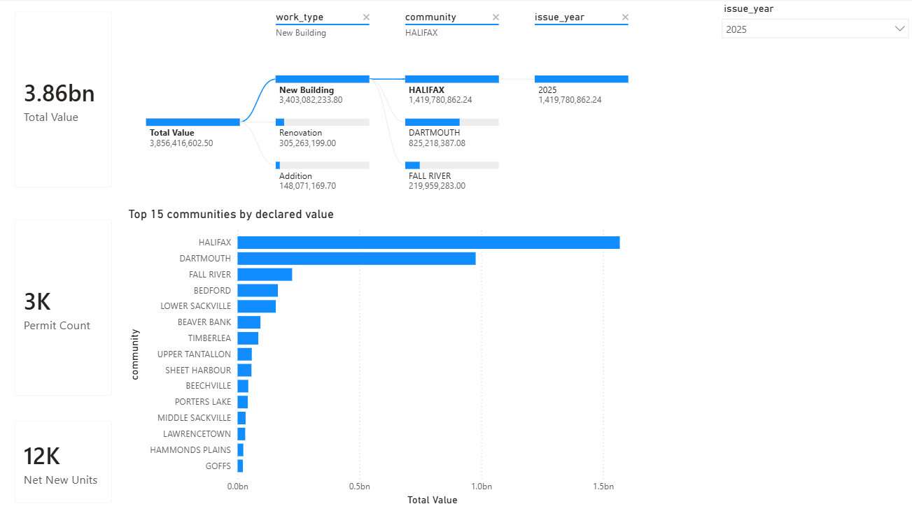
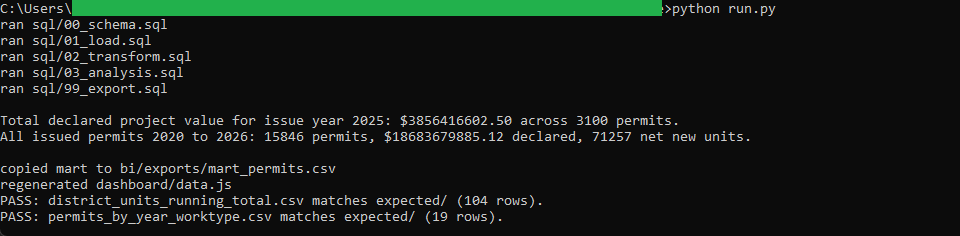
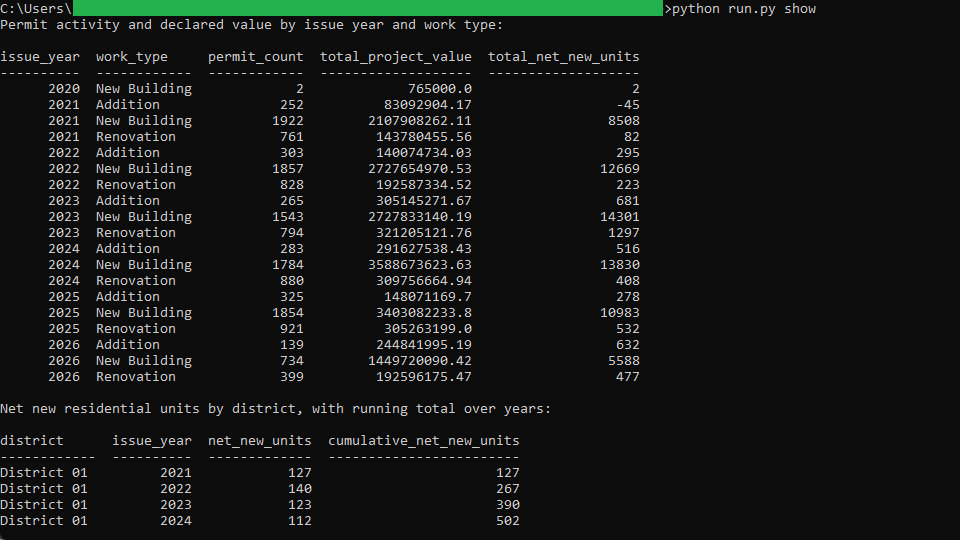
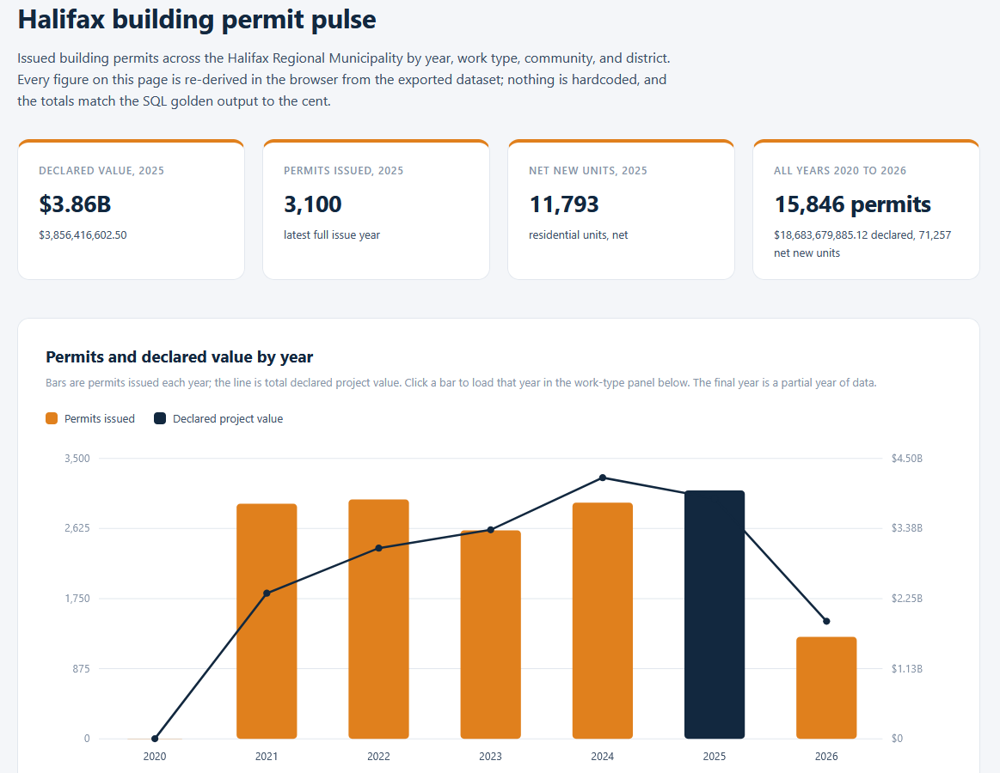

# 01: Building permit pulse

Tracks Halifax building permit activity and declared construction value by year,
work type, community, and council district, and follows where net new residential
units are landing. In 2025, the latest full issue year, Halifax issued 3,100
building permits carrying $3,856,416,602.50 in declared project value and 11,793
net new residential units. Across all issued permits from 2020 to 2026 that runs
to 15,846 permits and $18,683,679,885.12 declared.

All of the analysis lives in DuckDB SQL. Three dashboards read the one frozen CSV
the SQL exports: a plain browser page, a published **Tableau** viz, and a
committed **Power BI** report. None of them recompute anything, so the same
figure reads identically to the cent in all three.

## The data

Two layers from the Halifax Data Mapping and Analytics Hub, joined on permit
number:

- **PPL&C Building Permits** (`HRM::pplc-building-permits`), 18,316 rows, the
  authoritative attribute set (issuance date, declared value, work type, community,
  district, net new units). It carries no geometry.
- **PPL&C Building Permits Geolocated** (`HRM::pplc-building-permits-geolocated`),
  15,949 point features, the source of latitude and longitude only.

The committed snapshot `data/raw/hrm_pplc-building-permits_2026-07-09.csv` is the
base attributes LEFT JOINed to the points, one row per permit with coordinates
attached where they exist. Endpoints, item ids, licence, pull date, and the join
key are in SOURCE.md.

Contains information licenced under the Open Government Licence, Halifax.

## What it computes

Every step is deterministic and rule-based. All logic lives in `sql/`, named by
step; `run.py` holds none of it. The pipeline types the raw snapshot, derives the
issue year and month from the issuance date against a pinned pull-date constant,
and builds one clean row per permit. From there it rolls up two goldens: permit
count, declared value to the cent, and net new units by issue year and work type;
and a per-district running total of net new units across the years. It exports a
frozen per-permit mart for the three dashboards and prints a headline naming the
latest full year's declared value. Every result query ends in an `ORDER BY`,
which is what makes the output reproducible. spec.md walks each step;
data_dictionary.md defines every column.

The browser dashboard in `dashboard/` opens with a double click, no server and no
build step. It re-derives its headline figures in JavaScript from the exported
data, and they must equal the SQL golden exactly.

The same mart drives both BI builds in `bi/`. The **Tableau** dashboard pairs a
permit point map, sized by declared value and coloured by work type, with the
per-district running total of net new units. It is
[published on Tableau Public](https://public.tableau.com/views/HalifaxBuildingPermitPulse/Permits),
and the workbook is committed as diffable XML at
`bi/tableau/building_permit_pulse.twb`.

The **Power BI** report, committed as a `.pbip` project in `bi/powerbi/`, breaks
total declared value down with a decomposition tree (work type, then community,
then year), ranks the top communities with a RANKX measure, and carries
year-over-year value measures. Total declared project value for issue year 2025
reads $3,856,416,602.50 in the SQL golden, on the Tableau map, and on the Power
BI Total Value card.

## Testing

DuckDB is the only dependency:

    pip install duckdb

From this folder:

    python run.py            # runs the SQL end to end, then verifies
    python run.py verify     # re-runs the golden diff only
    python run.py show       # prints the results as aligned tables

`python run.py` writes the result files to `out/`, checks the two goldens against
`expected/` row for row, prints PASS when they match, then copies the mart to
`bi/exports/` and regenerates `dashboard/data.js`. `python run.py show` prints the
year-and-work-type rollup and the per-district running total as aligned tables. It
only prints columns the SQL already produced.

## License

MIT. Copyright (c) 2026 Kevin Yu (https://github.com/exekyute).
