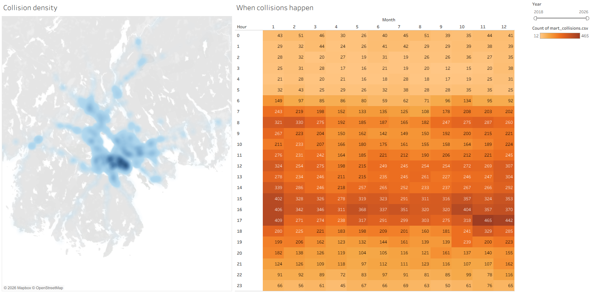
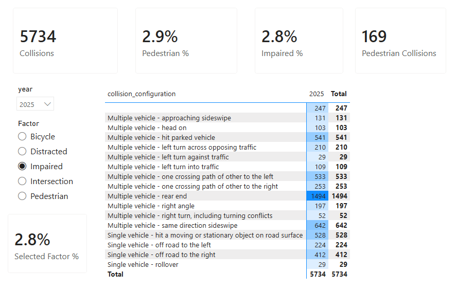
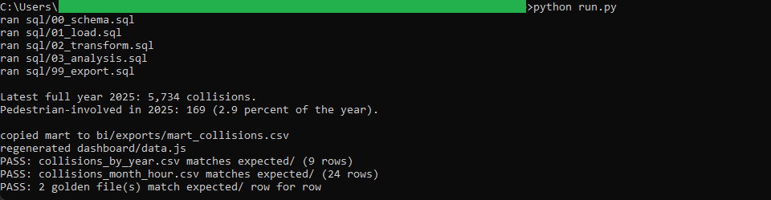
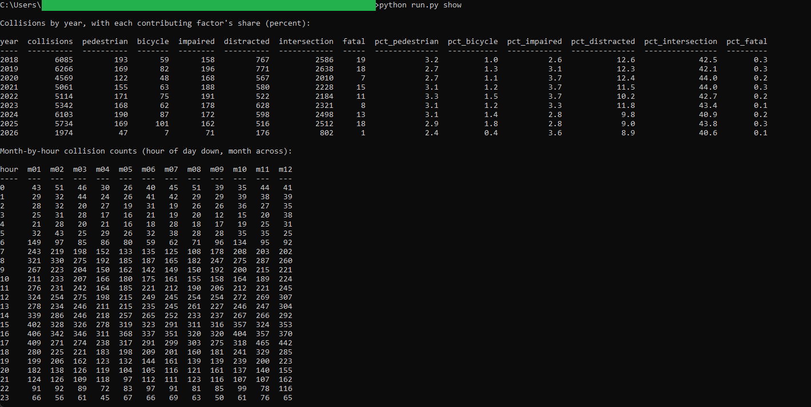
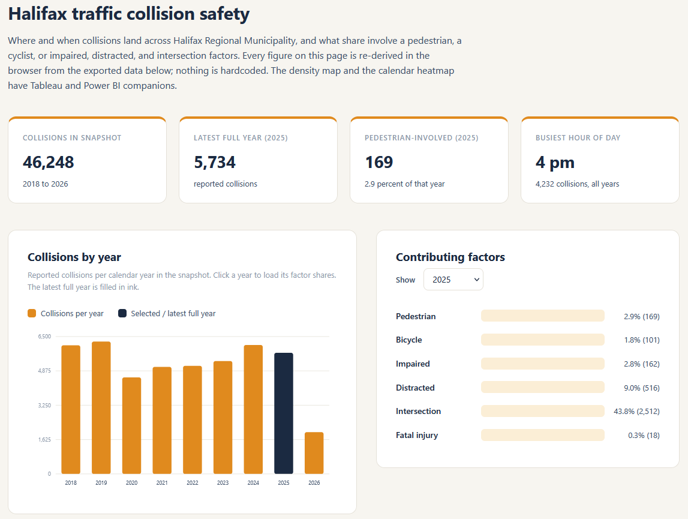

# 02: Traffic collision safety map

Maps where and when traffic collisions land across Halifax Regional Municipality,
and what share involve a pedestrian, a cyclist, or impaired, distracted, and
intersection factors. The snapshot holds 46,285 reported collisions from 2018 to
2026, 46,248 of them with a usable timestamp and coordinates. In 2025, the latest
full year, Halifax recorded 5,734 collisions, 169 of them pedestrian-involved (2.9
percent), and intersections figured in 43.8 percent of them. Collisions peak in the
afternoon: 4 pm is the busiest hour of the day, with 4,232 across the whole window.

All of the analysis lives in DuckDB SQL. Three faces read the one frozen CSV the SQL
exports: a plain browser page, a published **Tableau** viz, and a committed **Power
BI** report. None of them recompute anything, so the same figure reads identically
in all three.

## The data

Halifax Data Mapping and Analytics Hub: **Traffic Collisions**
(`HRM::traffic-collisions`), 46,285 reported collisions carrying a location, a local
timestamp, and a set of contributing-factor flags. Endpoints, item id, licence, and
pull date are in SOURCE.md.

Contains information licenced under the Open Government Licence, Halifax.

## What it computes

Every step is deterministic and rule-based. All logic lives in `sql/`, named by
step; `run.py` holds none of it. The pipeline reads the committed snapshot, parses
each collision's local Halifax timestamp, and derives the year, month, hour of day,
and weekday. Each Y/N or Yes factor field becomes a clean 0/1 integer. From that one
clean row per collision it rolls up two goldens: collision counts with each factor's
share by year, and a month-by-hour count matrix that reads as a calendar heatmap. It
exports a frozen per-collision mart for the three faces and prints a headline naming
the latest full year's collision and pedestrian counts. Every result query ends in
an `ORDER BY`, which is what makes the output reproducible. spec.md walks each step;
data_dictionary.md defines every column.

The browser dashboard in `dashboard/` opens with a double click, no server and no
build step. It re-derives its headline figures in JavaScript from the exported data,
and they must equal the SQL golden exactly.

The same mart drives both BI builds in `bi/`. The **Tableau** dashboard pairs a
point density map of every collision with a month-by-hour calendar heatmap, under
one shared year filter. It is
[published on Tableau Public](https://public.tableau.com/views/HRMTrafficCollisionSafety/Collisionsafety),
and the workbook is committed as diffable XML at
`bi/tableau/collision_safety_map.twb`.

The **Power BI** report, committed as a `.pbip` project in `bi/powerbi/`, turns the
factor flags into share measures, drives a what-if factor slicer off a disconnected
table, and carries a year-over-year collision measure and a configuration-by-year
matrix. With the year slicer on 2025, pedestrian-involved collisions read 169 in the
SQL golden, on the Tableau count, and on the Power BI card, against 5,734 collisions
for the year.

## Testing

DuckDB is the only dependency:

    pip install duckdb

From this folder:

    python run.py            # runs the SQL end to end, then verifies
    python run.py verify     # re-runs the golden diff only
    python run.py show       # prints the results as aligned tables

`python run.py` writes the result files to `out/`, checks the two goldens against
`expected/` row for row, prints PASS when they match, then copies the mart to
`bi/exports/` and regenerates `dashboard/data.js`. `python run.py show` prints the
per-year rollup and the month-by-hour matrix as aligned tables. It only prints
columns the SQL already produced.

## License

MIT. Copyright (c) 2026 Kevin Yu (https://github.com/exekyute).
