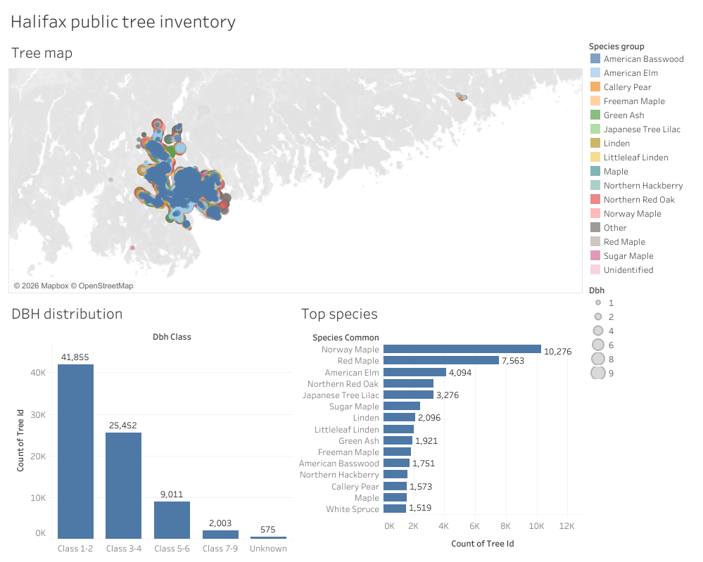
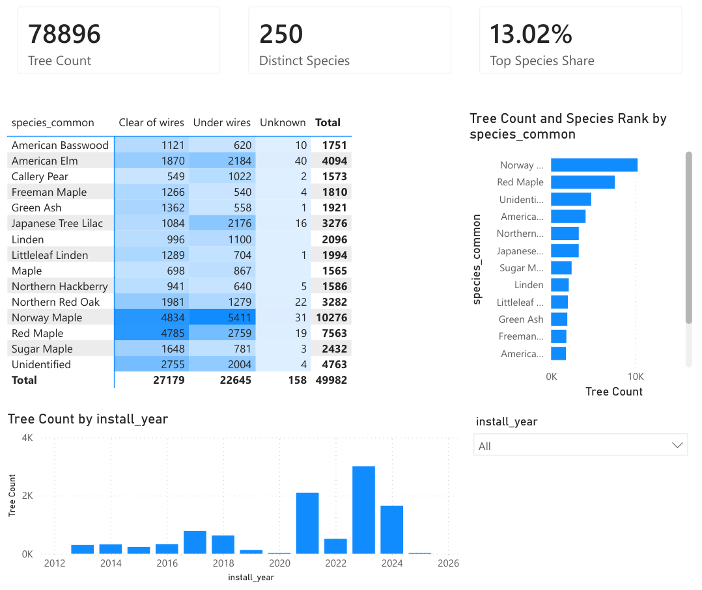
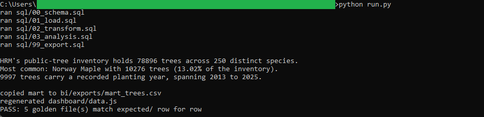
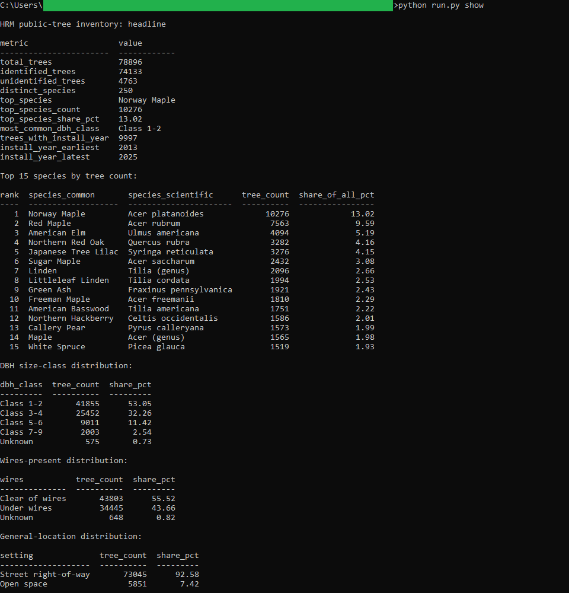
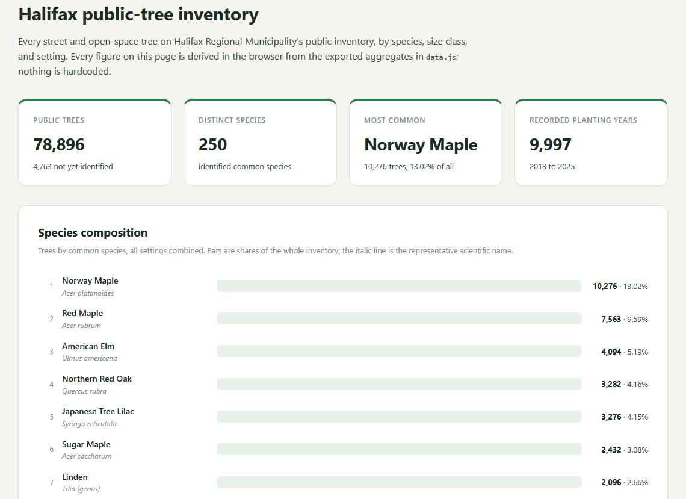

# 03: Public tree inventory

Halifax Regional Municipality keeps 78,896 trees on its public inventory, across 250
distinct species. Norway Maple leads at 10,276 trees, 13.02% of the whole, ahead of Red
Maple (7,563) and American Elm (4,094). The canopy runs young: the smallest size class
holds 41,855 trees (53.05%), and 92.58% of the trees stand in the street right-of-way
rather than open space. 9,997 carry a recorded planting year, all between 2013 and 2025.

All of the analysis lives in DuckDB SQL. Three views read the one frozen CSV the SQL
exports: a plain browser page, a published **Tableau** dashboard, and a committed
**Power BI** report. None of them recompute anything, so the same figures read
identically across all three: 78,896 trees, 250 species, Norway Maple at 13.02%.

## The data

**Public Trees** from the Halifax Data Mapping and Analytics Hub (`HRM::public-trees`,
item `33a4e9b6c7e9439abcd2b20ac50c5a4d`), one point per tree, pulled with WGS84
coordinates. Endpoints, item id, licence, the exact pull query, and the field notes are
in SOURCE.md.

The published layer records no tree-condition rating (that field is empty for every row),
and it stores DBH as an integer size-class code 1 to 9 rather than a centimetre
measurement. The build works with what the data carries: species, size class, general
location (street right-of-way versus open space), and whether the tree stands under
overhead wires. SOURCE.md and spec.md set out those choices.

Contains information licenced under the Open Government Licence, Halifax.

## What it computes

Every step is deterministic and rule-based. All logic lives in `sql/`, named by step;
`run.py` holds none of it. The pipeline types the raw snapshot, normalizes species names
and size classes, and builds one clean row per tree. From there it rolls up the golden
results: a species ranking with each species' share of the inventory, a DBH size-class
distribution, a wires-present distribution, a general-location distribution, and a
summary carrying the distinct-species count. It exports one frozen per-tree mart for the
dashboards. Every result query ends in an `ORDER BY`, which is what makes the output
reproducible. spec.md walks each step; data_dictionary.md defines every column.

The browser dashboard in `dashboard/` opens with a double click, no server and no build
step. It re-derives its headline figures in JavaScript from the exported aggregates, and
they equal the SQL golden exactly.

The same mart drives both BI builds in `bi/`. The **Tableau** dashboard pairs a species
point map, coloured by the leading species and sized by DBH class, with a DBH histogram
and a ranked top-species bar. It is
[published on Tableau Public](https://public.tableau.com/views/HRMPublicTreeInventory/Urbanforest),
and the workbook is committed as diffable XML at `bi/tableau/public_tree_inventory.twb`.

The **Power BI** report, committed as a `.pbip` project in `bi/powerbi/`, carries the
diversity measures in DAX (tree count, distinct species, top-species share), a
species-by-wires matrix with conditional formatting, a planting-year column chart, and a
ranked species bar. The public-tree inventory holds 78,896 trees across 250 distinct
species in the SQL golden, on the Tableau map, and on the Power BI cards.

## Testing

DuckDB is the only dependency:

    pip install duckdb

From this folder:

    python run.py            # runs the SQL end to end, then verifies
    python run.py verify     # re-runs the golden diff only
    python run.py show       # prints the results as aligned tables

`python run.py` writes the result files to `out/`, checks them against `expected/` row
for row, prints PASS when they match, then copies the mart to `bi/exports/` and
regenerates `dashboard/data.js`. `python run.py show` prints the species ranking and the
distributions as aligned tables. It only prints columns the SQL already produced.

## License

MIT. Copyright (c) 2026 Kevin Yu (https://github.com/exekyute).
