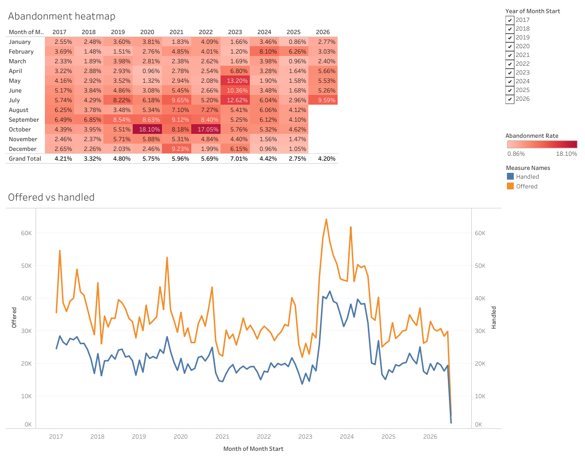
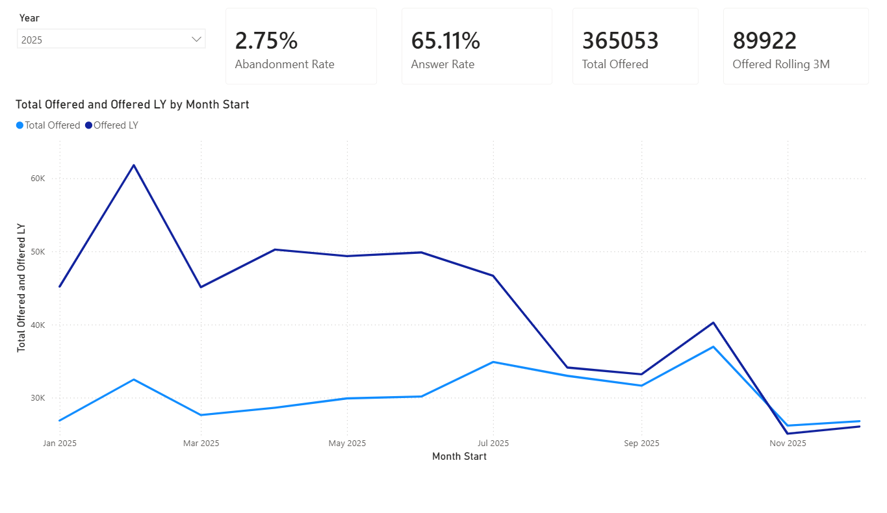
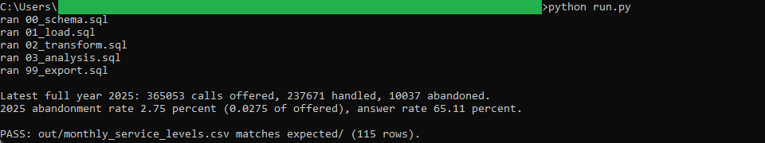
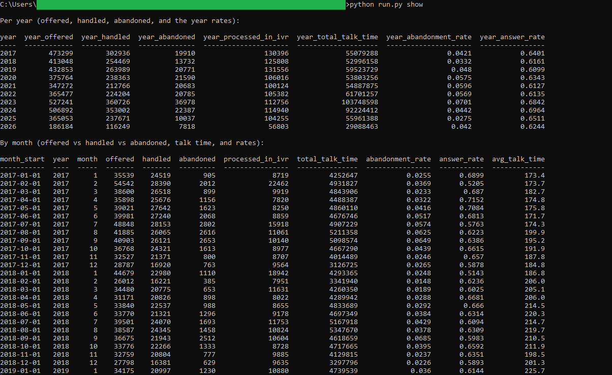

# 04: 311 call service levels

Rolls Halifax's 311 call-centre volumes from half-hour intervals up to months and
years, and tracks how offered, handled, and abandoned calls move over time. In
2025, the latest full year, the line was offered 365,053 calls, handled 237,671,
and abandoned 10,037, a 2.75 percent abandonment rate and a 65.11 percent answer
rate. Across the nine full years from 2017 to 2025 the annual abandonment rate ran
from 2.75 percent in 2025 up to 7.01 percent in 2023.

All of the analysis lives in DuckDB SQL. Two dashboards read the one frozen CSV
the SQL exports: a published **Tableau** dashboard and a committed **Power BI**
report. Neither recomputes anything, so the same figure reads identically in both.

## The data

Halifax Data Mapping and Analytics Hub: **311 Call Volumes**
(`HRM::311-call-volumes`), 145,363 rows, one per half-hour interval per date,
spanning 2017-01-01 through 2026-07-04. Each row carries the calls offered,
handled, abandoned, and processed in the automated menu for that interval, plus
total talk time in seconds.

The set carries no geography, which is what a call-centre feed looks like. Both
dashboards are therefore time-shaped, and each one flexes a different muscle: a
year-by-month calendar heatmap and a ratio calculation in Tableau, a date table
and time-intelligence measures in Power BI.

Endpoint, item id, licence, and pull date are in SOURCE.md.

Contains information licenced under the Open Government Licence, Halifax.

## What it computes

Every step is deterministic and rule-based. All logic lives in `sql/`, named by
step; `run.py` holds none of it. The Hub's CSV export renders `CALL_DATE` as a
formatted local datetime string rather than an epoch value, so the pipeline parses
that string and keeps the calendar date. It sums the five counts to one row per
month, derives the per-month abandonment rate, answer rate, and average talk time,
then rolls the months up to years and attaches each month to its year's totals.
That gives 115 months, 2017-01 through 2026-07. spec.md walks each step;
data_dictionary.md defines every column.

Every rate is a ratio of summed counts rather than an average of monthly rates,
and the difference is not cosmetic. Averaging 2025's twelve monthly abandonment
rates returns 2.61 percent, because it weights a quiet 26,176-call November the
same as a busy 36,966-call October. Dividing total abandoned by total offered
returns 2.75 percent, which is the rate the year actually ran at. Both dashboards
derive their rates the same way, from the same counts.

The **Tableau** dashboard pairs a year-by-month abandonment heatmap with an
offered-against-handled dual axis, under one shared year filter. Column grand
totals on the heatmap give each year its own rate. It is
[published on Tableau Public](https://public.tableau.com/views/Halifax311CallServiceLevels/311servicelevels),
and the workbook is committed as diffable XML at
`bi/tableau/311_call_service_levels.twb`.

The **Power BI** report, committed as a `.pbip` project in `bi/powerbi/`, puts the
same mart behind a marked date table and reads it with time-intelligence measures:
`SAMEPERIODLASTYEAR` for the prior-year line and `DATESINPERIOD` for a rolling
three-month total. The 2025 abandonment rate reads 2.75 percent in the SQL golden,
on the Tableau heatmap's 2025 column total, and on the Power BI Abandonment Rate
card. All three divide the same 10,037 abandoned calls by the same 365,053 offered.

## Testing

DuckDB is the only dependency:

    pip install duckdb

From this folder:

    python run.py            # runs the SQL end to end, then verifies
    python run.py verify     # re-runs the golden diff only
    python run.py show       # prints the per-year summary and the monthly series

`python run.py` writes out/monthly_service_levels.csv, checks it against
expected/monthly_service_levels.csv, and prints PASS when they match row for row,
and writes the frozen mart both dashboards read to `bi/exports/`. `python run.py
show` prints a per-year summary followed by the month-by-month detail. It only
prints columns the SQL already produced.

## License

MIT. Copyright (c) 2026 Kevin Yu (https://github.com/exekyute).
