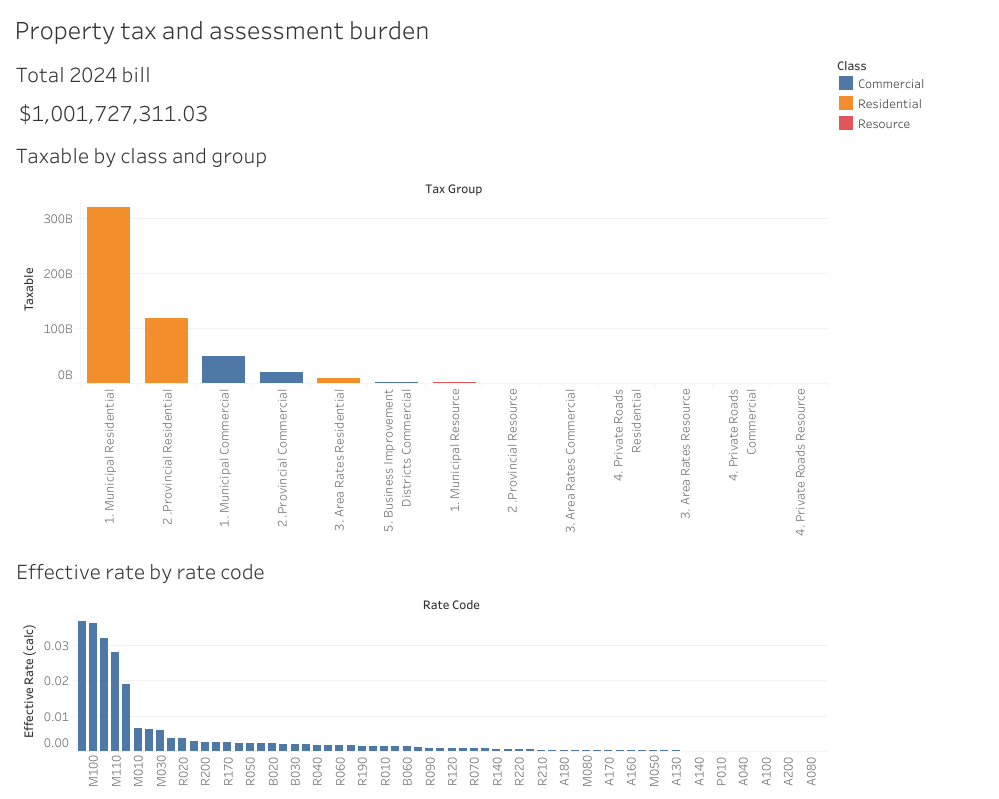
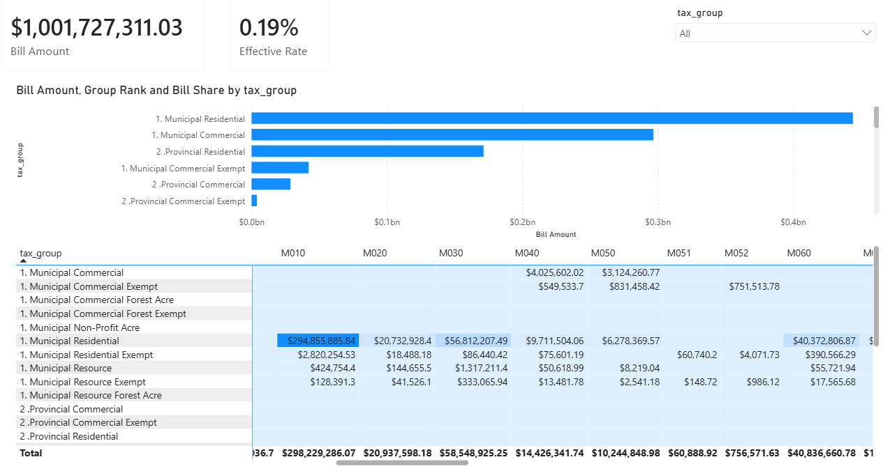
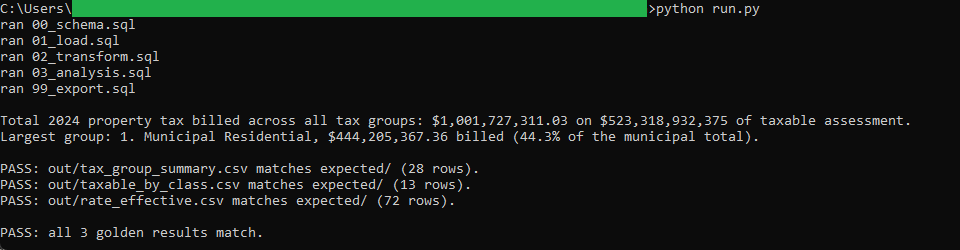
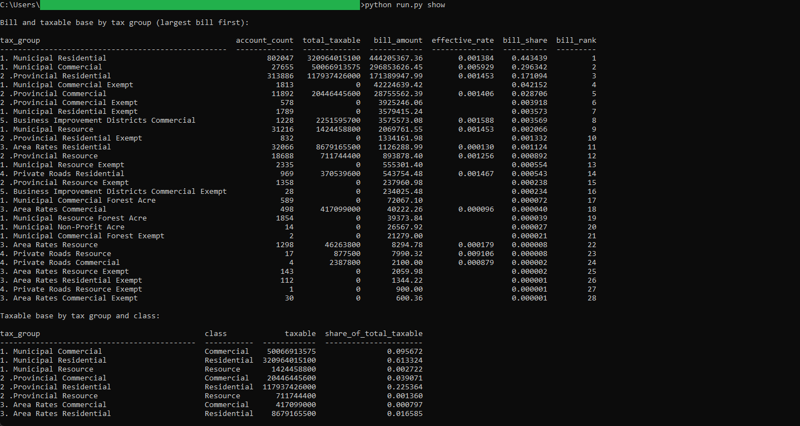

# 05: Property tax and assessment burden

Splits Halifax's 2024 property tax across residential, commercial, and resource assessment, by tax group and rate code. In 2024, the one tax year in the data, Halifax billed $1,001,727,311.03 across all tax groups on $523,318,932,375 of taxable assessment. Municipal Residential is the largest group at $444,205,367.36, 44.3 percent of the municipal bill. The special area rates carry the highest realized rate against their taxable base, near 0.037, while the general municipal rates sit near 0.006.

All of the analysis lives in DuckDB SQL. Two dashboards read the one frozen pair of CSVs the SQL exports: a published **Tableau** dashboard and a committed **Power BI** report. Neither recomputes anything, so the same figure reads identically to the cent in both.

## The data

Halifax Data Mapping and Analytics Hub: **HRM Tax Bill Info** (`HRM::hrm-tax-bill-info`). The raw table is 1,252,942 account-rate lines, every one for tax year 2024, so it is pulled with server-side aggregation into a compact 5,383-row grouped snapshot rather than downloaded whole. Endpoints, item id, licence, the exact `outStatistics` query, and pull date are in SOURCE.md.

Contains information licenced under the Open Government Licence, Halifax.

## What it computes

Every step is deterministic and rule-based. All logic lives in `sql/`, named by step; `run.py` holds none of it. The pipeline cleans the grouped snapshot, rounds every billed dollar to the cent once, then builds two BI marts and three golden results: taxable value by tax group and class for the stacked bar, the bill by tax group with its share of the municipal total and a rank, and the effective rate by rate code, which is billed dollars against the taxable base. Money rounds to the cent and the totals tie: the bill totalled by tax group, by rate code, and over the wide mart all sum to the same $1,001,727,311.03. Every result query ends in an `ORDER BY`, which is what makes the output reproducible. spec.md walks each step; data_dictionary.md defines every column.

The same marts drive both BI builds in `bi/`. The **Tableau** dashboard pairs a stacked bar of taxable value by class and tax group, carrying a FIXED level-of-detail share of the municipal base, with a ranked bar of effective rate by rate code and a total-bill tile. It is
[published on Tableau Public](https://public.tableau.com/views/HalifaxPropertyTaxandAssessmentBurden/Propertytaxandassessmentburden),
and the workbook is committed as diffable XML at `bi/tableau/property_tax_burden.twb`.

The **Power BI** report, committed as a `.pbip` project in `bi/powerbi/`, carries an effective-rate DAX measure of bill over taxable, a tax-group by rate-code matrix with conditional formatting, and a RANKX tax-group ranking with a bill-share tooltip. Total 2024 property tax billed reads $1,001,727,311.03 in the SQL golden, on the Tableau total tile, and on the Power BI Bill Amount card.

## Testing

DuckDB is the only dependency:

    pip install duckdb

From this folder:

    python run.py            # runs the SQL end to end, then verifies all three golden results
    python run.py verify     # re-runs the golden diff only
    python run.py show       # prints the results as aligned tables

`python run.py` writes the three files in `out/`, checks each against `expected/` row for row, prints PASS when they match, then rewrites the two frozen marts in `bi/exports/`. `python run.py show` prints the tax-group summary, the taxable base by class, and the highest effective rates by rate code. It only prints columns the SQL already produced.

## License

MIT. Copyright (c) 2026 Kevin Yu (https://github.com/exekyute).
