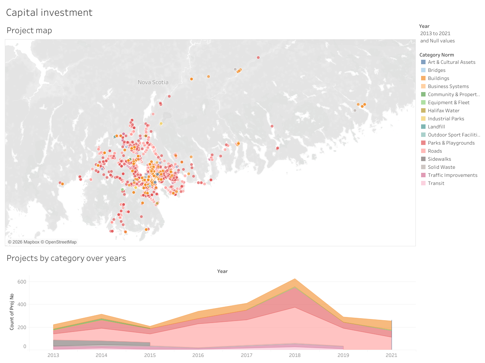
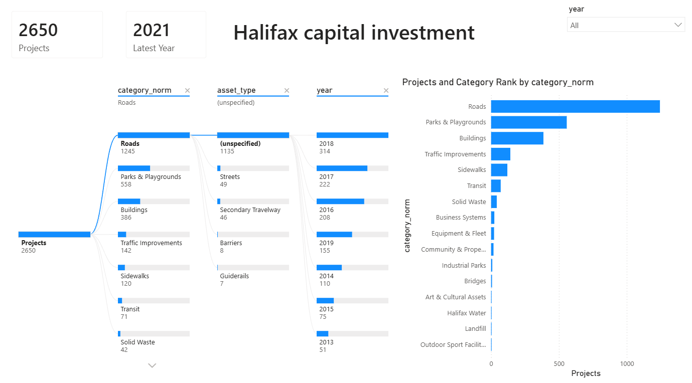
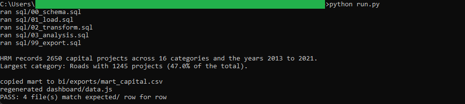
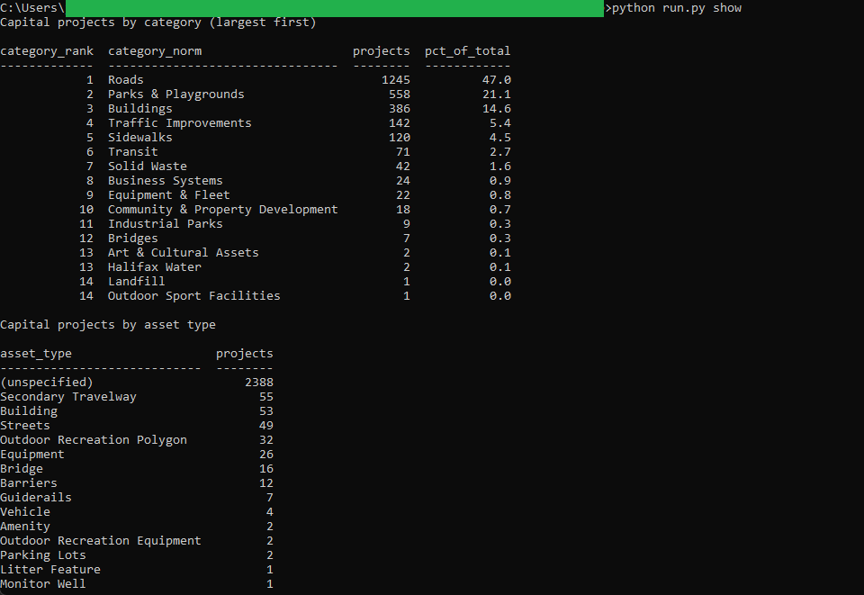
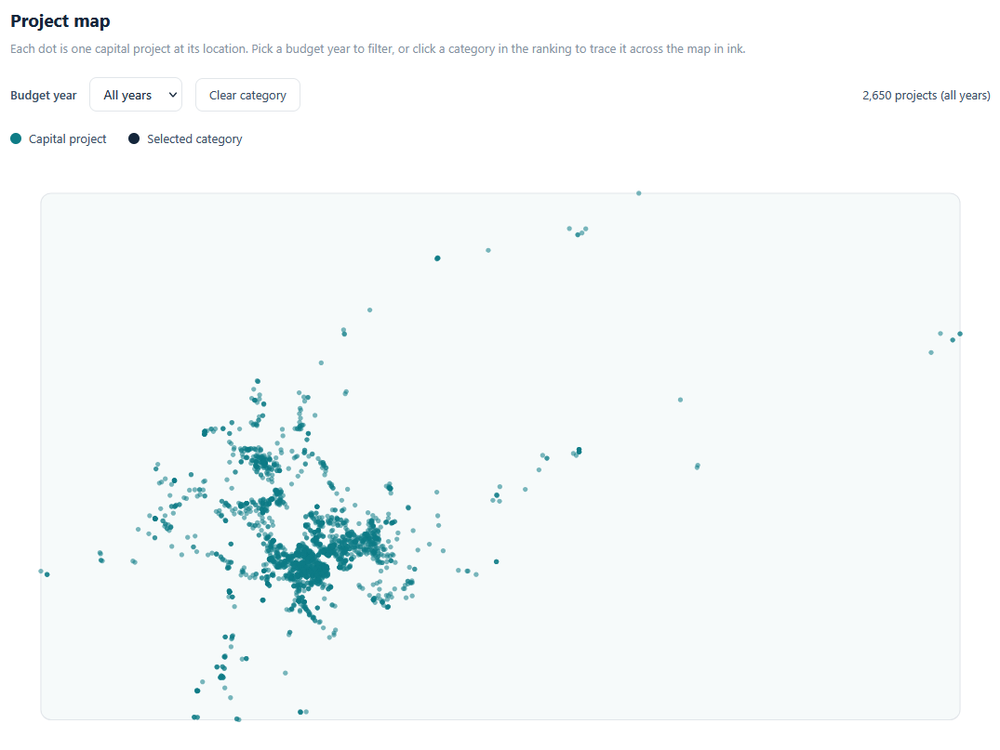

# 06: Capital investment map

Maps and counts Halifax Regional Municipality's capital projects by category and
budget year from a pinned open-data snapshot. The headline: HRM records 2,650
capital projects across 16 normalized categories and the years 2013 to 2021,
with Roads the largest category at 1,245 projects (47.0% of the total), ahead of
Parks & Playgrounds at 558 and Buildings at 386. The dataset carries no dollar
field, so every measure is a count of projects, not a sum of investment dollars.

## The data

Halifax Data Mapping and Analytics Hub: **Capital Projects**
(`HRM::capital-projects`, item `3d468db830e3430b8e4340015e11517e`). 2,650 point
records with location, work and project descriptions, budget category, budget
year, and asset type. Latitude and longitude come from the GeoJSON point
geometry (WGS84); the projected `NORTHING` and `EASTING` columns are not used.
Source, licence, pull method, and pull date are in SOURCE.md. Catalog idea #22.

## What it computes

Every step is deterministic and rule-based. All logic lives in `sql/`, named by
step; `run.py` holds none of it. The load reads each GeoJSON feature straight
into DuckDB, taking longitude and latitude from the point geometry. The transform
folds stray whitespace out of the text fields, casts the year, rounds the
coordinates, and maps the inconsistent `CATEGORY` labels onto a stable
`category_norm` (24 raw labels collapse to 16 normalized categories; the raw
label is kept too, and the full mapping is documented in spec.md). The analysis
then counts project records three ways: by category and year, by asset type, and
as a category ranking with a dense rank and each category's share of the total.

Five files come out: a per-record mart of all 2,650 rows and three golden count
tables, each with a fixed `ORDER BY`. The mart is frozen to `bi/exports/` for the
two BI faces and re-emitted as `dashboard/data.js` for the browser face, so all
three views read the same numbers.

## Three faces, one brain

The SQL is the verified brain. Three faces read its frozen output and recompute
nothing:

- **Browser dashboard** (`dashboard/index.html`, this repo): a zero-setup local
  view. Double-click it; it reads `dashboard/data.js` and re-derives every figure
  in the browser, so the total, the ranking, and the asset counts match the SQL
  golden. A project map with a budget-year filter, a category ranking, a
  by-year chart, and an asset-type breakdown.
- **Tableau**: a project point map coloured by category over a category-by-year
  area chart, with one budget-year filter driving both sheets. It is
  [published on Tableau Public](https://public.tableau.com/views/HalifaxCapitalInvestmentMap/Capitalinvestment)
  and committed as diffable XML at `bi/tableau/capital_investment_map.twb`.

  

- **Power BI**: a decomposition tree of projects by category, asset type, and
  year, a RANKX category ranking, and project-count cards. The committed
  deliverable is the `.pbip` text project under `bi/powerbi/`.

  

Every face lands on the same figures: 2,650 capital projects with Roads the
largest at 1,245, matching across the SQL golden (`expected/category_ranking.csv`),
the Tableau map, the Power BI cards, and the browser dashboard.

## Testing

DuckDB is the only dependency:

    pip install duckdb

From this folder:

    python run.py            # runs the SQL end to end, then verifies
    python run.py verify     # re-runs the golden diff only
    python run.py show       # prints the category ranking and asset-type counts

`python run.py` runs the five SQL steps, writes the mart and the three count
tables to `out/`, copies the mart into `bi/exports/`, regenerates
`dashboard/data.js`, and diffs `out/` against `expected/` row for row, printing
PASS on an exact match across all four golden files. `python run.py show` prints
the category ranking and the asset-type counts as aligned plain-ASCII tables. It
only prints columns the SQL already produced.

## License

MIT. Copyright (c) 2026 Kevin Yu (https://github.com/exekyute).
