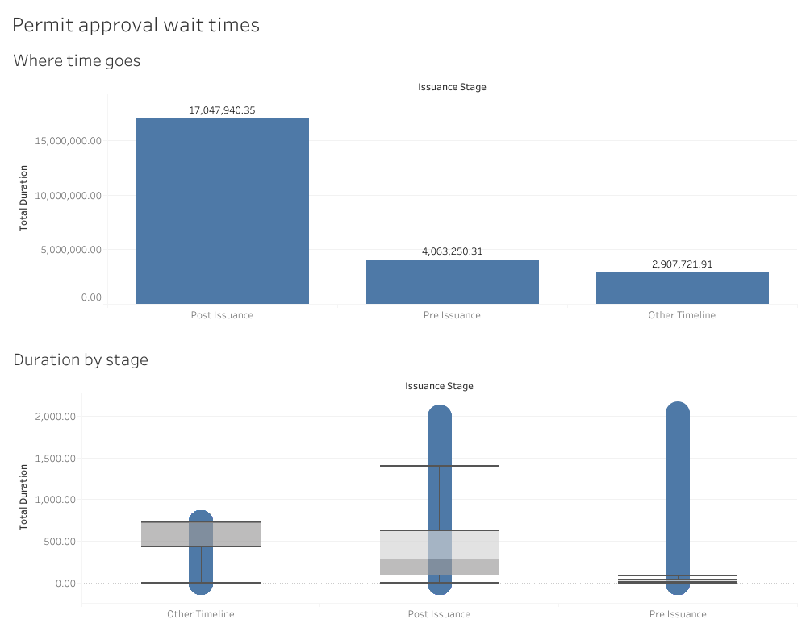
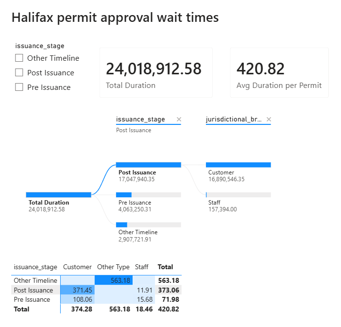
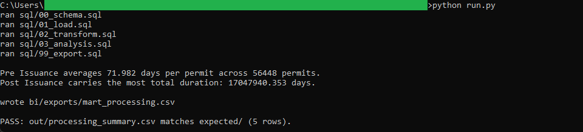
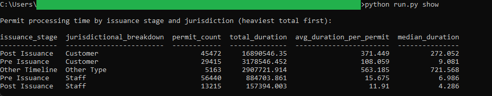

# 07: Permit approval wait times

Reads where a Halifax permit spends its time, across 149,705 processing records
for 57,076 permits. Post Issuance carries the most total time by far,
17,047,940.35 days summed over 45,698 permits, about 373 days each, while Pre
Issuance averages 71.98 days per permit. Customer time dwarfs staff time inside
every stage.

All of the analysis lives in DuckDB SQL. Two dashboards read the one frozen CSV
the SQL exports: a published **Tableau** dashboard and a committed **Power BI**
report. Neither recomputes anything, so the same figure reads identically in both
and in the SQL golden.

## The data

Halifax Data Mapping and Analytics Hub: **PPL&C Permit Processing Times**
(`HRM::pplc-permit-processing-times`, item `ba0ed0900b274984bcd9e05063ffb388`),
149,711 rows. The grain is one row per permit per issuance stage per
jurisdictional breakdown, so a single permit contributes several rows: a Pre
Issuance and a Post Issuance record, each split by whether the time sat with the
Customer or with Staff. The table carries no geometry, which is expected for this
dataset. Endpoints, item id, licence, and pull date are in SOURCE.md.

Contains information licenced under the Open Government Licence, Halifax.

## What it computes

Every step is deterministic and rule-based. All logic lives in `sql/`, named by
step; `run.py` holds none of it. The pipeline cleans and types the snapshot into a
per-permit-per-stage-per-jurisdiction mart, then rolls that mart up to one row per
issuance stage and jurisdiction, reporting the permit count, the total duration,
the average duration per permit, and a deterministic median. The mean and the
median are both kept because the distribution is heavily right-skewed, so they
diverge and answer different questions. Every result query ends in an `ORDER BY`,
which is what makes the output reproducible. spec.md walks each step;
data_dictionary.md defines every column.

The same frozen mart at `bi/exports/mart_processing.csv` drives both BI faces. The
**Tableau** dashboard pairs a per-permit duration box plot, which shows the median
and quartile spread of each stage, with a stage-total sorted bar. It is
[published on Tableau Public](https://public.tableau.com/views/HalifaxPermitApprovalWaitTimes/Permitapprovalwaittimes),
and the workbook is committed as diffable XML at
`bi/tableau/permit_approval_wait_times.twb`.

The **Power BI** report, committed as a `.pbip` project in `bi/powerbi/`, breaks
total duration down with a decomposition tree, issuance stage then jurisdiction,
and reads the average duration per permit across those same two dimensions in a
conditional-format matrix, with cards for the totals. Post Issuance total
processing time reads 17,047,940.35 days in the SQL golden, on the Tableau sorted
bar, and on the Power BI Total Duration card.

## Testing

DuckDB is the only dependency:

    pip install duckdb

From this folder:

    python run.py            # runs the SQL end to end, then verifies
    python run.py verify     # re-runs the golden diff only
    python run.py show       # prints the summary result as a table

`python run.py` writes out/processing_summary.csv, refreshes the frozen mart at
bi/exports/mart_processing.csv, checks the summary against
expected/processing_summary.csv, and prints PASS when they match row for row.
`python run.py show` prints the same result as an aligned table, one row per
issuance stage and jurisdiction, heaviest total duration first. It only prints
columns the SQL already produced.

## License

MIT. Copyright (c) 2026 Kevin Yu (https://github.com/exekyute).
