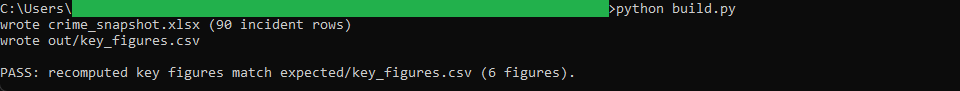
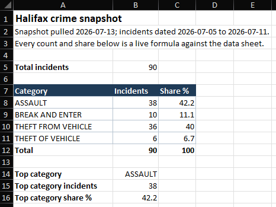

# 08: Crime snapshot

A live Excel workbook that summarizes a point-in-time pull of Halifax Regional
Police incidents by category and by area. The snapshot holds 90 incidents dated
2026-07-05 to 2026-07-11; the top category is ASSAULT with 38 incidents, 42.2
percent of the total, ahead of theft from vehicle at 40.0 percent.

## The data

Halifax Data Mapping and Analytics Hub: **Crime** (`HRM::crime`, item
`f6921c5b12e64d17b5cd173cafb23677`). Source, licence, and pull date in SOURCE.md.
(Catalog idea #28.)

This is a small rolling incident feed, not a multi-year aggregate: each row is one
recent police event, the feed holds only a short window of days, and it refreshes,
so the row count and date window move between pulls. Everything here is computed
from the committed dated snapshot in `data/raw/`, so the workbook is reproducible
even though a fresh pull would return different incidents. See SOURCE.md.

## What it computes

The workbook itself is the deliverable, and every summary figure is a live cell
formula, no macros and no pasted values.

- **data** sheet: the raw incidents, `evt_date` as a real Excel date, plus
  `evt_rin`, `category`, `code`, and `location`, sorted by the stable key
  (`evt_date`, then `evt_rin`) so the sheet is reproducible from the snapshot.
- **summary** sheet: incidents by category with `COUNTIF` against the data sheet,
  each category's share of the total with a `ROUND` formula, the total incident
  count, and the top category found with `INDEX`/`MATCH` over `MAX`. Every number
  references the data sheet; none is typed in.
- **by_area** sheet: a count by location, again one `COUNTIF` per area.

`build.py` recomputes the same key figures independently in plain Python to form
the golden. The Python shares round half-away-from-zero (`decimal.ROUND_HALF_UP`)
to mirror Excel's `ROUND`, so the workbook and the golden agree to the decimal.
spec.md maps every key figure to the exact cell that holds it.

## Testing

openpyxl is the only dependency:

    pip install openpyxl

From this folder:

    python build.py            # regenerate the .xlsx from the snapshot, then verify
    python build.py verify     # re-run the golden diff only
    python build.py show       # print the key-figures table

`python build.py` writes crime_snapshot.xlsx and out/key_figures.csv, then
recomputes the key figures in plain Python and diffs them against
expected/key_figures.csv, printing PASS on an exact match. `python build.py show`
prints the same key figures as an aligned table. The golden is recomputed from the
snapshot, never read back from the workbook.

## License

MIT. Copyright (c) 2026 Kevin Yu (https://github.com/exekyute).
