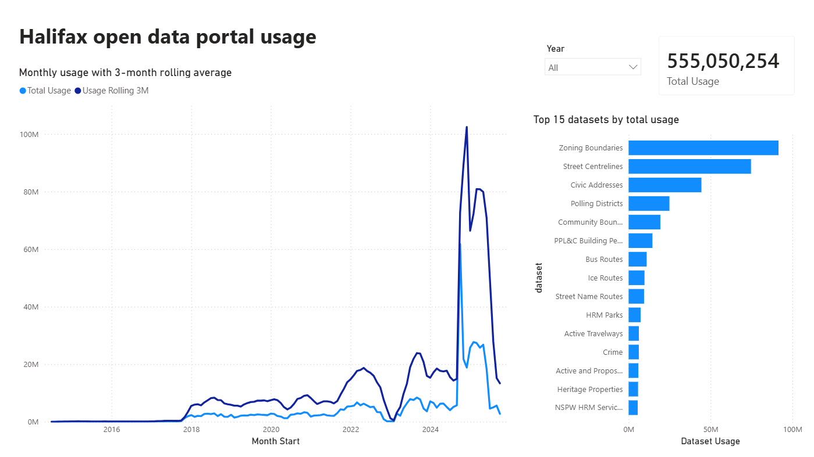
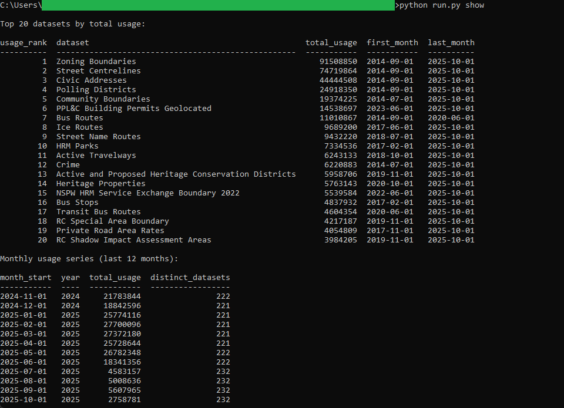

# 09: Open data portal usage

Ranks Halifax's open-data items by the usage they draw on the municipal hub and
tracks how portal traffic moves month by month. Across 136 months, July 2014 to
October 2025, the portal recorded 555,050,254 hits against 237 datasets. Zoning
Boundaries is the most-used by a wide margin at 91,508,850 hits, ahead of Street
Centrelines at 74,719,864 and Civic Addresses at 44,444,508.

All of the analysis lives in DuckDB SQL. A committed **Power BI** report reads the
one frozen mart pair the SQL exports, so the same figure reads identically in the
report and in the SQL golden.

## The data

Halifax Data Mapping and Analytics Hub: **Open Data Analytics**
(`HRM::open-data-analytics`, item `f88dc9dab9bb4c59bc277f3676f89724`), 639,108
rows. The grain is one row per dataset per usage-stamp date, and the dataset name
is carried inline, so no join to the separate open data catalogue is needed. The
table carries no geometry, which is expected for a usage log.

At 639,108 rows the raw layer is too large to commit. It was pulled once to a
working file and rolled up to a compact snapshot of 14,102 rows, one per dataset
per month. SOURCE.md records the endpoints, the item id, the licence, the pull
date, and the verbatim aggregation query, so the snapshot reproduces from the
endpoint on any future day.

Contains information licenced under the Open Government Licence, Halifax.

## What it computes

Every step is deterministic and rule-based. All logic lives in `sql/`, named by
step; `run.py` holds none of it. The pipeline types the snapshot, keeps the
dataset-months that drew positive usage, and builds two marts.
`mart_usage_monthly` is one row per month carrying the month's total usage and the
count of distinct datasets that drew traffic. `mart_usage_by_dataset` is one row
per dataset carrying its total usage over the window, the first and last month it
drew usage, and a usage rank. The rank uses competition ranking, so tied totals
share a rank and the next rank skips, which is what lets it agree with the
report's DAX ranking row for row. Every result query ends in an `ORDER BY`, which
is what makes the output reproducible. spec.md walks each step;
data_dictionary.md defines every column.

Keeping only the positive-usage months is the one analytical rule worth naming. It
does not move any total, since a zero adds nothing, but it sets when a dataset
first counts and how many distinct datasets a month holds. It is also why the
series opens in July 2014 rather than April 2014, the snapshot's earliest month:
the three months before that carried only zero totals.

The same frozen marts at `bi/exports/` drive the BI face. The **Power BI** report,
committed as a `.pbip` project in `bi/powerbi/`, pairs a monthly usage line and a
trailing three-month total on a marked date table with a ranked bar of the top 15
datasets, a year slicer, and a total card. Total recorded usage reads 555,050,254
in the SQL golden and on the Power BI Total Usage card. This build ships one BI
face rather than two: it is usage KPIs over time with no geography, so a second
tool would render the same line and the same bar rather than flex a different
muscle.

## Testing

DuckDB is the only dependency:

    pip install duckdb

From this folder:

    python run.py            # runs the SQL end to end, then verifies
    python run.py verify     # re-runs the golden diff only
    python run.py show       # prints the ranked datasets and the monthly series

`python run.py` writes out/mart_usage_monthly.csv and
out/mart_usage_by_dataset.csv, refreshes the frozen marts at bi/exports/, checks
each output against its twin in expected/, and prints PASS when they match row for
row. `python run.py show` prints the top datasets by usage and the recent monthly
series as aligned tables. It only prints columns the SQL already produced.

## License

MIT. Copyright (c) 2026 Kevin Yu (https://github.com/exekyute).
