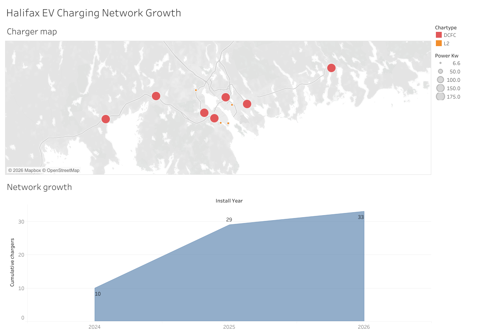
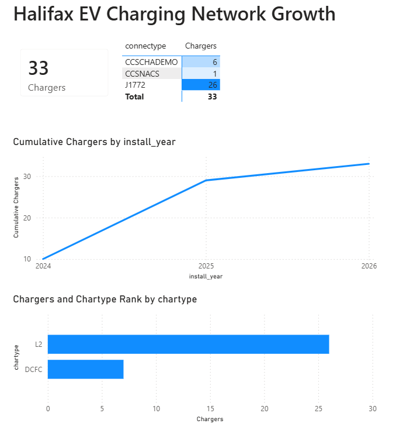
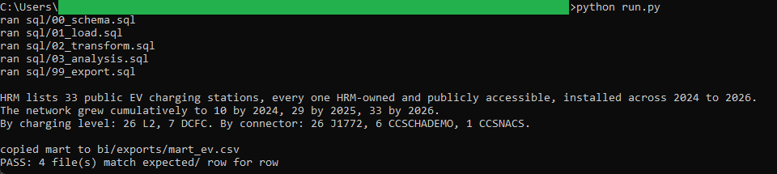
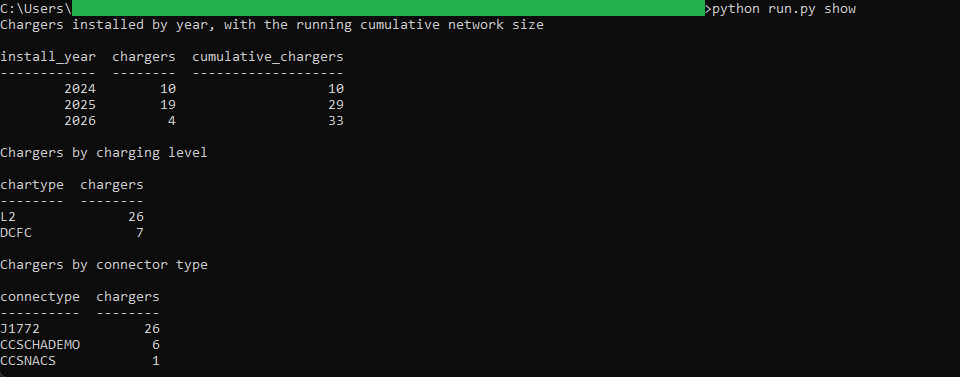

# 10: EV charging network growth

Maps Halifax Regional Municipality's public EV charging network from a pinned
open-data snapshot. HRM lists 33 public charging stations, every one HRM-owned and
publicly accessible, installed across 2024 to 2026. The network grew cumulatively to
10 stations by 2024, 29 by 2025, and 33 by 2026. By charging level it splits 26
Level 2 (`L2`) to 7 DC fast (`DCFC`); by connector, 26 `J1772`, 6 `CCSCHADEMO`, and
1 `CCSNACS`. Every measure is a count of stations, not a sum of ports.

All of the analysis lives in DuckDB SQL. Two dashboards read the one frozen CSV the
SQL exports: a published **Tableau** dashboard and a committed **Power BI** report.
Neither recomputes anything, so the same figure reads identically in both and in the
SQL golden.

## The data

Halifax Data Mapping and Analytics Hub: **EV Charging Station**
(`HRM::ev-charging-station`, item `5447b08b3e254c99aedf9665c7e6d5a4`). 33 point
records, each an installed (`ASSETSTAT = INS`), publicly accessible
(`EVACCESS = PUBLIC`), HRM-owned station with a charging level, connector type,
power rating, install year, port count, and address. Latitude and longitude come
from the GeoJSON point geometry, pulled with `outSR=4326` so it is already WGS84.
Endpoints, item id, licence, and pull date are in SOURCE.md.

Contains information licenced under the Open Government Licence, Halifax.

## What it computes

Every step is deterministic and rule-based. All logic lives in `sql/`, named by
step; `run.py` holds none of it. The load reads each GeoJSON feature straight into
DuckDB, taking longitude and latitude from the point geometry. The transform folds
stray whitespace out of the text fields, casts the install year and port count,
rounds the power rating and the coordinates, and keeps only installed
(`ASSETSTAT = INS`) stations. The analysis then counts stations three ways: by
install year with a running cumulative total, by charging level, and by connector
type. Every result query ends in an `ORDER BY`, which is what makes the output
reproducible. spec.md walks each step; data_dictionary.md defines every column.

The network is only three years old, so the cumulative curve is short by design; the
charging-level and connector breakdowns carry the second dimension alongside it.

The same frozen mart at `bi/exports/mart_ev.csv` drives both BI faces. The
**Tableau** dashboard pairs a charger point map, coloured by charging level and sized
by power rating, with a cumulative running-total area chart built from a table
calculation. It is
[published on Tableau Public](https://public.tableau.com/views/HalifaxEVChargingNetworkGrowth/HalifaxEVChargingNetworkGrowth),
and the workbook is committed as diffable XML at
`bi/tableau/ev_charging_network_growth.twb`.

The **Power BI** report, committed as a `.pbip` project in `bi/powerbi/`, reads the
same growth curve a different way: a DAX cumulative-total measure over the install-year
index, alongside a KPI card for the network size, a RANKX ranking of the charging
levels, and a conditional-format matrix by connector. HRM has 33 public EV chargers
reaching a cumulative 33 by 2026, and that figure reads the same on the SQL golden, on
the Tableau map, and on the Power BI Chargers card.

## Testing

DuckDB is the only dependency:

    pip install duckdb

From this folder:

    python run.py            # runs the SQL end to end, then verifies
    python run.py verify     # re-runs the golden diff only
    python run.py show       # prints the growth curve and the two mix breakdowns

`python run.py` writes the mart and the three count tables to `out/`, refreshes the
frozen mart at `bi/exports/mart_ev.csv`, checks the output against `expected/`, and
prints PASS when all four golden files match row for row. `python run.py show` prints
the cumulative growth curve and the charging-level and connector counts as aligned
tables. It only prints columns the SQL already produced.

## License

MIT. Copyright (c) 2026 Kevin Yu (https://github.com/exekyute).
