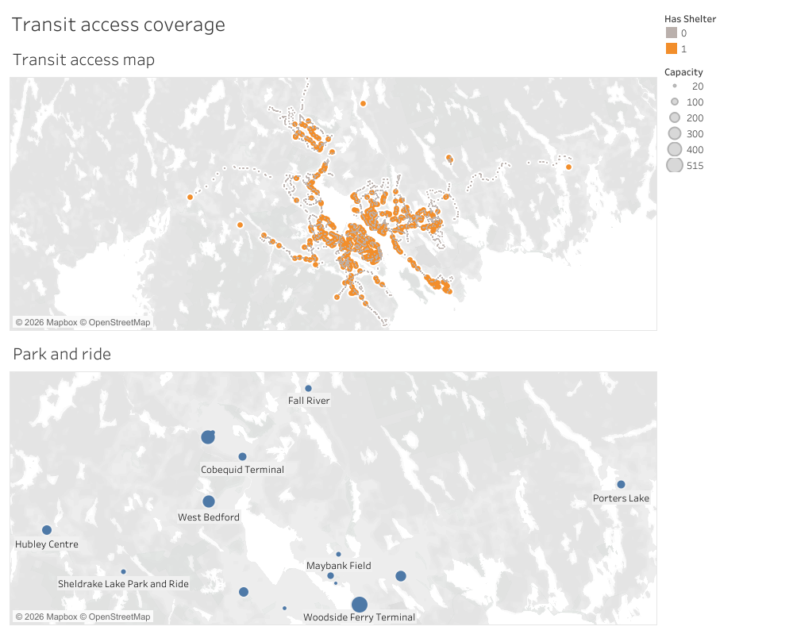
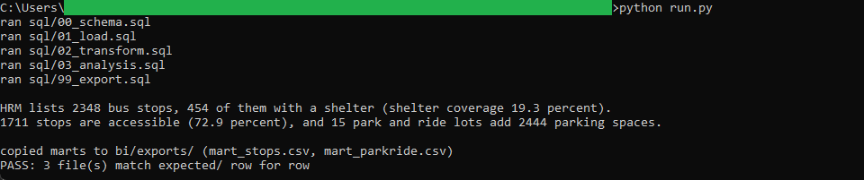
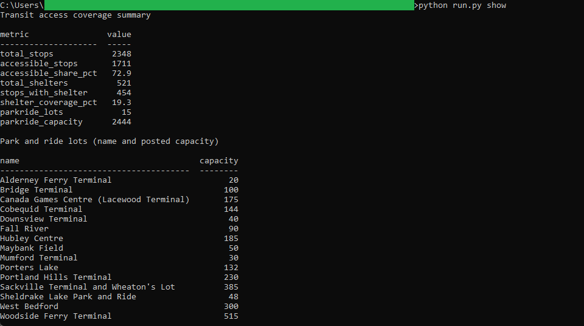

# 11: Transit access coverage

Maps how well Halifax Transit's access assets cover the network, from three pinned
open-data snapshots: bus stops, shelters, and park and ride lots. HRM lists **2348
bus stops**, **454** of them with a shelter (**shelter coverage 19.3 percent**), and
**1711** are accessible (**72.9 percent**). Fifteen park and ride lots add **2444**
parking spaces. Every stop measure is a count of stops, and the shelter flag is one
per stop even where a stop carries more than one shelter.

All of the analysis lives in DuckDB SQL. A published **Tableau** dashboard reads the
two frozen CSVs the SQL exports and recomputes nothing, so the same figure reads
identically on the dashboard and in the SQL golden. This build is Tableau only: it is
an access-geography snapshot with no time dimension and no measure a second tool would
render differently, so the map carries the whole story.

## The data

Halifax Data Mapping and Analytics Hub, three layers: **Bus Stops** (`HRM::bus-stops`,
item `29de9d04a3454e11a1e0a1f78a27bc07`, 2348 points), **Transit Shelters**
(`HRM::transit-shelters`, item `e1ab0076711c4df8828009d248495692`, 521 points, each
linked to a stop by `BUSSTOPID`), and **Park & Ride** (`HRM::park-ride`, item
`2e1a4a314a6e415bb7d7346e96a62191`, 15 polygons). The stops and shelters were pulled
with `outSR=4326` so their geometry is already WGS84; the park and ride polygons are
reduced to their centroids for the map. Endpoints, item ids, licence, and pull date
are in SOURCE.md.

Contains information licenced under the Open Government Licence, Halifax.

## What it computes

Every step is deterministic and rule-based. All logic lives in `sql/`, named by step;
`run.py` holds none of it. The load reads each GeoJSON feature into DuckDB, taking
longitude and latitude from the point geometry and, for the park and ride polygons,
from `ST_Centroid` (the one place the `spatial` extension is used). The transform
folds stray whitespace out of the text fields, reduces the accessibility code to a
0/1 flag (1 only when the stop is coded `A`, Accessible), and rounds every coordinate
to six decimals. The analysis then builds two marts and one summary: a per-stop mart
carrying an `accessible` flag and a `has_shelter` flag (1 when at least one shelter
links to that stop), a per-lot mart with capacity and centroid, and a coverage summary
rolling those up to the golden figures. Every result query ends in an `ORDER BY`,
which is what makes the output reproducible. spec.md walks each step;
data_dictionary.md defines every column.

The two frozen marts at `bi/exports/mart_stops.csv` and `bi/exports/mart_parkride.csv`
drive the Tableau face. The dashboard pairs a bus-stop map, coloured by whether each
stop has a shelter and sized so sheltered stops read larger, with a park and ride map
whose lots are sized by parking capacity. It is
[published on Tableau Public](https://public.tableau.com/views/HalifaxTransitAccessCoverage/Transitaccesscoverage),
and the workbook is committed as diffable XML at
`bi/tableau/transit_access_coverage.twb`. Shelter coverage reads 19.3 percent (454 of
2348 stops) on the SQL golden and on the Tableau map, and the 15 park and ride lots
total 2444 spaces on both.

## Testing

DuckDB is the only dependency:

    pip install duckdb

From this folder:

    python run.py            # runs the SQL end to end, then verifies
    python run.py verify     # re-runs the golden diff only
    python run.py show       # prints the coverage summary and the park and ride lots

`python run.py` runs the five SQL steps, writes the two marts and the coverage summary
to `out/`, refreshes the frozen marts in `bi/exports/`, and diffs `out/` against
`expected/` row for row, printing PASS on an exact match across all three golden
files. `python run.py show` prints the coverage summary and the park and ride lots as
aligned tables. It only prints columns the SQL already produced.

## License

MIT. Copyright (c) 2026 Kevin Yu (https://github.com/exekyute).
