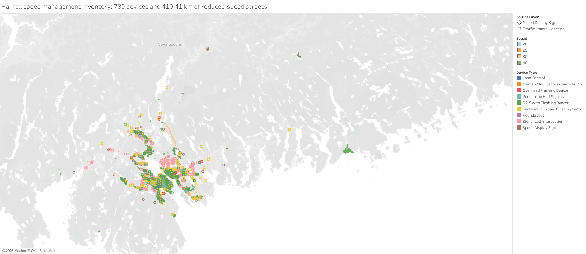
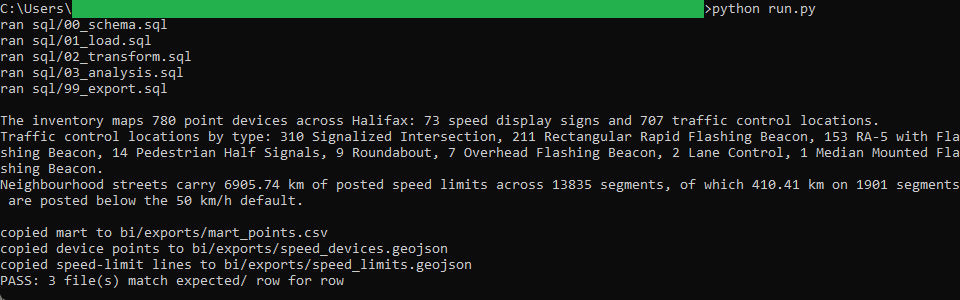
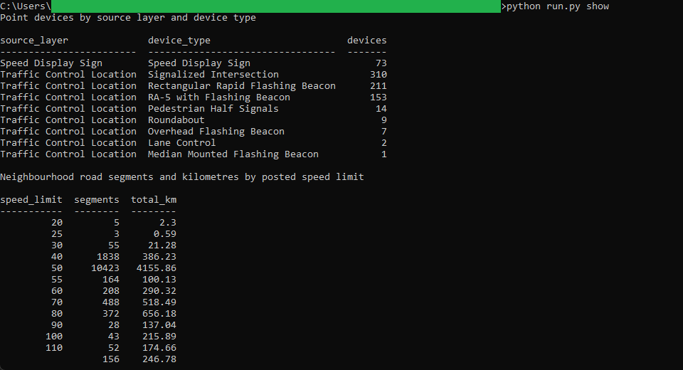

# 12: Speed management inventory

Maps Halifax's speed-management geography from three pinned open-data snapshots: **73**
speed display signs, **707** traffic control locations, and **13,835** neighbourhood road
segments carrying **6,905.74 km** of posted speed limits. Only **410.41 km** of that
network, **5.9 percent** on 1,901 segments, is posted below the 50 km/h default, and those
reduced-speed streets sit in the same urban core where the **780** point devices are
densest. Signalized intersections are the largest device type at 310.

All of the analysis lives in DuckDB SQL. A published **Tableau** map reads the frozen
exports the SQL writes and recomputes nothing, so the same figure reads identically on
the map and in the SQL golden. This build is Tableau only: it is a static coverage
snapshot with no time series and one flat count per device type, so a second tool would
render the same single numbers as bars.

## The data

Halifax Data Mapping and Analytics Hub, three layers: **Speed Display Signs**
(`HRM::speed-display-signs`, item `92b59f263845457391d9207d7f474e6d`, 73 points),
**Traffic Control Locations** (`HRM::traffic-control-locations`, item
`07e30ae319a24614918f77a3483e8652`, 707 points), and **Neighbourhood Speed Limit**
(`HRM::neighbourhood-speed-limit`, item `1bbee08f88ad439d950ef450afbcdaf5`, 13,835
polylines). The two point layers were pulled with `outSR=4326` so their geometry is
already WGS84; the polyline layer was paged past the 2,000-row cap as GeoJSON.

None of the three carries a community column, so coverage is summarised by device type
and by posted speed rather than by area. Two source fields arrive as codes rather than
labels: `CONTROL_TYPE` is an integer and `SIGNTYPE` a short string, both decoded against
the published domains. Endpoints, item ids, licence, and pull date are in SOURCE.md.

Contains information licenced under the Open Government Licence, Halifax.

## What it computes

Every step is deterministic and rule-based. All logic lives in `sql/`, named by step;
`run.py` holds none of it. The load reads each point GeoJSON into DuckDB, taking
longitude and latitude from the point geometry, and reads the polyline layer with
`ST_Read` from the `spatial` extension, keeping the posted speed and the published
segment length. The transform folds stray whitespace out of the location text, casts the
install year, rounds every coordinate to six decimals, and decodes each coded device
value to its domain label, so `CONTROL_TYPE` 6 becomes Signalized Intersection and
`SIGNTYPE` `SPDSGN` becomes Speed Display Sign. The analysis then counts the point
devices by type and rolls the road segments up by posted speed, summing `Shape__Length`
to kilometres. Every result query ends in an `ORDER BY`, which is what makes the output
reproducible. spec.md walks each step; data_dictionary.md defines every column.

All 73 signs carry one sign type, so the only real device-type variety is the eight-way
split across the traffic control locations. And 497 of the 707 control locations record
no install year, which is why this is a coverage snapshot and not a trend.

The frozen exports at `bi/exports/speed_devices.geojson` and
`bi/exports/speed_limits.geojson` drive the Tableau face. The map layers the 780 devices,
coloured by device type and shaped by source layer, over the speed-limit network drawn as
lines coloured by posted speed, with a filter that drops the streets to the reduced-speed
set. It is
[published on Tableau Public](https://public.tableau.com/views/HalifaxSpeedManagementInventory/Speedmanagementmap),
and the workbook is committed as diffable XML at
`bi/tableau/speed_management_inventory.twb`. The inventory reads 780 point devices and
410.41 km of reduced-speed streets on the SQL golden and on the Tableau map, across the
same 1,901 segments.

## Testing

DuckDB is the only dependency, and it pulls the `spatial` extension on first run:

    pip install duckdb

From this folder:

    python run.py            # runs the SQL end to end, then verifies
    python run.py verify     # re-runs the golden diff only
    python run.py show       # prints the device counts and the speed-limit summary

`python run.py` runs the five SQL steps, writes the point mart and the two summary tables
to `out/`, refreshes the frozen exports in `bi/exports/`, and diffs `out/` against
`expected/` row for row, printing PASS on an exact match across all three golden files.
`python run.py show` prints the device counts and the speed-limit summary as aligned
tables. It only prints columns the SQL already produced.

## License

MIT. Copyright (c) 2026 Kevin Yu (https://github.com/exekyute).
