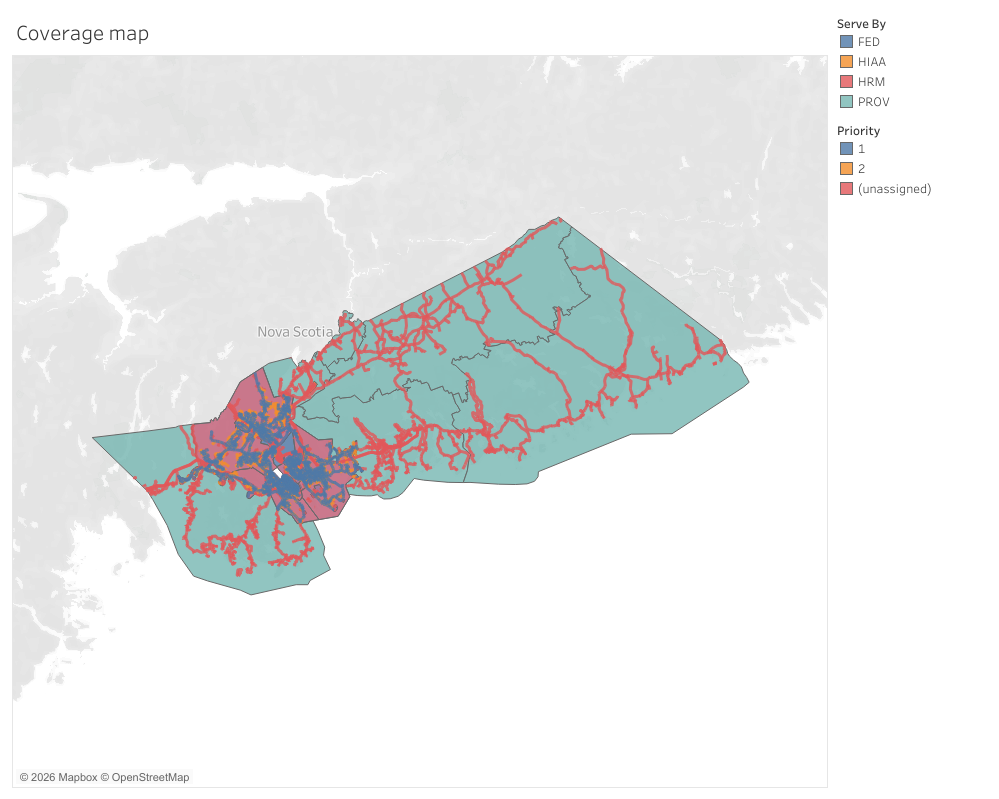
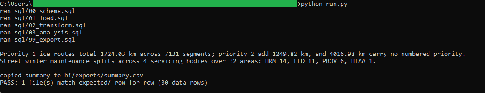
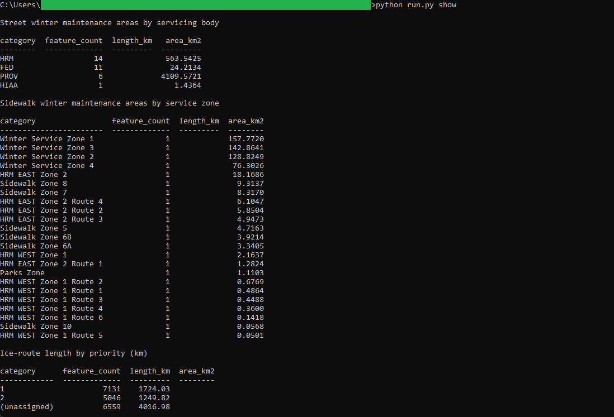

# 13: Snow service coverage

Carves up Halifax's winter maintenance geography from three pinned open-data snapshots:
**32** street maintenance areas, **23** sidewalk service zones, and **18,736** ice-route
segments. Priority 1 ice routes total **1,724.03 km** and Priority 2 add **1,249.82 km**,
while **4,016.98 km** on 6,559 segments carry no numbered priority. The street network
splits across four servicing bodies, with HRM covering **14** areas, the federal
government 11, the province 6, and the airport 1.

All of the analysis lives in DuckDB SQL. A published **Tableau** map reads the frozen
exports the SQL writes and recomputes nothing, so the same figure reads identically on the
map and in the SQL golden. This build is Tableau only: it is a static operational boundary
map with no time series, and the one measure, road length per priority, is a single flat
figure that a second tool would render as one bar.

## The data

Halifax Data Mapping and Analytics Hub, three layers: **Street Winter Maintenance Areas**
(`HRM::street-winter-maintenance-areas`, item `91ff9b57ecc54e59997f3e12b08f6895`, 32
polygons), **Sidewalk Winter Maintenance Areas**
(`HRM::sidewalk-winter-maintenance-areas`, item `d1d5a8f9eb0f4e0a81fda53858fa9b1f`, 23
polygons), and **Ice Routes** (`HRM::ice-routes`, item
`e9dd1561e22e4a149c5b45f54ec0942d`, 18,736 polylines). All three were pulled as GeoJSON;
the ice routes were paged past the 2,000-row cap.

The polygon layers are tagged by servicing body (`SERVE_BY`) and service zone (`MACHINE`);
the ice routes carry a snow-clearing priority (`1`, `2`, or none) and the source
`Shape__Length`. That length is stored in the layer's native Web Mercator projection, which
overstates true ground distance by roughly the secant of the latitude, so it is summed as
provided to match the map, and SOURCE.md records the true-ground figures for comparison.
Endpoints, item ids, licence, and pull date are in SOURCE.md.

Contains information licenced under the Open Government Licence, Halifax.

## What it computes

Every step is deterministic and rule-based. All logic lives in `sql/`, named by step;
`run.py` holds none of it. The load reads each GeoJSON into DuckDB with `ST_Read` from the
`spatial` extension, keeping both the attributes and the WGS84 geometry. The transform
folds stray whitespace out of the text fields, labels a missing priority `(unassigned)`,
and measures each polygon's true ground area with `ST_Area_Spheroid`. The analysis then
counts the street areas by servicing body, counts the sidewalk zones, and rolls the ice
routes up by priority, summing `Shape__Length` to kilometres. The three groupings are
stacked into one summary in a fixed row order, so a single `ORDER BY` fixes the output.
Every result query ends in an `ORDER BY`, which is what makes it reproducible. spec.md
walks each step; data_dictionary.md defines every column.

The 18,736 ice segments are also dissolved to one line feature per priority, and every
polygon is promoted to a uniform `MultiPolygon`, so the frozen exports at
`bi/exports/street_winter_areas.geojson`, `bi/exports/sidewalk_winter_areas.geojson`, and
`bi/exports/ice_routes_by_priority.geojson` drive the Tableau face directly. The map layers
the street areas coloured by servicing body, the sidewalk zones as a second fill, and the
ice routes as lines coloured by priority. It is
[published on Tableau Public](https://public.tableau.com/views/HalifaxSnowServiceCoverage/Snowservicecoverage),
and the workbook is committed as diffable XML at `bi/tableau/snow_service_coverage.twb`.
Priority 1 ice routes total 1,724.03 km on the SQL golden and on the Tableau map summary.

## Testing

DuckDB is the only dependency, and it pulls the `spatial` extension on first run:

    pip install duckdb

From this folder:

    python run.py            # runs the SQL end to end, then verifies
    python run.py verify     # re-runs the golden diff only
    python run.py show       # prints the coverage summary as a table

`python run.py` runs the five SQL steps, writes the summary to `out/`, refreshes the frozen
exports in `bi/exports/`, and diffs `out/` against `expected/` row for row, printing PASS on
an exact match. `python run.py show` prints the coverage summary as aligned tables, one
block per layer. It only prints columns the SQL already produced.

## License

MIT. Copyright (c) 2026 Kevin Yu (https://github.com/exekyute).
