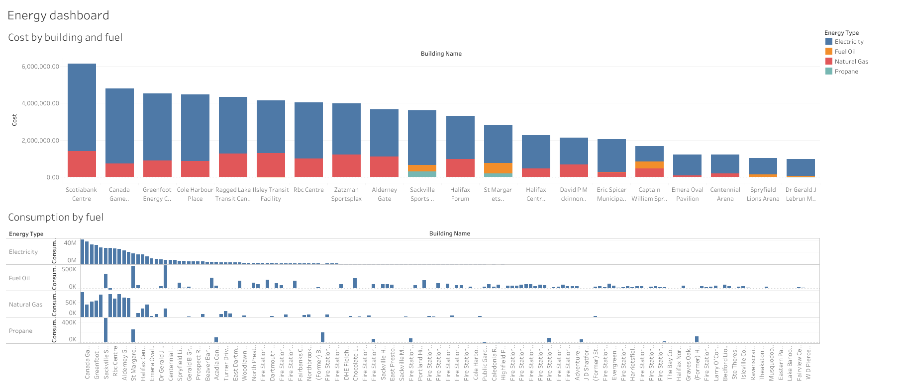
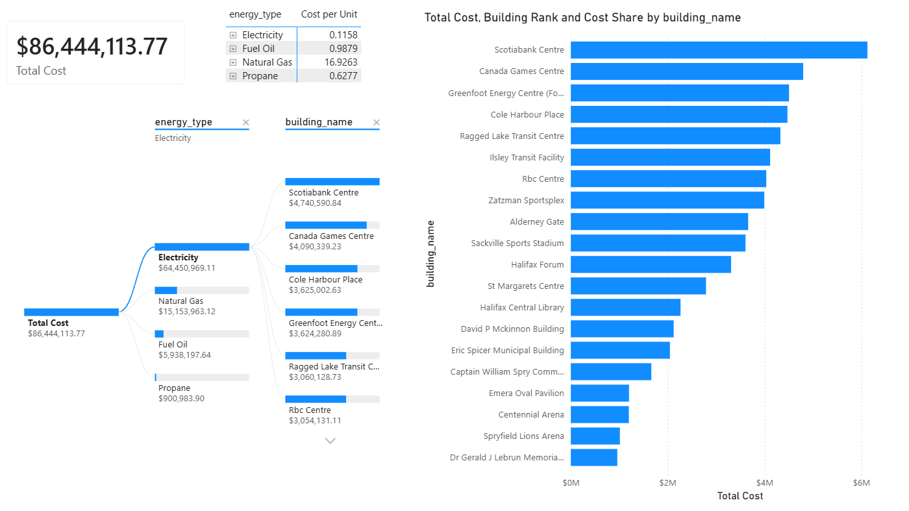
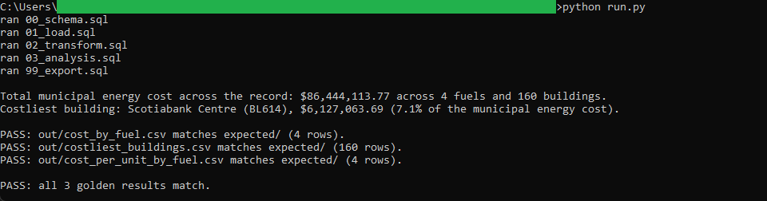
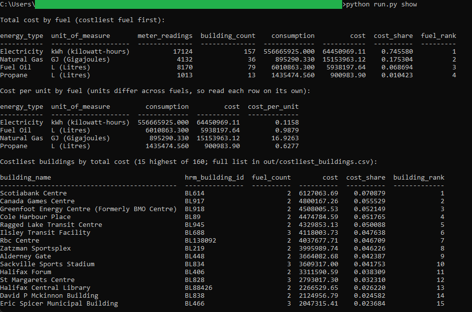

# 14: Municipal building energy and emissions

Ranks the fuels and buildings that drive Halifax's municipal energy cost across the whole reading record. Halifax spent $86,444,113.77 on energy at 160 municipal buildings, split across four fuels. Electricity is the largest at $64,450,969.11, 74.6 percent of the cost, ahead of natural gas at $15,153,963.12, fuel oil at $5,938,197.64, and propane at $900,983.90. Scotiabank Centre is the costliest building at $6,127,063.69, 7.1 percent of the municipal total.

All of the analysis lives in DuckDB SQL. Two dashboards read the one frozen CSV the SQL exports: a published **Tableau** dashboard and a committed **Power BI** report. Neither recomputes anything, so the same figure reads identically to the cent in both.

## The data

Halifax Data Mapping and Analytics Hub: **HRM Building Energy Usage** (`HRM::hrm-building-energy-usage`). The table is 30,439 rows, one row per meter reading period, small enough to download and commit whole. Endpoints, item id, licence, and pull date are in SOURCE.md.

Contains information licenced under the Open Government Licence, Halifax.

The four fuels are metered in three different units: natural gas in gigajoules, electricity in kilowatt-hours, and both propane and fuel oil in litres. A consumption figure is therefore only meaningful within a single fuel, so consumption is summed only within a fuel and its unit; only cost is summed across fuels.

## What it computes

Every step is deterministic and rule-based. All logic lives in `sql/`, named by step; `run.py` holds none of it. The pipeline cleans the readings, rounds every dollar to the cent once, then builds one BI mart and three golden results: total cost by fuel, the costliest buildings by total cost summed across fuels, and the cost per unit within each fuel. Money rounds to the cent and the totals tie: the cost totalled by fuel, by building, and over the mart all sum to the same $86,444,113.77. The cost per unit is guarded against a non-positive consumption base, so the two building-and-fuel groups whose net consumption goes negative once meter adjustments are applied render an empty per-unit figure rather than dividing by zero. Every result query ends in an `ORDER BY`, which is what makes the output reproducible. spec.md walks each step; data_dictionary.md defines every column.

The same mart drives both BI builds in `bi/`. The **Tableau** dashboard pairs a stacked bar of cost by building and fuel, kept to the 20 costliest buildings, with small-multiple consumption panels, one per fuel, so the three different units never share an axis. It is
[published on Tableau Public](https://public.tableau.com/views/HalifaxMunicipalBuildingEnergyandEmissions/Energydashboard),
and the workbook is committed as diffable XML at `bi/tableau/municipal_building_energy.twb`.

The **Power BI** report, committed as a `.pbip` project in `bi/powerbi/`, carries a decomposition tree of cost by fuel then building, a cost-per-unit DAX measure in a per-fuel matrix, and a RANKX building ranking with a cost-share tooltip. Total municipal energy cost reads $86,444,113.77 in the SQL golden, on the Tableau stacked-bar total, and on the Power BI Total Cost card.

## Testing

DuckDB is the only dependency:

    pip install duckdb

From this folder:

    python run.py            # runs the SQL end to end, then verifies all three golden results
    python run.py verify     # re-runs the golden diff only
    python run.py show       # prints the results as aligned tables

`python run.py` writes the three files in `out/`, checks each against `expected/` row for row, prints PASS when they match, then rewrites the frozen mart in `bi/exports/`. `python run.py show` prints total cost by fuel, cost per unit by fuel, and the costliest buildings. It only prints columns the SQL already produced.

## License

MIT. Copyright (c) 2026 Kevin Yu (https://github.com/exekyute).
