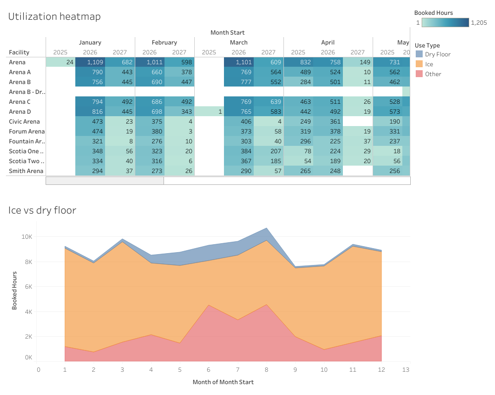
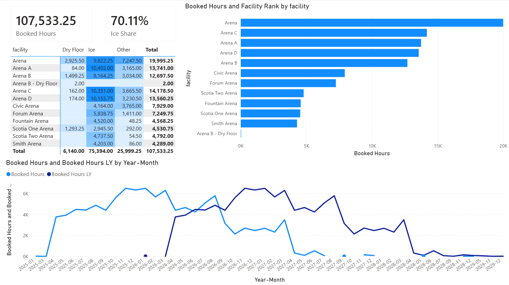
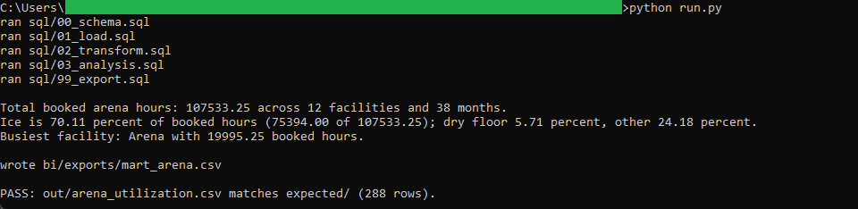
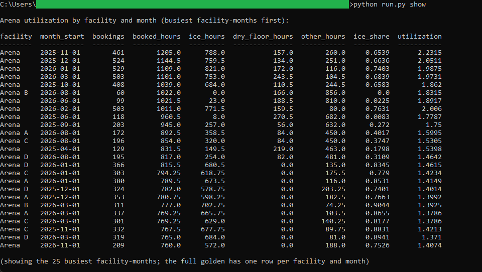

# 15: Arena booking utilization

Measures how fully Halifax's municipal arenas are booked, across 39,855 bookings on 12 ice pads. The record holds 107,533.25 booked hours, of which ice is 70.11 percent (75,394.0 hours), ahead of dry-floor use at 5.71 percent and other holds such as system bookings and noon hours at 24.18 percent. Arena is the busiest pad at 19,995.25 booked hours.

All of the analysis lives in DuckDB SQL. Two dashboards read the one frozen CSV the SQL exports: a published **Tableau** dashboard and a committed **Power BI** report. Neither recomputes anything, so the same figure reads identically in both.

## The data

Halifax Data Mapping and Analytics Hub: **Parks and Recreation Arena Bookings** (`HRM::parks-and-recreation-arena-bookings`). The table is 39,858 rows, one row per booking, small enough to download and commit whole. Endpoints, item id, licence, and pull date are in SOURCE.md.

Contains information licenced under the Open Government Licence, Halifax.

Ice versus dry-floor use is carried by the service line, not the activity: a service whose text contains "Ice" is ice time, one containing "Dry Floor" is dry-floor time, and the rest (system bookings, noon hours) is other. Booked hours come from each booking's start and end time. The bookings run into forward-scheduled seasons, heaviest in 2025 and 2026 and thinning through 2029. The dataset carries no capacity field, so utilization is a documented proxy: booked hours over a nominal capacity of days-in-month times 18 open hours per day. Because separate bookings on one pad can overlap, that proxy can read above 100 percent, so it ranks booking intensity rather than claiming true occupancy. spec.md and data_dictionary.md carry the assumption.

## What it computes

Every step is deterministic and rule-based. All logic lives in `sql/`, named by step; `run.py` holds none of it. The pipeline cleans and types the bookings into one row per booking, derives the month, the use type, and the booked hours, then rolls that up two ways: a use-type mart (`bi/exports/mart_arena.csv`), one row per facility, month, and use type, that both BI faces read; and a facility-month golden (`out/arena_utilization.csv`), one row per pad and month carrying the booked-hours total, the ice, dry-floor, and other split, the ice share, and the utilization proxy. The booked-hours total ties across the mart and the golden to the same 107,533.25, and every result query ends in an `ORDER BY`, which is what makes the output reproducible. spec.md walks each step; data_dictionary.md defines every column.

The same mart drives both BI builds in `bi/`. The **Tableau** dashboard pairs a facility-by-month utilization heatmap, coloured by booked hours, with an ice-versus-dry-floor stacked area, on a shared facility filter. It is
[published on Tableau Public](https://public.tableau.com/views/HalifaxArenaBookingUtilization/Arenabookingutilization),
and the workbook is committed as diffable XML at `bi/tableau/arena_booking_utilization.twb`.

The **Power BI** report, committed as a `.pbip` project in `bi/powerbi/`, carries cards for booked hours and ice share, a facility-by-use-type matrix with conditional formatting, a RANKX facility ranking, and a booked-hours line with a same-period-last-year overlay on a proper date table. Total booked hours reads 107,533.25 in the SQL golden, on the Tableau heatmap total, and on the Power BI Booked Hours card, with ice at 70.11 percent.

## Testing

DuckDB is the only dependency:

    pip install duckdb

From this folder:

    python run.py            # runs the SQL end to end, then verifies
    python run.py verify     # re-runs the golden diff only
    python run.py show       # prints the busiest facility-months as a table

`python run.py` writes out/arena_utilization.csv, checks it against expected/arena_utilization.csv row for row (288 rows), prints PASS, then refreshes the frozen mart in bi/exports/mart_arena.csv. `python run.py show` prints the busiest facility-months. It only prints columns the SQL already produced.

## License

MIT. Copyright (c) 2026 Kevin Yu (https://github.com/exekyute).
