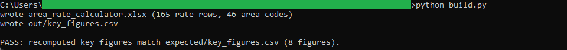
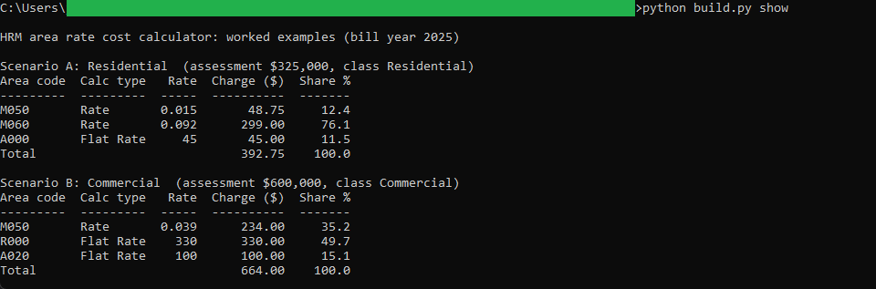
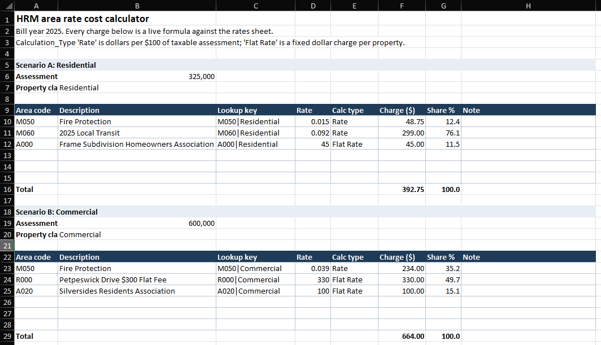

# 16: Area rate cost calculator

A live Excel workbook that stacks every applicable Halifax area rate onto one
property and returns the total. Pick an assessment, a property class, and one or
more area codes, and each charge is looked up and summed with real cell formulas.
A $325,000 Residential property carrying the Fire Protection, Local
Transit, and Frame Subdivision Homeowners area rates pays **$392.75**, of which
Local Transit alone is $299.00 (76.1 percent).

## The data

Halifax Data Mapping and Analytics Hub: **Tax Rates** (`HRM::tax-rates`, item
`a1d6cb118da642a4ae6a7b3191ae2369`) for the rate table, plus five area-rate polygon
layers (Fire Protection, Transit, Transportation, Community Facilities and
Services, Private Road) that enumerate the areas and carry the code that joins to
it. Source, licence, the join, and the per-$100 rate basis are in SOURCE.md.
(Catalog idea #24.)

The build keeps the latest bill year, **2025**: 165 rate rows over 72 codes, and 46
distinct area codes. An area's `AREARATE_CODE` equals a Tax Rates `Rate_Code`, and
a charge is looked up on that code plus the property class.

## What it computes

The workbook itself is the deliverable, and every charge is a live cell formula, no
macros and no pasted values.

- **rates** sheet: the flattened 2025 tax rates, one row per rate code and class,
  with the rate, the calculation type, and a live composite key `code|class`.
- **areas** sheet: one row per area code, with its label and the layer it came
  from.
- **calculator** sheet: two worked scenarios, each with an assessment input, a
  property class dropdown, and selectable area codes. For each code it builds the
  key, looks up the rate and calculation type with `INDEX`/`MATCH`, and computes
  the charge: the flat rate itself, or the rate times assessment over 100 for a
  per-$100 rate. The charges sum to a total, and each is shown as a share of it.

A calculation type of `Rate` is dollars per $100 of taxable assessment; `Flat Rate`
is a fixed dollar charge per property. So Local Transit at `0.092` per $100 on a
$325,000 assessment is `0.092 * 325000 / 100 = 299.00`, while the Frame Subdivision
Homeowners flat rate is a flat `45.00`. Switch the class to Commercial and the same
Fire Protection lookup returns `0.039` instead of `0.015`: the second scenario
shows a $600,000 Commercial property paying **$664.00**.

`build.py` recomputes both scenarios independently in plain Python to form the
golden. The Python charges round half-away-from-zero (`decimal.ROUND_HALF_UP`) to
mirror Excel's `ROUND`, so the workbook and the golden agree to the cent. spec.md
maps every worked-example figure to the exact cell that holds it.

## Testing

openpyxl is the only dependency:

    pip install openpyxl

From this folder:

    python build.py            # regenerate the .xlsx from the snapshots, then verify
    python build.py verify     # re-run the golden diff only
    python build.py show       # print the worked-example figures as a table

`python build.py` writes area_rate_calculator.xlsx and out/key_figures.csv, then
recomputes the worked examples in plain Python and diffs them against
expected/key_figures.csv, printing PASS on an exact match. `python build.py show`
prints the same figures as an aligned table. The golden is recomputed from the
snapshots, never read back from the workbook.

## License

MIT. Copyright (c) 2026 Kevin Yu (https://github.com/exekyute).
