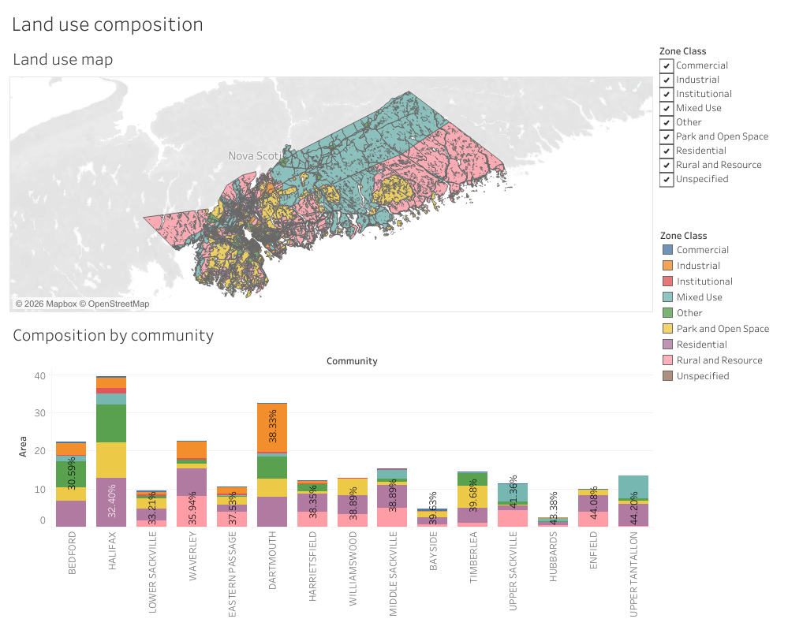
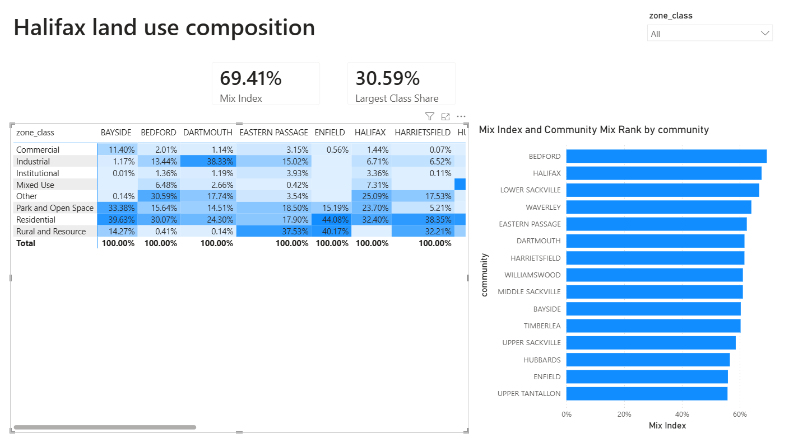

# 17: Land use composition by community

Rolls Halifax Regional Municipality's 11,076 zoning polygons up to community and
broad land use class from pinned open-data snapshots, using a spatial join. The
headline: across 182 communities and about 3,637 km2 of zoned land, Mixed Use
leads municipally at 40.20% (HRM's regional `MU` designation, which blankets the
suburban and rural fringe), ahead of Rural and Resource at 36.82% and Park and
Open Space at 14.84%. The most mixed community is Bedford, where the largest
single land use class holds only 30.59% of its zoned area across all 8 classes;
its master-planned Comprehensive Development Districts (30.59%) barely edge out
residential land (30.07%). Halifax is next at 32.40% and Lower Sackville at
33.21%.

## The data

Two layers from the Halifax Data Mapping and Analytics Hub:

- **Zoning Boundaries** (`HRM::zoning-boundaries`, item
  `11adc4e1e52a45b5b9f6bc63ef6e0883`): 11,076 land use polygons with a raw zone
  code and a plain-language description. This carries no community name.
- **Community Boundaries / General Service Areas** (`HRM::community-boundaries`,
  item `b4088a068b794436bdb4e5c31df76fe2`): 200 community polygons with
  `GSA_NAME`, supplying the geometry the "by community" rollup needs.

Both are pulled as WGS84 GeoJSON. Area is the true geodesic ground area computed
from the geometry, not the service's Web Mercator `Shape__Area`, which is
inflated about threefold at Halifax's latitude. Source, licence, pull method, and
pull date are in SOURCE.md.

## What it computes

Every step is deterministic and rule-based. All logic lives in `sql/`, named by
step; `run.py` holds none of it. The load reads both GeoJSON layers into DuckDB's
spatial engine. The transform folds each zoning polygon into one of eight broad
land use classes (Residential, Commercial, Mixed Use, Industrial, Park and Open
Space, Institutional, Rural and Resource, Other) plus Unspecified for a null zone
code, driven by keywords in the description because the raw zone code is reused
across by-laws with different meanings. It then assigns each polygon to the
community whose boundary contains the polygon's centroid, a single deterministic
point-in-polygon test. The full class mapping and the centroid join are
documented in spec.md.

The analysis computes, per community and class, the zoned area and that class's
share of the community's land; ranks the communities by a mix index (one hundred
minus the largest class share, so an evenly split community ranks high); and rolls
the same areas up to a municipal composition.

Three golden CSVs come out, each with a fixed `ORDER BY`: the per-community-class
mart (580 rows), the community mix ranking (182 rows), and the municipal
composition (9 rows). The mart is frozen to `bi/exports/` for the two BI faces,
alongside a `zoning_tagged.geojson` of all 11,076 polygons tagged with class and
community for the Tableau map.

## The two dashboards

Both dashboards read the SQL's frozen output and recompute none of the analysis,
so the same figure reads the same on either one. Full build steps for both are in
`bi/README.md`.

The **Tableau** dashboard pairs a filled zoning choropleth of all 11,076 polygons,
coloured by land use class, with a stacked bar of the fifteen most mixed
communities, whose within-community shares come from a `{FIXED}` LOD and so stay
true even when a class filter is applied. It is
[published on Tableau Public](https://public.tableau.com/views/Halifaxlandusecomposition/Landusecomposition),
and the workbook is committed as diffable XML at
`bi/tableau/land_use_composition.twb`.

The **Power BI** report, committed as a `.pbip` project in `bi/powerbi/`, carries
cards for the most mixed community, a conditional-format matrix of land use class
by community showing each class's share, and a RANKX ranking of the most mixed
communities. Bedford's largest class reads 30.59 percent in the SQL golden, on the
Tableau stacked bar, and in the Power BI matrix and cards.

## Testing

DuckDB is the only dependency, and the spatial extension it installs on first run:

    pip install duckdb

From this folder:

    python run.py            # runs the SQL end to end, then verifies
    python run.py verify     # re-runs the golden diff only
    python run.py show       # prints the municipal composition and most mixed communities

`python run.py` runs the five SQL steps, writes the mart and the two ranking
tables to `out/`, copies the mart into `bi/exports/`, writes the tagged zoning
GeoJSON, and diffs `out/` against `expected/` row for row, printing PASS on an
exact match across all three golden files. `python run.py show` prints the
municipal land use share and the fifteen most mixed communities as aligned
plain-ASCII tables. It only prints columns the SQL already produced.

<!-- screenshots: images/01-run.png images/02-show.png -->

## License

MIT. Copyright (c) 2026 Kevin Yu (https://github.com/exekyute).
