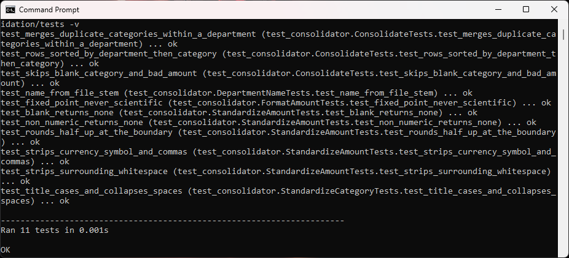
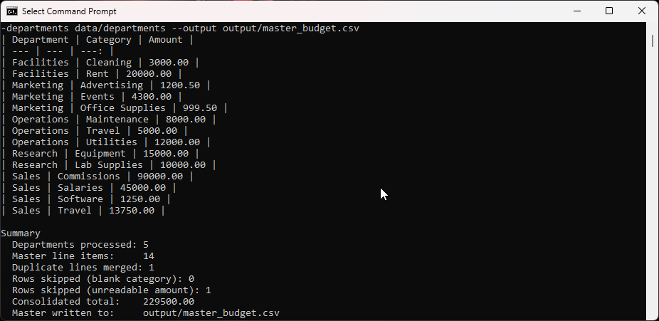
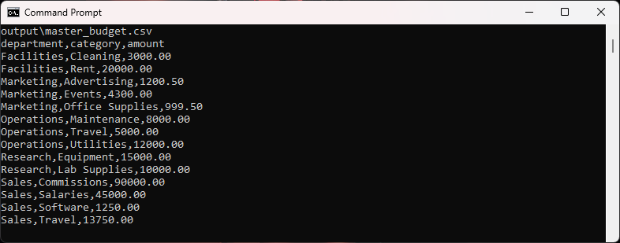
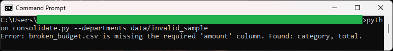

# Multi-Departmental Budget Consolidation Tool

Reads a directory of individual departmental budget sheets, standardizes their formatting, merges
duplicate line items, and writes one master corporate budget template. It cleans up dollar signs,
thousands commas, stray whitespace, and inconsistent letter casing, and it rounds every amount half
up to cents.

See [spec.md](spec.md) for the full design blueprint.

## How to run

From this tool folder:

```
python consolidate.py --departments data/departments --output output/master_budget.csv
```

The master template is written to `output/master_budget.csv`. That same file is the input to the
Variance Analysis tool.

## In action

The test suite passing. These checks cover the money math, the half-up rounding boundary, the
duplicate merge, and the skip-and-count rules:



A full consolidation run. Five departmental sheets are standardized and merged into one master
table. Notice `Operations / Travel` at `5000.00` (two raw lines summed), `Facilities / Cleaning` at
`3000.00` (rounded half up from `2,999.995`), one duplicate merged, one blank amount skipped, and a
consolidated total of `229500.00`:



The master budget file the run wrote, a clean `department,category,amount` template ready to hand to
the Variance Analysis tool:



The validation path. Pointed at a sheet whose column is named `total` instead of `amount`, the tool
refuses the file with a plain message and no traceback:



## Running the tests

From the repository root:

```
python -m unittest discover -s budget-consolidation/tests -v
```

## Files

- `consolidate.py` command-line entry point (reads the files, prints the table, writes the master CSV)
- `consolidator.py` pure standardization and merge logic
- `loader.py` CSV reading, department naming, and column validation
- `data/departments/*.csv` synthetic per-department budget sheets
- `data/invalid_sample/broken_budget.csv` a file with a missing column, for the validation demo
- `output/` where the generated master file is written
- `tests/test_consolidator.py` unittest suite
