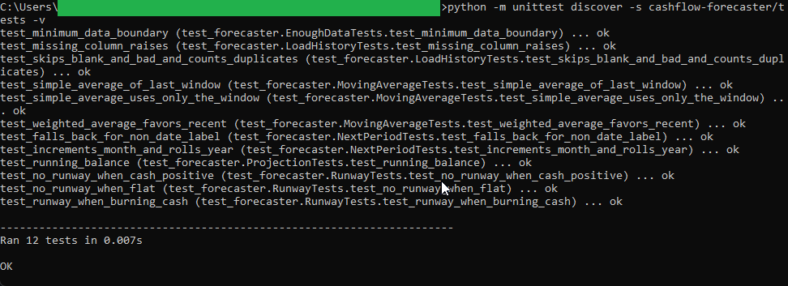
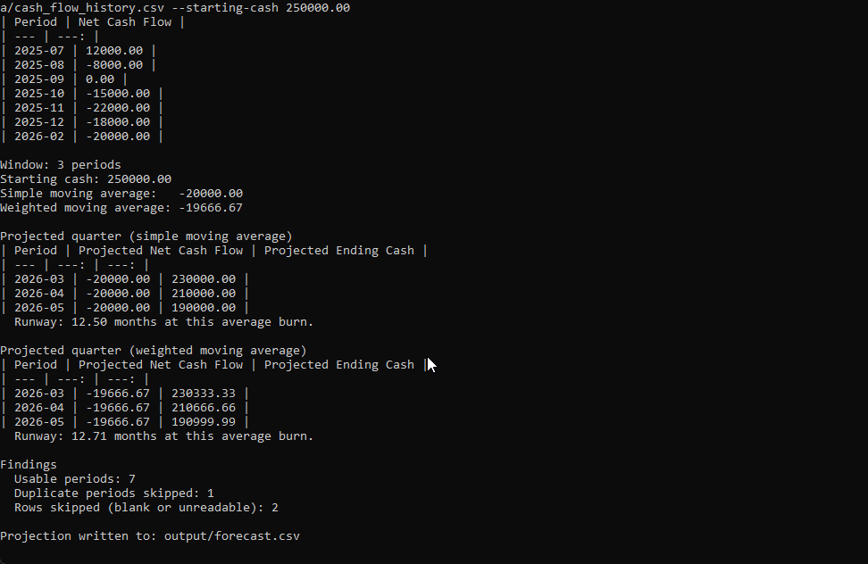
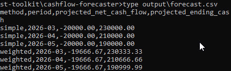
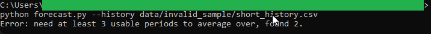

# Cash Flow Moving-Average Forecaster

Takes a history of monthly net cash flows and applies plain arithmetic moving averages to project
the upcoming quarter and estimate the cash runway in months. It computes a simple moving average
(every period weighted equally) and a weighted moving average (the most recent period weighted
heaviest), then carries each one forward across the next three periods.

See [spec.md](spec.md) for the full design blueprint.

## How to run

From this tool folder:

```
python forecast.py --history data/cash_flow_history.csv --starting-cash 250000.00
```

Change the averaging window with `--window`. The projection is written to `output/forecast.csv`.

## In action

The test suite passing. These checks cover both moving averages, the runway math, the year-boundary
period rollover, the running-balance projection, the minimum-data boundary, and the loader's
skip-and-count behavior:



A full run. The cleaned history feeds a simple and a weighted moving average. Each is carried forward
across the next quarter with a running ending-cash balance, and a runway in months. The simple
average burn of `-20000.00` gives a `12.50` month runway; the weighted average `-19666.67` gives
`12.71`, so the two methods visibly diverge. The findings line reports 7 usable periods, 1 duplicate
skipped, and 2 rows skipped:



The projection the run writes to disk, both methods side by side:



The validation path. Pointed at a history with only two usable periods, fewer than the window of
three, the tool refuses to project rather than guess:



## Running the tests

From the repository root:

```
python -m unittest discover -s cashflow-forecaster/tests -v
```

## Files

- `forecast.py` command-line entry point (reads history, prints the tables, writes the projection)
- `forecaster.py` pure moving-average, projection, and runway arithmetic
- `loader.py` CSV loading, column validation, duplicate and skip counting
- `data/cash_flow_history.csv` synthetic monthly net-cash-flow history
- `data/invalid_sample/short_history.csv` a too-short history, for the validation demo
- `output/` where the generated projection file is written
- `tests/test_forecaster.py` unittest suite
