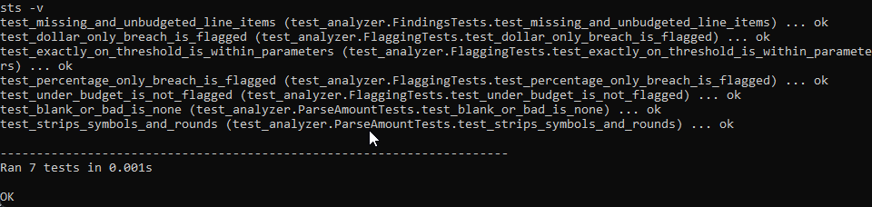
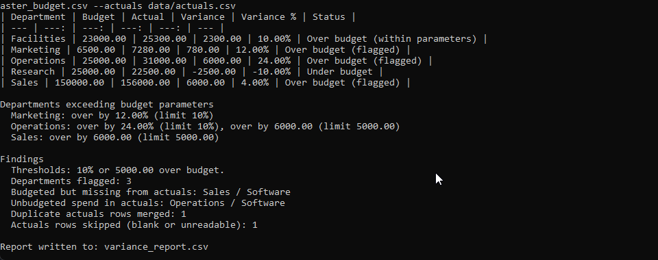
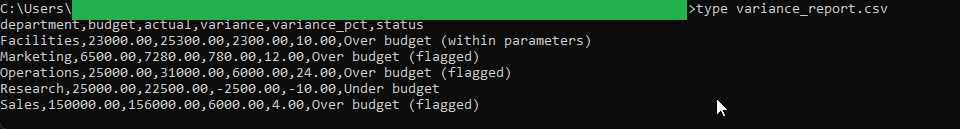
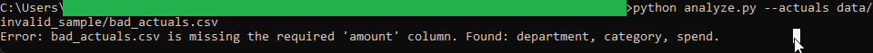

# Variance Analysis Report Writer

Compares a master budget against actual expenses, computes the variance for every department, and
writes a summary of the departments that exceed budget parameters. A department is flagged when it
goes over budget by more than a percentage limit or by more than a dollar limit, whichever trips
first. The budget file it reads is the master template produced by the
[Budget Consolidation tool](../budget-consolidation/).

See [spec.md](spec.md) for the full design blueprint.

## How to run

From this tool folder:

```
python analyze.py --budget data/master_budget.csv --actuals data/actuals.csv
```

Adjust the limits with `--pct-threshold` and `--dollar-threshold`. The report is written to
`variance_report.csv`.

## In action

The test suite passing. These checks cover the flag logic on every path: a percent-only breach, a
dollar-only breach, the exact-threshold boundary that stays within parameters, the favorable
under-budget case, and the missing and unbudgeted line-item findings:



A full run. The table compares budget against actuals for every department, and the written summary
below it lists the departments that exceed parameters with the reason for each. Facilities is exactly
10.00% over yet within parameters, Marketing trips on percentage, Sales on dollars, and Operations on
both. The findings block reports the budgeted-but-missing line item, the unbudgeted spend, one
duplicate merged, and one row skipped:



The variance report the run writes to disk, a per-department record ready to hand off:



The validation path. Pointed at an actuals file whose column is named `spend` instead of `amount`,
the tool refuses it with a plain message and no traceback:



## Running the tests

From the repository root:

```
python -m unittest discover -s variance-analysis/tests -v
```

## Files

- `analyze.py` command-line entry point (reads the files, prints the table and summary, writes the report)
- `analyzer.py` pure variance and flagging logic
- `loader.py` CSV loading, column validation, duplicate and skip counting
- `data/master_budget.csv` the master template from the consolidation tool (this tool's budget input)
- `data/actuals.csv` synthetic actual-spend file
- `data/invalid_sample/bad_actuals.csv` a file with a missing column, for the validation demo
- `tests/test_analyzer.py` unittest suite
