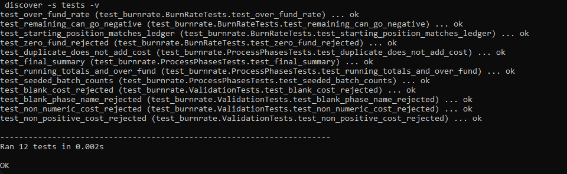
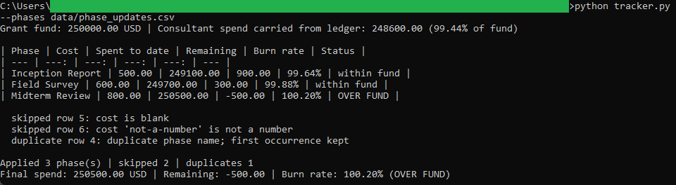
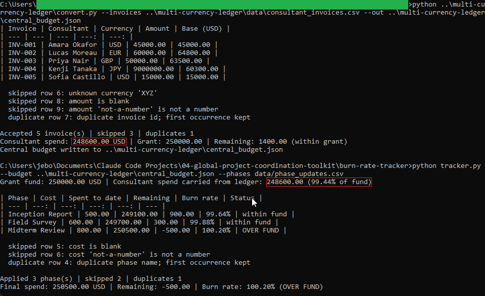
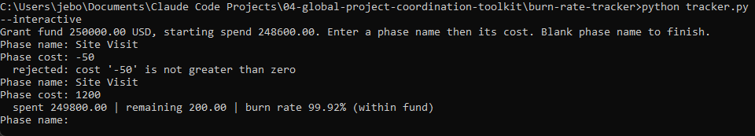

# Milestone-Driven Burn Rate Tracker

A command-line tool that reads the grant fund and consultant spend produced by the Multi-Currency
Consultant Ledger, applies project phase costs on top, and reports the running burn rate against the
fund after every phase. It answers one question at a glance: how much of the grant is left.

The grant fund and starting spend are read from the ledger's `central_budget.json`, so this tool and
the ledger always agree on the same numbers. All money math uses `decimal.Decimal` with half-up
rounding and prints as fixed-point values.

## How it works

- [`budget_source.py`](budget_source.py) reads the ledger's central budget file (grant and spend).
- [`validators.py`](validators.py) checks each phase name and cost one row at a time.
- [`burnrate.py`](burnrate.py) is the pure logic: add each cost, then compute remaining and burn rate.
- [`tracker.py`](tracker.py) is the command-line wrapper, with a batch mode and an interactive mode.

See [`spec.md`](spec.md) for the full design blueprint, including the hand-checked value that proves
this tool and the ledger agree.

## Requirements

Python 3.10 or newer. No third-party packages.

## Running the tests

From this folder:

```
python -m unittest discover -s tests -v
```

## Running the tool

Using the bundled budget snapshot and the seeded phases:

```
python tracker.py --phases data/phase_updates.csv
```

To run it against a freshly generated ledger file instead of the snapshot:

```
python tracker.py --budget ../multi-currency-ledger/central_budget.json --phases data/phase_updates.csv
```

To enter phases live, one at a time:

```
python tracker.py --interactive
```

## In action

The test suite passing:



The seeded run. Spend starts at the ledger's 248,600.00 (99.44% of the fund). Two phases stay within
fund, the third crosses it, and a duplicate phase name plus a blank and a non-numeric cost are all
rejected:



The same run reading the live ledger output instead of the snapshot, producing the identical 99.44%
starting line:



A bad cost rejected at the interactive prompt instead of throwing off the total:



All sample data in this folder is synthetic. No real project or financial information is included.
