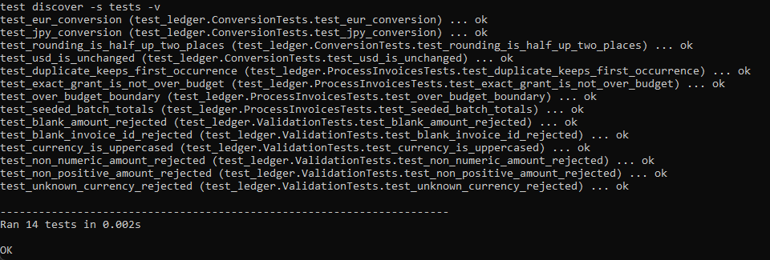
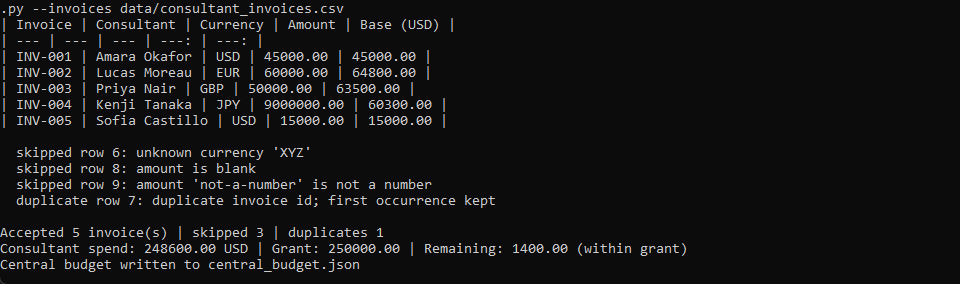
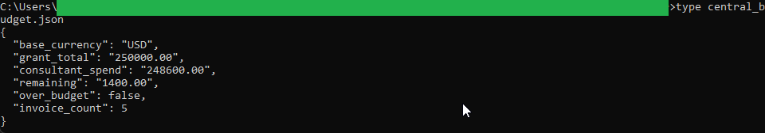
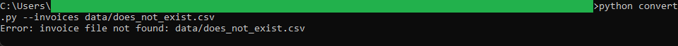

# Multi-Currency Consultant Ledger

A command-line tool that reads a log of consultant invoices submitted in different currencies,
converts each one into a single base currency, and reconciles the total against an approved grant.
It writes a central budget file that the Burn Rate Tracker reads as its starting figure.

The base currency is **USD**. Exchange rates live in a plain, editable dictionary in
[`rates.py`](rates.py), where each rate is the number of USD that one unit of a foreign currency is
worth. All money math uses `decimal.Decimal` with half-up rounding and prints as fixed-point values.

## How it works

- [`rates.py`](rates.py) holds the base currency and the editable exchange-rate dictionary.
- [`validators.py`](validators.py) checks invoice id, currency, and amount one row at a time.
- [`loader.py`](loader.py) reads the invoice CSV and confirms the required columns are present.
- [`ledger.py`](ledger.py) is the pure logic: convert, total, reconcile, and record findings.
- [`convert.py`](convert.py) is the command-line wrapper that prints the report and writes the
  central budget file.

See [`spec.md`](spec.md) for the full design blueprint.

## Requirements

Python 3.10 or newer. No third-party packages.

## Running the tests

From this folder:

```
python -m unittest discover -s tests -v
```

## Running the tool

```
python convert.py --invoices data/consultant_invoices.csv
```

This prints a table of accepted invoices, lists any skipped or duplicate rows, prints the
reconciliation summary, and writes `central_budget.json`.

To see the tool reject bad data, the seeded file already includes an invoice in currency `XYZ`, which
is not in the rate dictionary. The tool skips it, counts it, and explains why, while still processing
the valid rows.

## In action

The test suite passing:



Five invoices in four currencies converted to USD and reconciled against the 250,000.00 grant. The
ledger skips an unknown currency, a blank amount, and a non-numeric amount, flags a duplicate invoice
id, and still totals the valid rows to a 1,400.00 remaining balance:



The central budget file it writes, with every monetary value as fixed-point text, ready for the Burn
Rate Tracker to read:



A missing input file is rejected with one clear message instead of a stack trace:



All sample data in this folder is synthetic. No real consultant or financial information is included.
