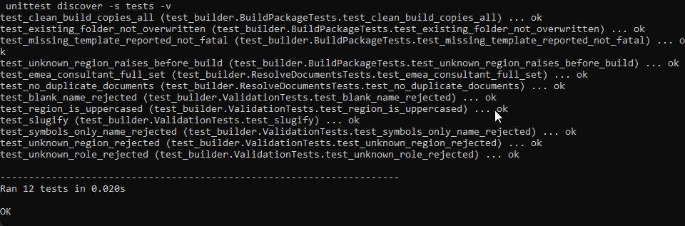
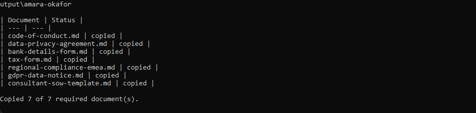
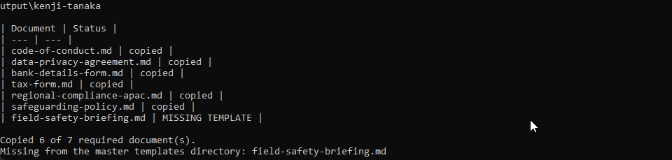
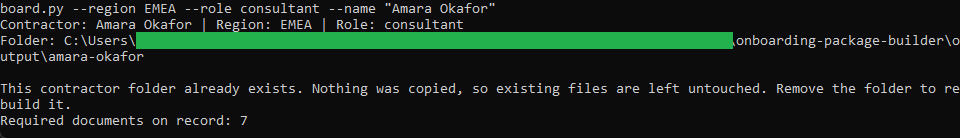
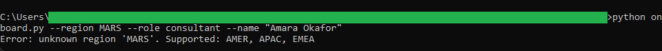

# Contractor Onboarding Package Builder

A command-line tool that builds a personalized onboarding folder for an international contractor.
Given a region and a role, it resolves the required compliance documents from editable rule tables
and copies those templates from a master directory into a vendor folder named after the contractor.

The rules are plain and editable. Every contractor receives a base set of documents, plus the
documents required for their region, plus the documents required for their role. Change what a region
or role requires by editing the lists in [`requirements.py`](requirements.py).

## How it works

- [`requirements.py`](requirements.py) holds the base, region, and role document rule tables.
- [`validators.py`](validators.py) checks the region, role, and contractor name.
- [`builder.py`](builder.py) is the pure logic: resolve the document set, then copy each template.
- [`onboard.py`](onboard.py) is the command-line wrapper, with direct arguments and a prompt mode.

See [`spec.md`](spec.md) for the full design blueprint.

## Requirements

Python 3.10 or newer. No third-party packages.

## Running the tests

From this folder:

```
python -m unittest discover -s tests -v
```

## Running the tool

Pass the region, role, and name directly:

```
python onboard.py --region EMEA --role consultant --name "Amara Okafor"
```

Or run it with no arguments to be prompted for each value:

```
python onboard.py
```

The supported regions are `AMER`, `APAC`, and `EMEA`. The supported roles are `consultant`,
`field-officer`, and `translator`. The built folder appears under `output/<contractor-slug>/`.

## In action

The test suite passing:



A clean build for an EMEA consultant. All seven required documents are copied into the vendor folder:



An APAC field officer, where one required template is deliberately absent from the master directory.
The tool reports the missing template and still copies the other six:



Re-running for a contractor whose folder already exists. Nothing is overwritten:



An unknown region rejected with the list of supported regions:



All templates and sample names in this folder are synthetic. No real contractor information is
included.
