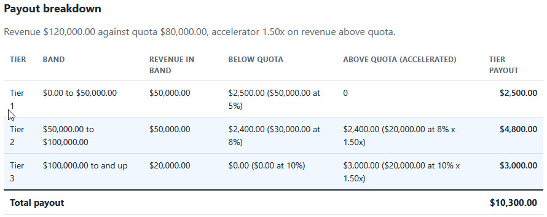
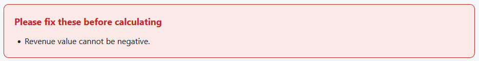
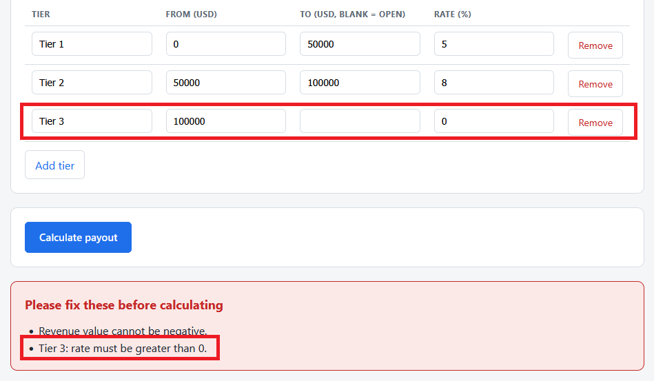

# Tiered Commission Calculator

A single page tool that turns one revenue figure and a commission plan into a
payout, then shows how much each tier contributed. Revenue is split across the
plan's marginal tiers, and the portion above quota earns its tier rate times the
plan's accelerator. Everything runs in the browser by double-clicking the HTML
file. No install, no build step, no server.

This is the first of three tools in the sales compensation toolkit. It defines
the commission plan format that the Comp Plan Rule Validator (tool 3) checks, so
the two tools agree on the same plan and the same hand-checked payout.

## What it does

- Takes a revenue figure and an editable commission plan.
- Validates both, and refuses to calculate until every problem is fixed.
- Splits revenue across marginal tiers and applies the accelerator above quota.
- Shows a per-tier breakdown and a grand total, all to the cent.

Full details are in [spec.md](spec.md).

## Requirements

A web browser. Nothing else. The tool opens by double-clicking `index.html`.

## Files

- `commission_logic.js` is the pure logic: cents math, the marginal tier and
  accelerator calculation, and the validation rules. It does no DOM work, so it
  is easy to test.
- `app.js` is the thin layer that reads the form, calls the logic, and renders
  the breakdown.
- `index.html` is the page. `styles.css` styles it.
- `tests.html` runs the logic against hand-worked numbers and prints PASS or
  FAIL on the page.
- `data/sample_plan.json` is the bundled commission plan. It is also the plan
  the Comp Plan Rule Validator approves.

## How to use it

1. Double-click `index.html` to open it in your browser.
2. It opens with the sample plan loaded and `120000` in the revenue box.
3. Click **Calculate payout** to see the breakdown and total.
4. Edit the revenue, the quota, the accelerator, or any tier and recalculate.
   Use **Load plan file** to read a different plan from a `.json` file.

To see the validation work, set a tier rate to `0` or change a tier's `from` so
the tiers no longer line up, then calculate. The tool lists the problems instead
of producing a payout.

## How to run the tests

Double-click `tests.html`. Each check compares the logic against a number worked
out by hand, including the `$10,300.00` payout described in the spec. The summary
line at the top reads `passed, failed`.

## In action

The payout breakdown for `$120,000` of revenue against the sample plan. Each
tier shows the revenue that fell in its band, the commission earned below quota,
the accelerated commission earned above quota, and the tier payout. The total
comes to `$10,300.00`.

A negative revenue is refused. The tool lists the problem instead of producing a
payout, so a bad figure never reaches a pay cycle.

The plan itself is checked too. Setting a tier rate to zero is flagged with the
exact tier and reason before any calculation runs.

## Money handling

All revenue, rate, and payout math runs in integer cents, with rates as basis
points and the accelerator as thousandths. Each tier's commission is rounded
once, and amounts are formatted with `Intl.NumberFormat`, so payouts always
print to the cent with no floating point artifacts.

## Privacy

Any plan file you load is read in your browser with the `FileReader` API. Your
data stays on your machine and is never uploaded.
