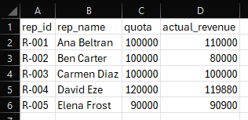
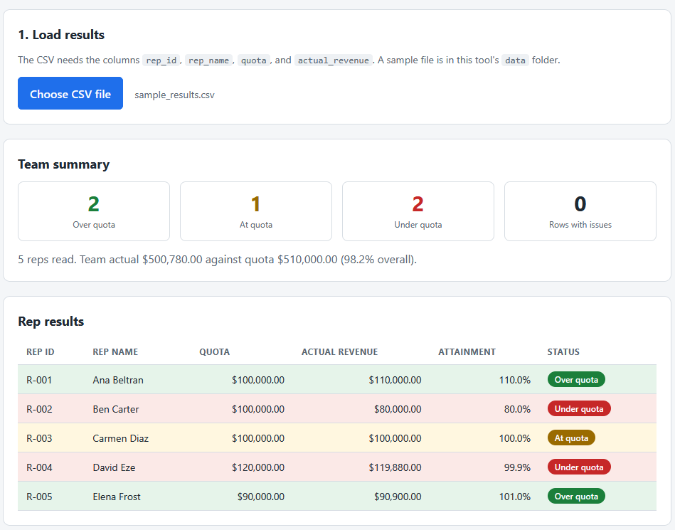
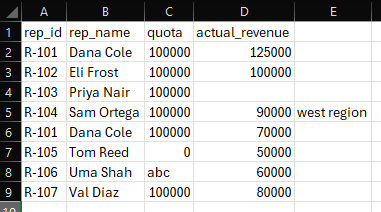
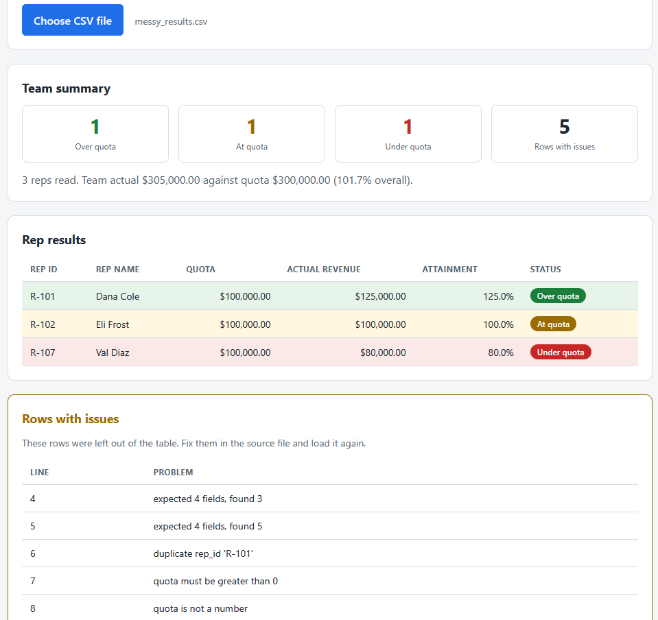

# Quota Attainment Dashboard

A single page tool that loads a CSV of rep results in the browser, checks every
row, and shows a color-coded table of who landed under, at, or over quota, with
a team summary. Rows with a problem are listed on their own so one bad row never
hides the rest. Everything runs by double-clicking the HTML file. No install, no
build step, no server.

This is the second of three tools in the sales compensation toolkit. It stands
on its own and does not depend on the other two.

## What it does

- Reads a CSV with the `FileReader` API. Your file never leaves your machine.
- Validates the header, then checks each row for missing or extra fields,
  duplicates, and bad numbers.
- Bands each rep by attainment and color codes the table.
- Summarises how many reps are over, at, and under quota across the team.

Full details are in [spec.md](spec.md).

## Requirements

A web browser. Nothing else. The tool opens by double-clicking `index.html`.

## Files

- `dashboard_logic.js` is the pure logic: the CSV parser, the row checks, the
  attainment banding, and the summary. It does no DOM work, so it is easy to test.
- `app.js` is the thin layer that reads the chosen file and renders the table,
  summary, and issues panel.
- `index.html` is the page. `styles.css` styles it.
- `tests.html` runs the logic against small CSV strings and prints PASS or FAIL.
- `data/sample_results.csv` is a clean file that lands reps under, at, and over
  quota, including the exact-100% boundary.
- `data/messy_results.csv` is a file that carries one of every row-level problem
  so a single load shows both the table and the issues panel.

## How to use it

1. Double-click `index.html` to open it in your browser.
2. Click **Choose CSV file** and pick `data/sample_results.csv`.
3. Read the team summary, then the color-coded table: green is over quota, amber
   is at quota, red is under.
4. Load `data/messy_results.csv` to see the issues panel fill with the rows that
   were rejected, each with its line number and reason.

## How to run the tests

Double-click `tests.html`. Each check runs the parser, the banding, and the row
validation against numbers worked out by hand. The summary line at the top reads
`passed, failed`.

## In action

A clean results file in the source spreadsheet. Five reps, each with a quota and
an actual revenue figure.

The same file loaded into the dashboard. The team summary counts reps over, at,
and under quota, and the table color codes each rep: green for over, amber for
exactly at quota, red for under. Carmen Diaz lands on the 100% boundary and is
banded "At quota".

A messy file in the spreadsheet, with a missing field, an extra field, a
duplicate rep, a zero quota, and a non-numeric quota.

The dashboard reading that messy file. The three valid reps still render in the
table, and the rows with problems are listed in their own panel by line number
and reason instead of breaking the report.

## CSV format

The header must contain `rep_id`, `rep_name`, `quota`, and `actual_revenue`.
Money values may include dollar signs and commas. Extra header columns are
ignored.

## Privacy

The CSV you choose is read in your browser with the `FileReader` API. Your data
stays on your machine and is never uploaded.
