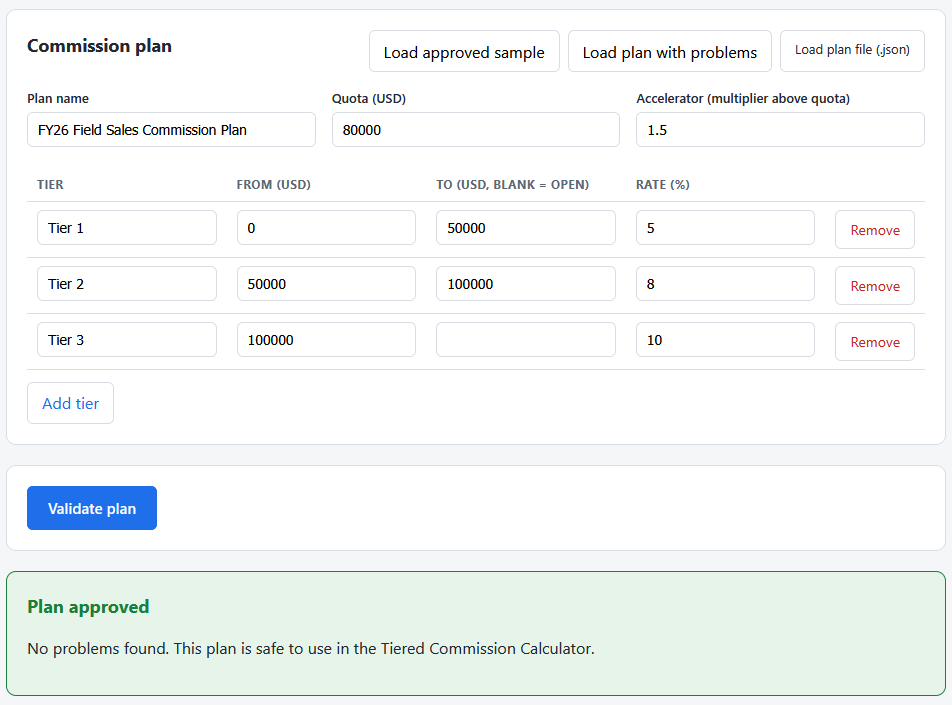
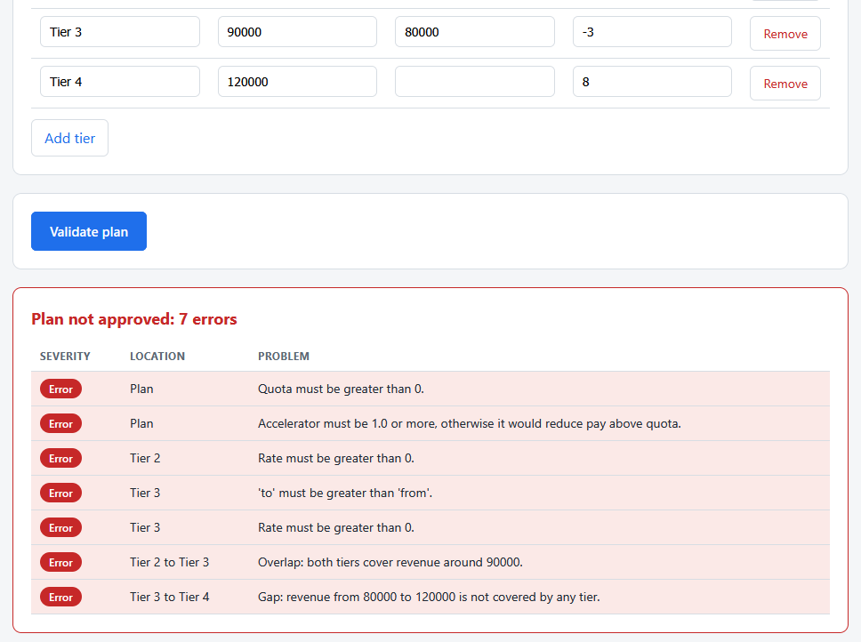

# Comp Plan Rule Validator

A single page tool that checks a commission plan before it is used for a pay
cycle. It flags gaps, overlaps, zero or negative rates, and thresholds that run
out of order, so a broken plan is caught before it reaches the calculator.
Everything runs by double-clicking the HTML file. No install, no build step, no
server.

This is the third of three tools in the sales compensation toolkit. It checks
the same plan format the Tiered Commission Calculator (tool 1) consumes, so a
plan approved here is safe to pay against there.

## What it does

- Takes a commission plan, by form, by file, or from the bundled samples.
- Runs the plan through the full set of rules.
- Shows a green banner when the plan is clean, or a findings table that names
  each problem, where it is, and why it matters.

Full details are in [spec.md](spec.md).

## Requirements

A web browser. Nothing else. The tool opens by double-clicking `index.html`.

## Files

- `validator_logic.js` is the pure logic: the full rule set. It does no DOM
  work, so it is easy to test. This is the formal home of the plan rules that
  the calculator guards against in a lighter form.
- `app.js` is the thin layer that reads the plan and renders the findings.
- `index.html` is the page. `styles.css` styles it.
- `tests.html` runs the rules against hand-worked plans and prints PASS or FAIL.
- `data/sample_plan.json` is the approved plan. It is the same plan the Tiered
  Commission Calculator ships.
- `data/broken_plan.json` is a plan that trips one of every flag.

## How to use it

1. Double-click `index.html` to open it in your browser.
2. It opens with the approved sample loaded. Click **Validate plan** to see the
   green approval.
3. Click **Load plan with problems**, then **Validate plan**, to see the
   findings table fill with one of every flag.
4. Edit any field, or use **Load plan file** to check a plan from a `.json`
   file.

## How to run the tests

Double-click `tests.html`. Each check runs the rules against a plan worked out
by hand, including the approved sample and the broken sample. The summary line
at the top reads `passed, failed`.

## In action

The approved sample plan. Quota, accelerator, and three tiers that run in order
with no gap or overlap. The validator clears it with a green banner, confirming
it is safe to use in the calculator.

The bundled plan with problems. A single check surfaces seven errors at once: a
zero quota, an accelerator below 1.0, a zero rate, a negative rate, a threshold
that runs out of order, an overlap, and a gap. Each is named with its location.

## How it connects to the calculator

`data/sample_plan.json` here is byte for byte the plan the Tiered Commission
Calculator ships. This tool approves it, and that tool pays revenue of
`$120,000` against it as exactly `$10,300.00`. Validating a plan here and
calculating with it there are two views of the same agreed plan.

## Privacy

Any plan file you load is read in your browser with the `FileReader` API. Your
data stays on your machine and is never uploaded.
