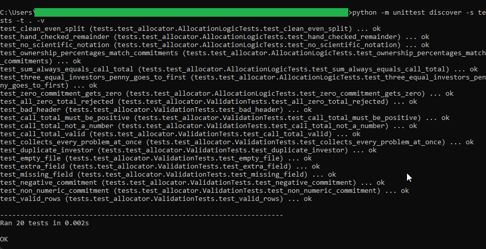
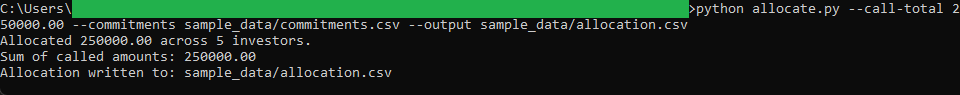
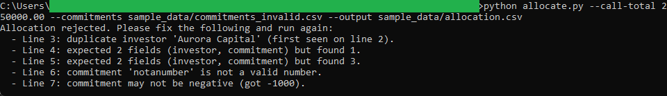

# Capital Call Allocator

A small command-line tool that splits a fund's capital call across its investors
in proportion to their commitments. It rounds each investor's share to whole
cents and then reconciles the leftover pennies so the per-investor amounts add up
to the call total exactly. The result is written as a per-investor allocation CSV
that the Investor Allocation Dashboard can load.

Written in Python with the standard library only. No third-party packages, no
network access, no build step.

## How it is organised

The code is split so each part has one job and can be read on its own:

- `allocator_logic.py` holds the calculation. It works in whole cents with
  `decimal.Decimal` and the largest-remainder method, and never touches files or
  the screen.
- `allocator_validation.py` holds the input checks. It collects every problem it
  finds and returns plain-language messages.
- `allocate.py` is the thin command-line wrapper. It reads the commitments CSV,
  runs validation, calls the logic, and writes the allocation CSV.
- `tests/test_allocator.py` is the unit-test suite.
- `sample_data/` holds a valid commitments file, a deliberately broken one, and
  the allocation file produced from the valid run.

See `spec.md` for the full input, validation, logic, and output details, plus a
hand-checked worked example.

## Requirements

Python 3.8 or newer. Nothing else to install.

## Usage

From inside the `capital-call-allocator` folder:

```
python allocate.py --call-total 250000.00 --commitments sample_data/commitments.csv --output sample_data/allocation.csv
```

This reads the five sample investors, allocates a 250,000.00 call, and writes
`sample_data/allocation.csv`. The output columns are
`investor,commitment,ownership_pct,called_amount`.

## Running the tests

From inside the `capital-call-allocator` folder:

```
python -m unittest discover -s tests -t . -v
```

The suite checks the clean split, the penny reconciliation, a zero-commitment
investor, that the called amounts always sum to the call total, and that every
validation rule rejects bad input.

## Trying the validation

Run the tool against the broken sample to see it reject bad data and write
nothing:

```
python allocate.py --call-total 250000.00 --commitments sample_data/commitments_invalid.csv --output sample_data/allocation.csv
```

It prints a numbered list of the problems (duplicate investor, missing field,
extra field, non-numeric commitment, negative commitment) and exits without
producing an allocation file.

## In action

The unit-test suite, all 20 tests passing:



A real allocation run. The five sample investors receive a 250,000.00 call and
the called amounts sum to 250,000.00 exactly:



The same tool refusing a broken file. It lists every problem at once and writes
no output:


