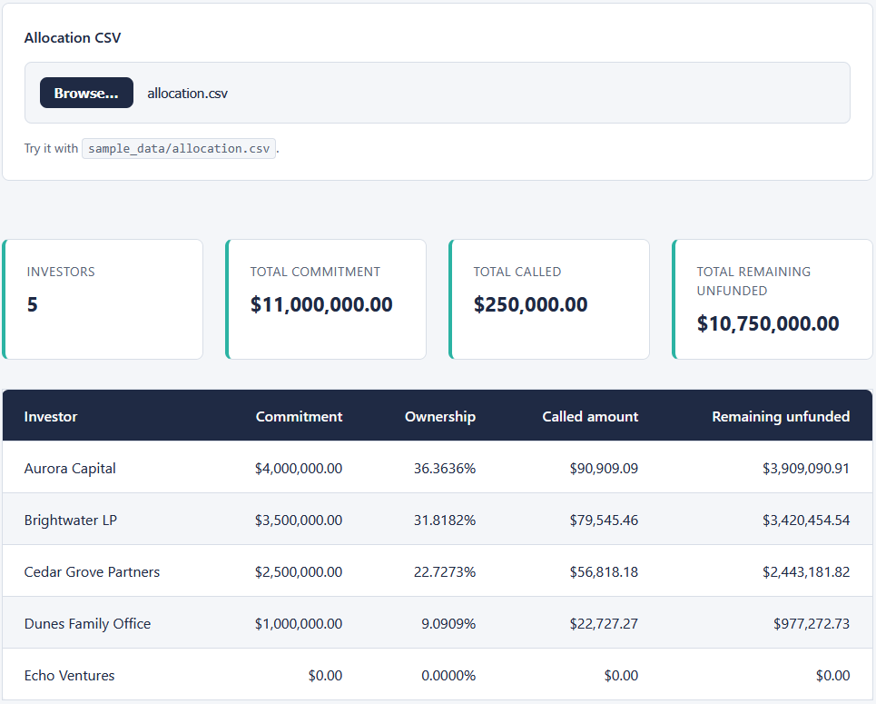
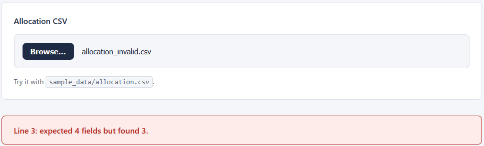

# Investor Allocation Dashboard

A single-page browser tool that loads an allocation CSV from the Capital Call
Allocator and shows each investor's commitment, ownership percentage, called
amount, and remaining unfunded commitment, with a fund-level summary line. The
file is read in the browser with the `FileReader` API and is never uploaded.

Plain HTML, CSS, and vanilla JavaScript. No server, no framework, no build step.
It opens by double-clicking `index.html`.

## How it is organised

- `allocation-logic.js` holds the pure logic: parsing the CSV, converting dollars
  to whole cents, computing ownership, remaining, and totals, and formatting for
  display. It does not touch the page, so it can be tested on its own.
- `dashboard.js` is the thin wiring. It reads the chosen file with `FileReader`
  and puts the results into the table and summary.
- `index.html` holds the markup; `styles.css` holds all of the styling.
- `tests.html` runs the pure logic against assertions and prints PASS or FAIL
  rows on the page.
- `sample_data/` holds the allocation file from the allocator and a deliberately
  broken file for trying the validation.

See `spec.md` for the full input, validation, logic, and output details, plus the
hand-checked example shared with the allocator.

## Money handling

Every dollar amount is converted to whole cents on the way in, all arithmetic is
done in cents, and amounts are formatted back to dollars with `Intl.NumberFormat`
only for display. This keeps the totals exact and free of floating-point
artifacts.

## How to open it

Double-click `index.html`. Click "Choose File" and pick
`sample_data/allocation.csv`. The table and summary appear immediately. The
total called matches the capital call exactly.

## Running the tests

Double-click `tests.html`. Each check prints PASS or FAIL on the page, with a
green banner reading "15 passed, 0 failed" when everything is in order. No tools
to install.

## Trying the validation

In `index.html`, choose `sample_data/allocation_invalid.csv`. That file has a row
missing a field, so the page shows a plain message naming the bad line and keeps
the table hidden.

## In action

The dashboard with the sample allocation loaded. The summary totals reconcile,
and the total called matches the capital call exactly at 250,000.00:

The dashboard refusing a malformed file. It names the bad line and leaves the
table hidden:

