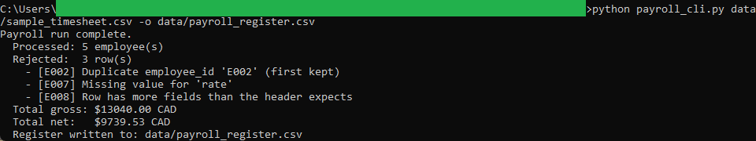
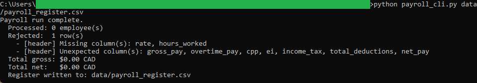

# Payroll Run Calculator

A Python command-line tool that reads a timesheet CSV and computes Canadian
gross-to-net pay for hourly and salaried employees, then writes a per-employee
payroll register CSV. It handles overtime, pre-tax deductions, CPP, EI, flat
income tax withholding, and post-tax deductions, and it reports any rows that
fail validation instead of guessing.

This is the first of two tools in the toolkit. Its register CSV is the input for
the companion Net Pay Dashboard.

## What it does
- Reads a timesheet CSV with hourly and salaried employees.
- Computes gross pay, applying overtime past the weekly threshold at the
  configured multiplier.
- Applies CPP and EI as rate-based deductions with a per-period basic exemption
  and per-period maximum, prorated from annual figures.
- Applies a flat combined federal and provincial income tax rate on taxable pay.
- Subtracts pre-tax and post-tax deductions in the correct order.
- Writes a payroll register CSV and prints a run summary with rejected rows.

All money math uses `decimal.Decimal` with ROUND_HALF_UP, and amounts are printed
as fixed-point values, never scientific notation.

## Design
The code keeps three concerns in separate files:

- `payroll_logic.py`: pure calculation functions and the `PayrollConfig`
  constants. No file or console input or output.
- `payroll_validation.py`: row and header checks that return readable error
  messages rather than raising.
- `payroll_cli.py`: a thin wrapper that reads the CSV, orchestrates the run, and
  writes the register.

See [spec.md](spec.md) for the full input, validation, logic, and output rules,
including a hand-checked example.

## Requirements
Python 3 standard library only. No packages to install.

## Usage
From this tool's folder:

```
python payroll_cli.py data/sample_timesheet.csv -o data/payroll_register.csv
```

Configuration flags (all optional):

```
--overtime-threshold 44     weekly hours before overtime (Ontario ESA default)
--overtime-multiplier 1.5   overtime pay multiplier
--income-tax-rate 0.20      flat combined federal and provincial rate
--pay-periods 26            pay periods per year for CPP and EI proration
```

## Tests
From this tool's folder:

```
python -m unittest discover -s tests
```

## In action

A single run on the sample timesheet. Five employees are processed and three
rows are rejected: a duplicate employee id, a missing field, and a row with an
extra field. The run prints total gross and total net in CAD.



The header check runs before any money is calculated. Pointing the tool at a
file with the wrong columns is refused with the exact missing and unexpected
columns named, and zero rows are processed.



## Defaults and scope
Defaults use 2024 federal CRA figures for employees outside Quebec, with an
Ontario overtime threshold. Provincial overtime rules and tax rates differ, so
the thresholds and rates are configurable. The income tax rate is a single flat
rate for clear, reproducible output rather than a bracketed calculation.
