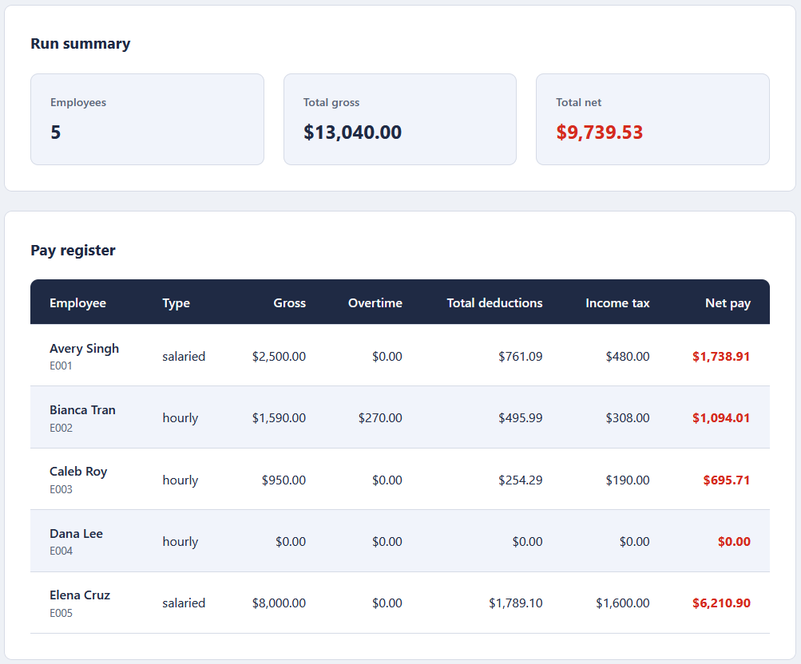
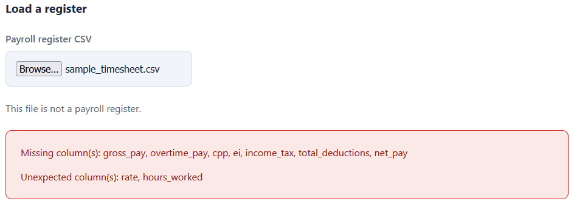

# Net Pay Dashboard

A single-page browser tool that loads a payroll register CSV and shows each
employee's pay alongside the run totals. It reads the file in your browser with
the FileReader API, so the data never leaves the page. No server, no build step,
no install.

This is the second of two tools in the toolkit. It reads the register CSV
produced by the Payroll Run Calculator.

## What it does
- Loads a payroll register CSV chosen from your computer.
- Shows a table of each employee's gross, overtime, total deductions, income
  tax, and net pay.
- Shows a run summary with the employee count, total gross, and total net.
- Checks the file before rendering, and lists any header problem or skipped row.

Money is handled as integer cents and formatted with `Intl.NumberFormat` for
Canadian dollars, so amounts never show floating-point artifacts.

## Design
The code keeps three concerns in separate files:

- `dashboard_logic.js`: pure functions for parsing, validation, summing, and
  formatting. No DOM access.
- `app.js`: a thin layer that reads the file and updates the page.
- `index.html` and `styles.css`: markup and styling.

See [spec.md](spec.md) for the full input, validation, logic, and output rules,
including a hand-checked example.

## Usage
Double-click `index.html` to open it in your browser. Choose a payroll register
CSV, such as the bundled `data/payroll_register.csv`, and the table and summary
appear. To see the file check at work, load any CSV that is not a register and
the tool names the missing columns instead of rendering.

## Tests
Double-click `tests.html` to open it in your browser. It runs the logic
assertions and prints PASS or FAIL for each, with a final tally. No tooling
required.

## In action

Loading the payroll register shows the run summary and a row per employee, with
gross, overtime, total deductions, income tax, and net pay. Total gross and
total net match the calculator to the cent.

The file is checked before anything is rendered. Loading a timesheet, which has
the wrong columns for a register, is refused with the missing and unexpected
columns named.

## Styling
A two-tone palette, one deep slate base plus one Canadian red accent, defined as
CSS variables, with a single 8px spacing scale reused across every margin,
padding, and gap.
