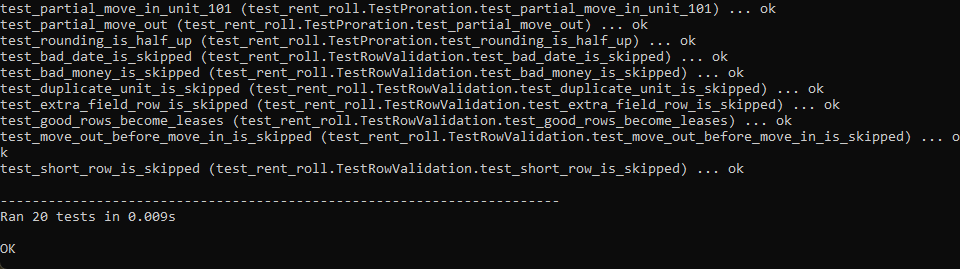
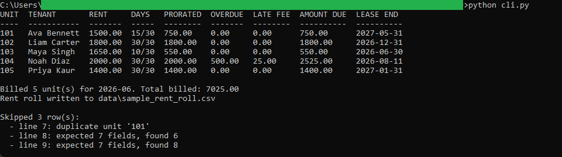
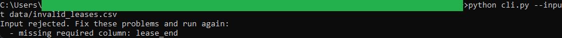

# Rent Roll and Proration Calculator

A Python command-line tool that reads a CSV of leases and produces a per-unit rent
roll for one billing month. It prorates rent for partial-month move-ins and
move-outs by counting the actual occupied days against the actual days in the month,
applies a late fee to any overdue balance, totals what each unit owes, and writes the
result to a rent roll CSV. The companion browser tool in this repository loads that
CSV.

Standard library only. No third-party packages, no network, no database.

## What it does

- Prorates partial-month rent by actual occupied days over the actual days in the
  billing month, so a 30-day month and a 28-day month are each handled on their own
  terms.
- Applies a configurable late fee to overdue balances.
- Totals the amount due per unit and the total billed across the roll.
- Carries each lease end date through so expirations can be flagged downstream.
- Validates the input: a missing required column stops the run, while a single bad
  row is skipped and reported by line number so the rest of the roll still builds.

## Files

- `rent_roll_logic.py` is the pure money and date math. It takes typed values and
  returns values, with no file or console access.
- `rent_roll_validation.py` checks the header and each row and turns good rows into
  typed lease records.
- `cli.py` is the thin command-line wrapper that reads the CSV, prints the table, and
  writes the output.
- `test_rent_roll.py` is the unittest suite over the logic and the validation.
- `data/sample_leases.csv` is the sample input. `data/invalid_leases.csv` is a file
  with a missing column, for demonstrating rejection. `data/sample_rent_roll.csv` is
  the output a default run produces.

## Running it

From inside this folder:

```
python cli.py
```

That reads `data/sample_leases.csv`, prints the rent roll for June 2026, and writes
`data/sample_rent_roll.csv`.

Options:

```
python cli.py --month 2026-06 --late-fee-rate 0.05
python cli.py --input data/sample_leases.csv --output data/sample_rent_roll.csv
python cli.py --input data/invalid_leases.csv
```

## Running the tests

```
python -m unittest -v
```

The suite checks the proration math (full month, partial move-in, partial move-out,
boundary dates, rounding), the late fee, the amount due, and the header and row
validation.

## Worked example

Unit 101 has a monthly rent of `1500.00` and a move-in date of `2026-06-16`. June
2026 has 30 days, and the 16th through the 30th is 15 occupied days. The prorated
rent is `1500.00 * 15 / 30 = 750.00`. The dashboard in this repository reads the same
`750.00` from the rent roll CSV, so the two tools agree to the cent.

See `spec.md` for the full input, validation, logic, output, and edge case detail.

## In action



Running `python -m unittest -v`. All 20 checks pass, covering the proration math,
the late fee, the amount due, and the header and row validation.



Running `python cli.py` on the sample. Unit 101 prorates to 750.00 for its
mid-month move-in, Unit 104 adds a 25.00 late fee on its 500.00 overdue balance, the
total billed is 7025.00, and the three bad rows are reported as skipped.



Running `python cli.py --input data/invalid_leases.csv`. The file is missing the
`lease_end` column, so the whole file is refused with a named reason instead of
producing a partial roll.

## License

Released under the MIT License. See the `LICENSE` file at the root of this
repository. Copyright (c) 2026 Kevin Yu (https://github.com/exekyute).
