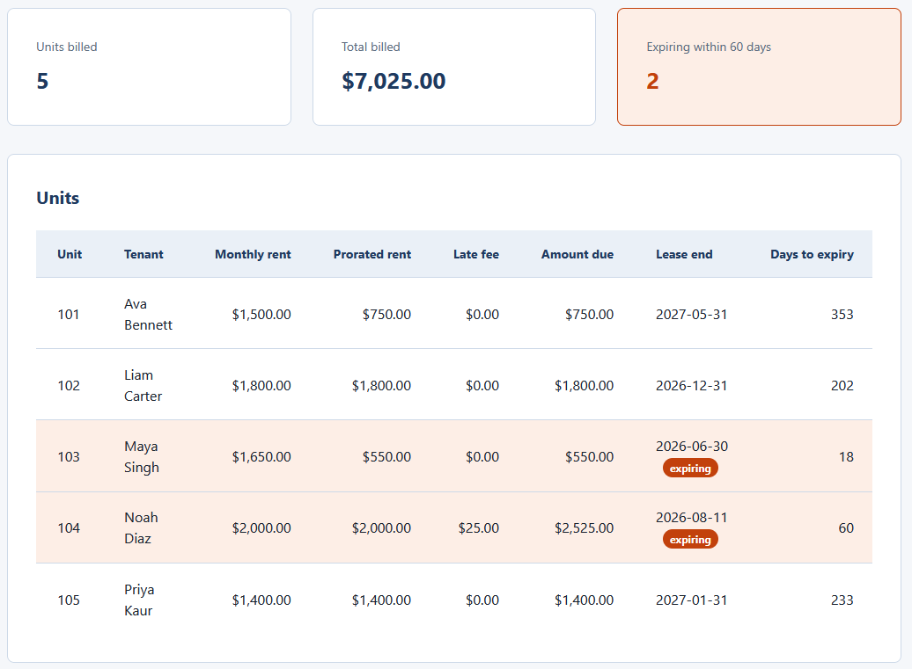
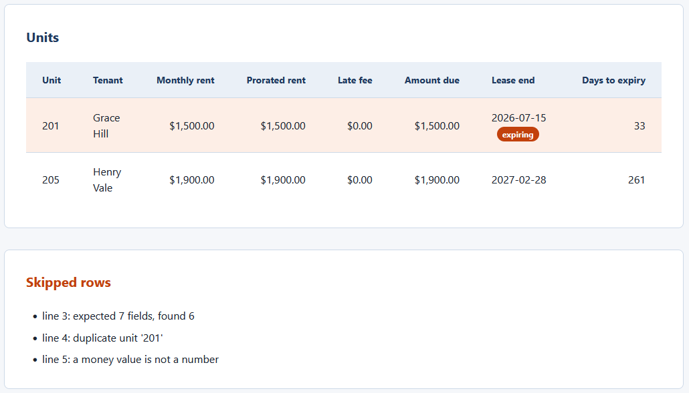

# Lease and Rent Roll Dashboard

A single-page browser tool that loads a rent roll CSV and shows what every unit owes
this month, along with which leases are due for renewal. It reads the file in your
browser with the `FileReader` API, so nothing is uploaded or sent anywhere. This
dashboard reads the CSV produced by the `01-rent-roll-proration-calculator` tool in
this repository.

Plain HTML, CSS, and vanilla JavaScript. No framework, no build step, no server. It
opens by double-clicking `index.html`.

## What it does

- Reads a rent roll CSV and renders a per-unit table of monthly rent, prorated rent,
  late fee, amount due, lease end, and days to expiry.
- Totals the amount billed across the units.
- Flags every lease ending within a window you choose, against an as-of date you set.
- Validates the file: a missing required column stops the load, while a single bad
  row is skipped and listed in an issues panel by line number so the rest still shows.

## Files

- `index.html` is the page markup.
- `styles.css` is the styling, built on a two-tone palette and an 8px spacing scale.
- `dashboard_logic.js` is the pure logic: CSV parsing, money in integer cents, date
  math, validation, and the summary. It has no access to the page.
- `app.js` is the thin wiring that reads the file and puts the results on the page.
- `tests.html` runs the pure logic against hand-worked numbers and prints PASS or FAIL
  on the page.
- `data/sample_rent_roll.csv` is the clean sample. `data/messy_rent_roll.csv` carries
  one of every row-level problem. `data/invalid_rent_roll.csv` is missing a required
  column, for demonstrating rejection.

## Running it

Double-click `index.html` to open it in your browser. Click the file picker and choose
`data/sample_rent_roll.csv`. The table, the summary, and any flags appear at once.

Change the **As of date** or the **Expiry window** to see the renewal flags update
without reloading the file.

## Running the tests

Double-click `tests.html`. It checks the money parsing and formatting, the date and
day math, the expiry boundary, the hand-checked Unit 101 figure, the summary totals,
and both the whole-file and row-level validation. You want to see PASS on every line
and a green count at the top.

## Worked example

The calculator prorates Unit 101 to `750.00` for a `2026-06-16` move-in. Loading the
rent roll here, Unit 101 shows a prorated rent of `$750.00` and the summary totals the
billed amount to `$7,025.00`, the same figures the calculator printed, so the two
tools agree to the cent. With the default as-of date of `2026-06-12` and a 60-day
window, Unit 103 (ending `2026-06-30`) and Unit 104 (ending `2026-08-11`, exactly 60
days out) are both flagged for renewal.

See `spec.md` for the full input, validation, logic, output, and edge case detail.

## In action

Loading `data/sample_rent_roll.csv`. The summary shows five units billed, a total of
$7,025.00, and two leases expiring within 60 days. Unit 101 reads $750.00 of prorated
rent, matching the calculator, and Units 103 and 104 carry the orange expiring badge.

Loading `data/messy_rent_roll.csv`. Two valid units still fill the table while the
Skipped rows panel lists the three rejected rows by line number: a bad field count, a
duplicate unit, and a non-numeric money value.

## Privacy

The dashboard runs entirely in your browser. The file you choose is read with the
`FileReader` API and stays on your machine.

## License

Released under the MIT License. See the `LICENSE` file at the root of this
repository. Copyright (c) 2026 Kevin Yu (https://github.com/exekyute).
