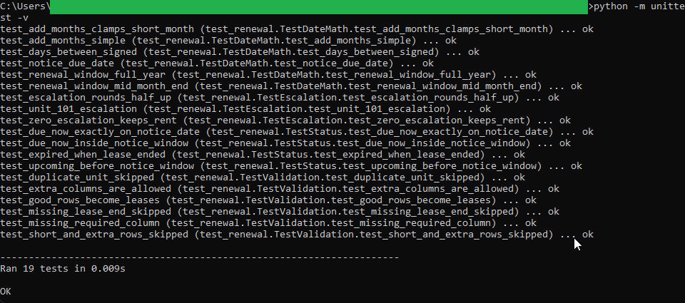
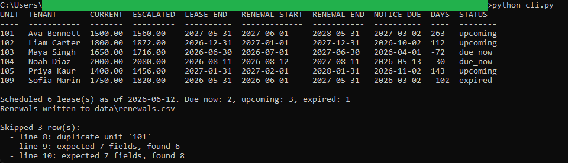
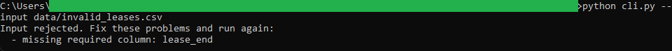

# Lease Renewal and Escalation Scheduler

A Python command-line tool that reads a CSV of leases and produces a renewal schedule
for a reference date. For each lease it works out the next term's start and end, the
escalated rent for that term, and the date a renewal notice is due, then marks the
lease as due now, upcoming, or expired. It writes the schedule to a renewals CSV. The
companion browser tool in this repository loads that CSV.

Standard library only. No third-party packages, no network, no database.

## What it does

- Computes the next lease term from the current lease end and a term length, clamping
  month-ends so a term never rolls past the end of a short month.
- Applies a configurable escalation rate to the current rent for the next term.
- Computes the notice due date and how many days remain until it.
- Classifies each lease as due now, upcoming, or expired against a reference date.
- Validates the input: a missing required column stops the run, while a single bad row
  is skipped and reported by line number.

## Files

- `renewal_logic.py` is the pure date and money math. It takes typed values and
  returns values, with no file or console access.
- `renewal_validation.py` checks the header and each row and turns good rows into
  typed lease records.
- `cli.py` is the thin command-line wrapper that reads the CSV, prints the table, and
  writes the output.
- `test_renewal.py` is the unittest suite over the logic and the validation.
- `data/sample_leases.csv` is the sample input. `data/invalid_leases.csv` is a file
  with a missing column, for demonstrating rejection. `data/renewals.csv` is the
  output a default run produces.

## Running it

From inside this folder:

```
python cli.py
```

That reads `data/sample_leases.csv`, prints the renewal schedule as of 2026-06-12, and
writes `data/renewals.csv`.

Options:

```
python cli.py --as-of 2026-06-12 --notice-days 90 --escalation-rate 0.04
python cli.py --term-months 12 --output data/renewals.csv
python cli.py --input data/invalid_leases.csv
```

## Running the tests

```
python -m unittest -v
```

The suite checks the escalation rounding, the month-end clamp, the renewal window, the
notice date math, the due now and upcoming and expired classification, and the header
and row validation.

## Worked example

Unit 101 has a current rent of `1500.00`. With the default escalation rate of 4
percent, the next term's rent is `1500.00 * 1.04 = 1560.00`. The renewal tracker in
this repository reads the same `1560.00` from the renewals CSV, so the two tools agree
to the cent. Its lease ends `2027-05-31`, so the next term runs `2027-06-01` through
`2028-05-31`, and with a 90-day notice window its notice is not due until `2027-03-02`,
marking it `upcoming` as of `2026-06-12`.

See `spec.md` for the full input, validation, logic, output, and edge case detail.

## In action



Running `python -m unittest -v`. All 19 checks pass, covering the escalation rounding,
the month-end clamp, the renewal window, the notice date math, the status
classification, and the header and row validation.



Running `python cli.py` on the sample. Unit 101 escalates from 1500.00 to 1560.00 with
a next term of 2027-06-01 to 2028-05-31. The schedule shows all three statuses (two due
now, three upcoming, one expired), and the three bad rows are reported as skipped.



Running `python cli.py --input data/invalid_leases.csv`. The file is missing the
`lease_end` column, so the whole file is refused with a named reason.

## License

Released under the MIT License. See the `LICENSE` file at the root of this
repository. Copyright (c) 2026 Kevin Yu (https://github.com/exekyute).
