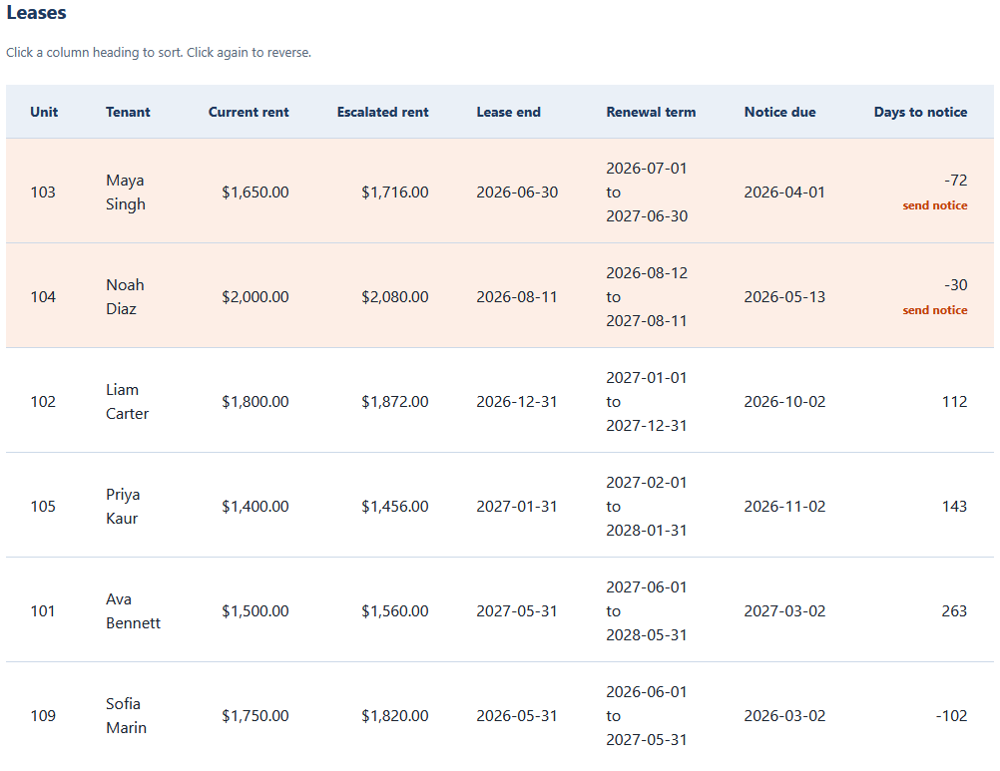
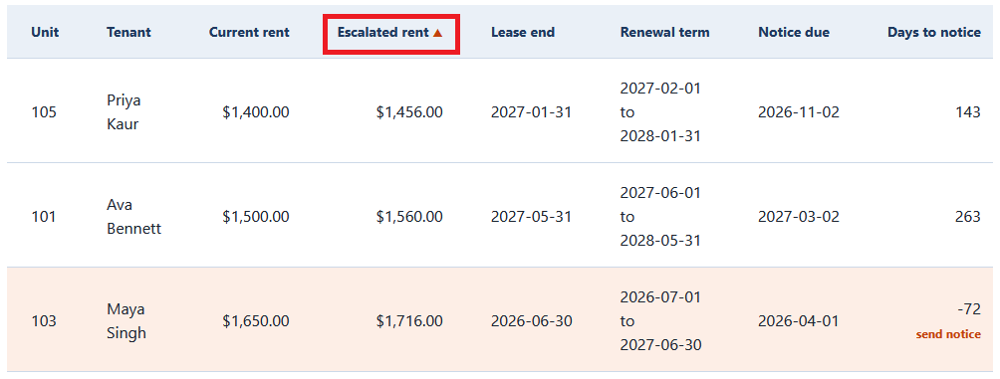
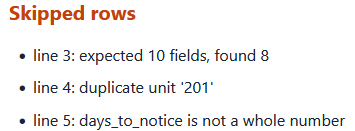
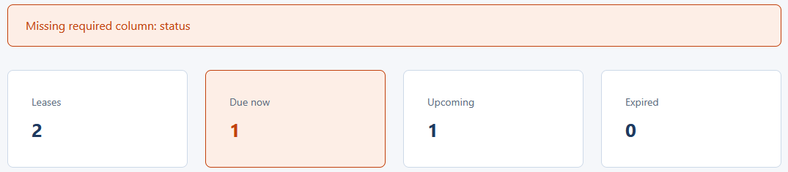

# Renewal Pipeline Tracker

A single-page browser tool that loads a renewals CSV and shows the renewal pipeline at
a glance, grouped by status and sortable so the most urgent leases come first. It reads
the file in your browser with the `FileReader` API, so nothing is uploaded or sent
anywhere. This tracker reads the CSV produced by the
`03-lease-renewal-escalation-scheduler` tool in this repository.

Plain HTML, CSS, and vanilla JavaScript. No framework, no build step, no server. It
opens by double-clicking `index.html`.

## What it does

- Reads a renewals CSV and renders a per-lease table of current and escalated rent,
  the renewal term, the notice due date, days to notice, and status.
- Counts the leases that are due now, upcoming, and expired.
- Orders the table by urgency by default, and lets you sort by any key column by
  clicking its heading. Clicking the same heading again reverses the direction.
- Validates the file: a missing required column stops the load, while a single bad row
  is skipped and listed in an issues panel by line number.

## Files

- `index.html` is the page markup.
- `styles.css` is the styling, built on a two-tone palette and an 8px spacing scale.
- `tracker_logic.js` is the pure logic: CSV parsing, money in integer cents, the status
  counts, and the sort. It has no access to the page.
- `app.js` is the thin wiring that reads the file, handles heading clicks, and renders.
- `tests.html` runs the pure logic against hand-worked numbers and prints PASS or FAIL
  on the page.
- `data/renewals.csv` is the clean sample. `data/messy_renewals.csv` carries one of
  every row-level problem. `data/invalid_renewals.csv` is missing a required column,
  for demonstrating rejection.

## Running it

Double-click `index.html` to open it in your browser. Click the file picker and choose
`data/renewals.csv`. The summary and the table appear at once, ordered by urgency.

Click any underlined column heading to sort by it, and click again to reverse.

## Running the tests

Double-click `tests.html`. It checks the money parsing and formatting, the whole-number
and date validation, the status counts, the default urgency order, sorting by several
columns in both directions, the hand-checked Unit 101 figure, and both the whole-file
and row-level validation. You want PASS on every line and a green count at the top.

## Worked example

The scheduler escalates Unit 101 from `1500.00` to `1560.00`. Loading the renewals here,
Unit 101 shows an escalated rent of `$1,560.00`, the same figure, so the two tools agree
to the cent. By default the two due now leases lead the table, with Unit 103 (its notice
72 days overdue) ahead of Unit 104 (30 days overdue). Sorting by escalated rent
ascending instead leads with Unit 105 at `$1,456.00`.

See `spec.md` for the full input, validation, logic, output, and edge case detail.

## In action

Loading `data/renewals.csv`. The summary counts six leases (two due now, three
upcoming, one expired). The table opens in urgency order, so the two due now leases
lead with a send notice flag, Unit 103 ahead of Unit 104 because its notice is more
overdue.

Clicking the Escalated rent heading sorts the table ascending, with an arrow marking
the active column. Unit 105 leads at $1,456.00. Clicking again reverses it.

Loading `data/messy_renewals.csv`. Two valid leases still fill the table while the
Skipped rows panel lists the three rejected rows by line number.

Loading `data/invalid_renewals.csv`. The file is missing the `status` column, so it is
refused with a named reason and no table.

## Privacy

The tracker runs entirely in your browser. The file you choose is read with the
`FileReader` API and stays on your machine.

## License

Released under the MIT License. See the `LICENSE` file at the root of this
repository. Copyright (c) 2026 Kevin Yu (https://github.com/exekyute).
