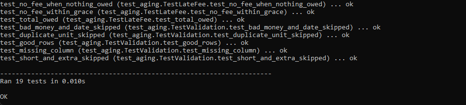
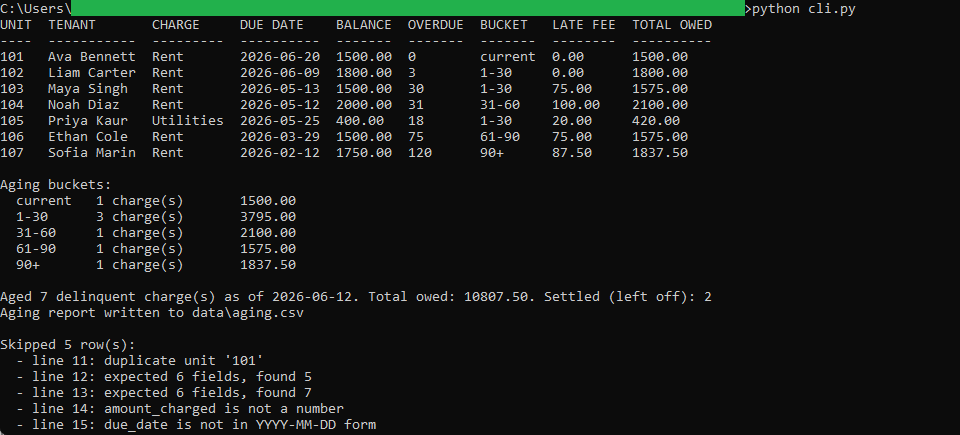
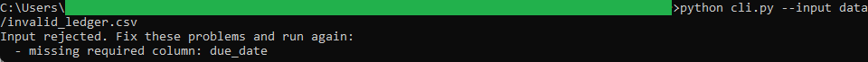

# Delinquency and Aging Ledger

A Python command-line tool that reads a CSV of charges and payments and produces a
delinquency report for a reference date. For each unit it computes the open balance,
ages it into a bucket by days past due, applies a late fee once the grace period has
passed, and totals what is owed. It writes the report to an aging CSV. The companion
browser tool in this repository loads that CSV.

Standard library only. No third-party packages, no network, no database.

## What it does

- Computes each unit's open balance from the amount charged and the amount paid.
- Ages the balance into buckets (current, 1-30, 31-60, 61-90, 90+) by actual days past
  due.
- Applies a configurable late fee once a charge is past a configurable grace period.
- Totals what is owed per charge and per bucket.
- Leaves fully paid charges off the report as settled, and counts them.
- Validates the input: a missing required column stops the run, while a single bad row
  is skipped and reported by line number.

## Files

- `aging_logic.py` is the pure money and date math. It takes typed values and returns
  values, with no file or console access.
- `aging_validation.py` checks the header and each row and turns good rows into typed
  charge records.
- `cli.py` is the thin command-line wrapper that reads the CSV, prints the table and
  bucket totals, and writes the output.
- `test_aging.py` is the unittest suite over the logic and the validation.
- `data/sample_ledger.csv` is the sample input. `data/invalid_ledger.csv` is a file
  with a missing column, for demonstrating rejection. `data/aging.csv` is the output a
  default run produces.

## Running it

From inside this folder:

```
python cli.py
```

That reads `data/sample_ledger.csv`, prints the aging report as of 2026-06-12, and
writes `data/aging.csv`.

Options:

```
python cli.py --as-of 2026-06-12 --grace-days 5 --late-fee-rate 0.05
python cli.py --input data/sample_ledger.csv --output data/aging.csv
python cli.py --input data/invalid_ledger.csv
```

## Running the tests

```
python -m unittest -v
```

The suite checks the balance, the days overdue, every bucket boundary, the grace
period, the late fee, the total owed, and the header and row validation.

## Worked example

Unit 103 was charged `1650.00` and paid `150.00`, leaving an open balance of `1500.00`.
Its rent was due `2026-05-13`, which is exactly 30 days before the reference date, so it
ages into the `1-30` bucket and, being past the 5-day grace window, accrues a 5 percent
late fee of `75.00` for a total owed of `1575.00`. Unit 102, only 3 days past due, ages
into the same bucket but carries no fee yet because it is still inside the grace window.

See `spec.md` for the full input, validation, logic, output, and edge case detail.

## In action



Running `python -m unittest -v`. All 19 checks pass, covering the balance, the days
overdue, every bucket boundary, the grace period, the late fee, the total owed, and the
header and row validation.



Running `python cli.py` on the sample. Every bucket is populated, Unit 102 ages into
1-30 with no fee because it is inside the grace window, and the bucket summary totals
each band. Two settled charges are left off and five malformed rows are reported.



Running `python cli.py --input data/invalid_ledger.csv`. The file is missing the
`due_date` column, so the whole file is refused with a named reason.

## License

Released under the MIT License. See the `LICENSE` file at the root of this
repository. Copyright (c) 2026 Kevin Yu (https://github.com/exekyute).
