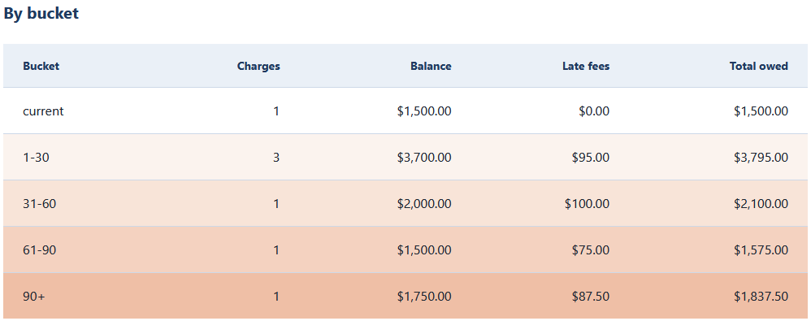
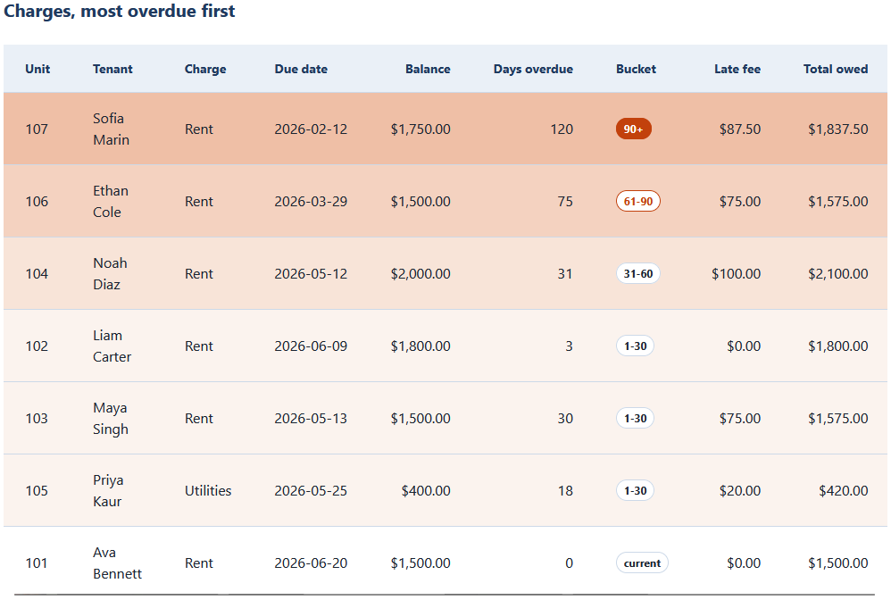
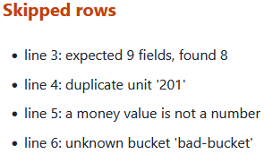
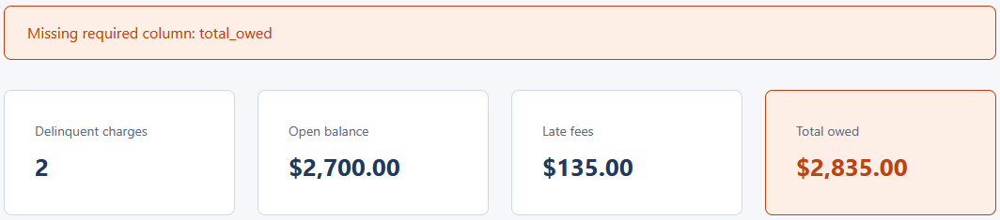

# Delinquency Dashboard

A single-page browser tool that loads an aging CSV and shows delinquency by bucket,
with totals and the most overdue charges first. It reads the file in your browser with
the `FileReader` API, so nothing is uploaded or sent anywhere. This dashboard reads the
CSV produced by the `05-delinquency-aging-ledger` tool in this repository.

Plain HTML, CSS, and vanilla JavaScript. No framework, no build step, no server. It
opens by double-clicking `index.html`.

## What it does

- Reads an aging CSV and totals the open balance, late fees, and total owed, overall
  and within each aging bucket.
- Lists all five buckets (current, 1-30, 31-60, 61-90, 90+) in order, each tinted by
  severity.
- Renders the charges with the most overdue first, tinting each row from the base tone
  toward the accent tone as the bucket worsens.
- Validates the file: a missing required column stops the load, while a single bad row
  is skipped and listed in an issues panel by line number.

## Files

- `index.html` is the page markup.
- `styles.css` is the styling, built on a two-tone palette, an 8px spacing scale, and a
  base-to-accent severity ramp.
- `delinquency_logic.js` is the pure logic: CSV parsing, money in integer cents, the
  bucket totals, and the worst-first sort. It has no access to the page.
- `app.js` is the thin wiring that reads the file and renders.
- `tests.html` runs the pure logic against hand-worked numbers and prints PASS or FAIL
  on the page.
- `data/aging.csv` is the clean sample. `data/messy_aging.csv` carries one of every
  row-level problem. `data/invalid_aging.csv` is missing a required column, for
  demonstrating rejection.

## Running it

Double-click `index.html` to open it in your browser. Click the file picker and choose
`data/aging.csv`. The summary, the by-bucket table, and the charges appear at once.

## Running the tests

Double-click `tests.html`. It checks the money parsing and formatting, the whole-number
and date and bucket validation, the overall and per-bucket totals, the worst-first
sort, and both the whole-file and row-level validation. You want PASS on every line and
a green count at the top.

## Worked example

The ledger reports a total owed of `10807.50` across seven delinquent charges. Loading
the aging CSV here, the summary totals the same `$10,807.50`, so the two tools agree to
the cent. The by-bucket table breaks that down, and the charges table leads with Unit
107 in the `90+` bucket, the most overdue, and ends with Unit 101 in `current`.

See `spec.md` for the full input, validation, logic, output, and edge case detail.

## In action

Loading `data/aging.csv`. All five buckets are listed in aging order with their counts
and totals, each tinted by severity from the base tone toward the accent tone.

The charges table leads with Unit 107 in the 90+ bucket, carrying the strongest tint,
and ends with Unit 101 in current. Each row carries its bucket badge.

Loading `data/messy_aging.csv`. Two valid charges still fill the table while the
Skipped rows panel lists four rejected rows by line number, including an unknown bucket.

Loading `data/invalid_aging.csv`. The file is missing the `total_owed` column, so it is
refused with a named reason and no table.

## Privacy

The dashboard runs entirely in your browser. The file you choose is read with the
`FileReader` API and stays on your machine.

## License

Released under the MIT License. See the `LICENSE` file at the root of this
repository. Copyright (c) 2026 Kevin Yu (https://github.com/exekyute).
