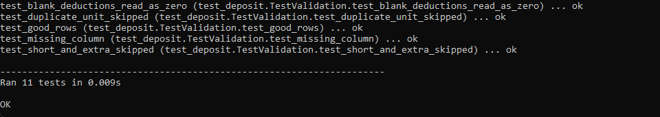
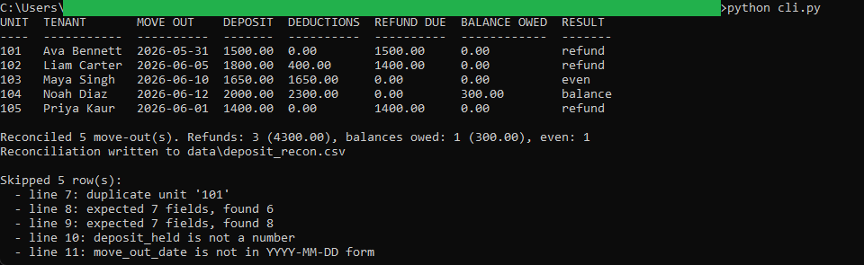
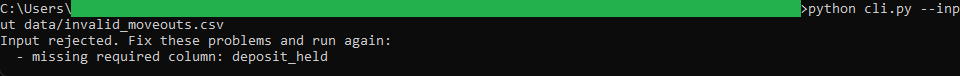

# Security Deposit Reconciliation

A Python command-line tool that reads a CSV of move-outs and reconciles each tenant's
security deposit against the itemized deductions taken from it. For each move-out it
totals the deductions, subtracts them from the deposit held, and reports a refund owed
to the tenant, a balance the tenant still owes, or an even result. It writes the
outcome to a reconciliation CSV. The companion browser tool in this repository loads
that CSV.

Standard library only. No third-party packages, no network, no database.

## What it does

- Totals the itemized deductions (unpaid rent, cleaning, damages) for each move-out.
- Subtracts the deductions from the deposit held and settles the result as a refund, a
  balance owed, or even.
- Totals the refunds owed and the balances owed across all move-outs.
- Treats blank deduction fields as 0.
- Validates the input: a missing required column stops the run, while a single bad row
  is skipped and reported by line number.

## Files

- `deposit_logic.py` is the pure money math. It takes typed values and returns values,
  with no file or console access.
- `deposit_validation.py` checks the header and each row and turns good rows into typed
  move-out records.
- `cli.py` is the thin command-line wrapper that reads the CSV, prints the table, and
  writes the output.
- `test_deposit.py` is the unittest suite over the logic and the validation.
- `data/sample_moveouts.csv` is the sample input. `data/invalid_moveouts.csv` is a file
  with a missing column, for demonstrating rejection. `data/deposit_recon.csv` is the
  output a default run produces.

## Running it

From inside this folder:

```
python cli.py
```

That reads `data/sample_moveouts.csv`, prints the reconciliation, and writes
`data/deposit_recon.csv`.

Options:

```
python cli.py --input data/sample_moveouts.csv --output data/deposit_recon.csv
python cli.py --input data/invalid_moveouts.csv
```

## Running the tests

```
python -m unittest -v
```

The suite checks the deduction total, all three settlement outcomes (refund, balance
owed, even), blank deductions reading as 0, and the header and row validation.

## Worked example

Unit 104 had a `2000.00` deposit and move-out deductions of `1500.00` unpaid rent,
`300.00` cleaning, and `500.00` damages, totaling `2300.00`. Since the deductions exceed
the deposit, there is no refund and the tenant owes a balance of `300.00`. Unit 102, by
contrast, had `400.00` of deductions against an `1800.00` deposit, leaving a `1400.00`
refund.

See `spec.md` for the full input, validation, logic, output, and edge case detail.

## In action



Running `python -m unittest -v`. All 11 checks pass, covering the deduction total, all
three settlement outcomes, blank deductions reading as 0, and the header and row
validation.



Running `python cli.py` on the sample. All three outcomes appear: full and partial
refunds, an even result where deductions equal the deposit, and a balance owed where
they exceed it. The footer totals the refunds and balances, and five malformed rows are
reported.



Running `python cli.py --input data/invalid_moveouts.csv`. The file is missing the
`deposit_held` column, so the whole file is refused with a named reason.

## License

Released under the MIT License. See the `LICENSE` file at the root of this
repository. Copyright (c) 2026 Kevin Yu (https://github.com/exekyute).
