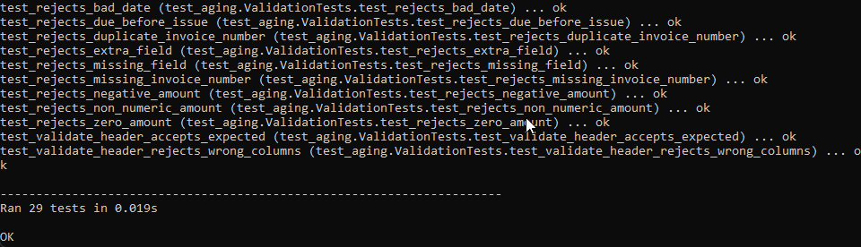
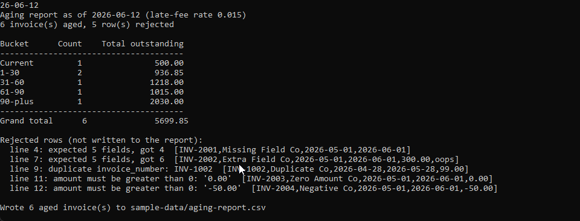

# AR Aging and Late-Fee Engine

A Python command-line tool that reads a CSV of open invoices, ages each one against a reference
date, applies a late fee to overdue invoices, and writes a per-invoice aging report. It uses the
Python standard library only, with no third-party packages and no network access.

This is the first of two tools in the [ar-collections-toolkit](../README.md). It produces the aging
report CSV that the Collections Aging Dashboard reads in the browser.

## What it does
- Buckets each invoice into Current, 1-30, 31-60, 61-90, or 90-plus days past due.
- Applies a configurable late-fee rate to overdue invoices only, with exact cent rounding.
- Rejects bad rows (missing or extra fields, duplicates, non-positive or non-numeric amounts, bad
  dates) with a clear reason, and keeps processing the valid rows.
- Prints a collection summary with the count and total outstanding per bucket.

See [spec.md](spec.md) for the full rules, including the bucket ranges and a hand-checked example.

## Files
- `aging.py` is the pure logic: days past due, bucket assignment, late fee, and totals. No file or
  console access lives here.
- `validation.py` parses and validates each row into an invoice or a reject reason.
- `cli.py` is a thin wrapper that reads the CSV, calls the logic, writes the report, and prints the summary.
- `test_aging.py` is the unittest suite for the logic and the validation rules.
- `sample-data/open-invoices.csv` is the input; `sample-data/aging-report.csv` is the output of a sample run.

## Requirements
Python 3.10 or newer. No installation step and no dependencies.

## Run the tests
From this folder:

```
cd "ar-aging-engine"
python -m unittest -v
```

## Run the engine
From this folder, age the sample invoices against a fixed reference date:

```
python cli.py --reference-date 2026-06-12
```

This reads `sample-data/open-invoices.csv`, writes `sample-data/aging-report.csv`, and prints the
summary. Rejected rows are listed on standard error. You can point at your own files and policy:

```
python cli.py --input my-invoices.csv --output my-aging.csv --reference-date 2026-06-12 --rate 0.02
```

## In action

The full unittest suite passing, covering the bucket edges, the cent rounding, and every rejection rule:



A single run aging the sample invoices against 2026-06-12: the per-bucket summary above and the
rejected rows (missing field, extra field, duplicate, zero, and negative amount) listed with their
reasons:


