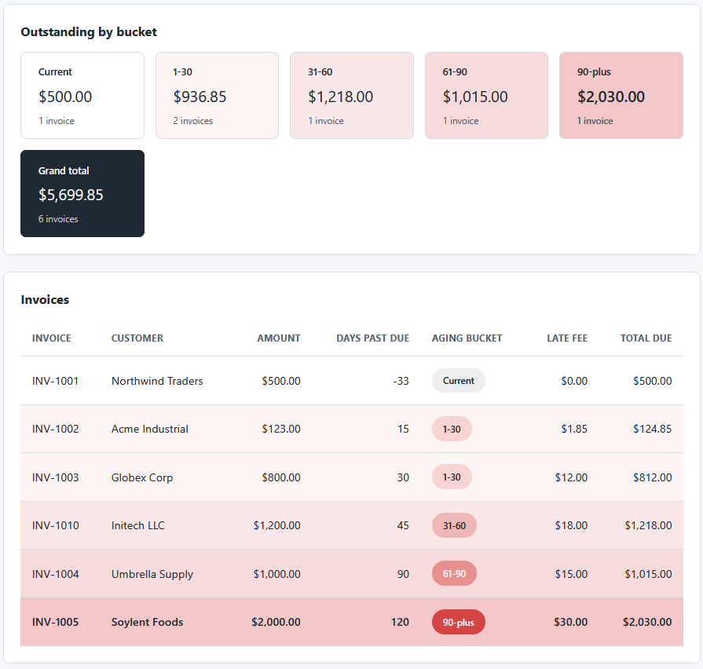
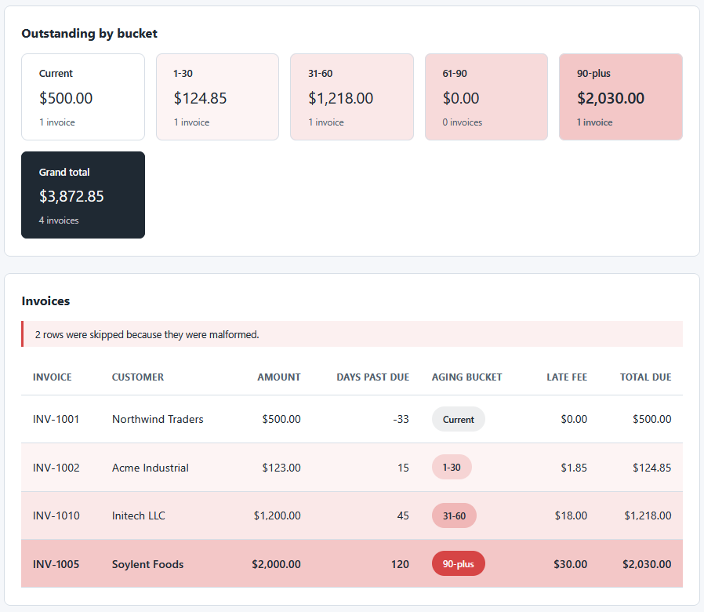

# Collections Aging Dashboard

A single-page browser tool that loads the aging report from the AR Aging and Late-Fee Engine and
shows a color-coded view of overdue accounts. It is plain HTML, CSS, and vanilla JavaScript, with no
server, no build step, and no dependencies. The file is read in the browser with the FileReader API
and never leaves the page.

This is the second of two tools in the [ar-collections-toolkit](../README.md). It reads the CSV the
[AR Aging and Late-Fee Engine](../ar-aging-engine/README.md) writes.

## What it does
- Reads an aging report CSV chosen through a file input, locally in the browser.
- Renders each invoice with its customer, amount, days past due, aging bucket, late fee, and total due.
- Color-codes rows by bucket on a single accent ramp, so older debt stands out.
- Summarizes the count and total outstanding per bucket, plus a grand total.
- Skips and counts malformed rows, and shows a clear message for an empty file or a wrong header.

See [spec.md](spec.md) for the full rules and a hand-checked example.

## Files
- `index.html` is the markup.
- `styles.css` holds the two-tone palette and the 8px spacing scale as CSS variables.
- `aging-logic.js` is the pure logic: CSV parsing, per-bucket totals, and money formatting. No DOM access.
- `dashboard.js` is the thin DOM layer: it reads the file and renders the table and summary.
- `tests.html` runs the pure logic against assertions and prints PASS or FAIL on the page, with no build tooling.
- `sample-data/aging-report.csv` is a report from the engine; `sample-data/aging-report-malformed-sample.csv`
  adds two bad rows to show the skip behavior.

## How to use it
1. Double-click `index.html` to open it in your browser.
2. Click the file button and choose `sample-data/aging-report.csv` (or any report the engine writes).
3. Review the per-bucket summary and the color-coded invoice table.

To see the malformed-row handling, load `sample-data/aging-report-malformed-sample.csv`. The
dashboard renders the four valid invoices and shows a notice that two rows were skipped.

## Run the tests
Double-click `tests.html`. It runs every assertion on load and shows the tally and a PASS or FAIL
badge per check. No build tooling is required.

## In action

The dashboard after loading `sample-data/aging-report.csv`: per-bucket totals across the top and the
color-coded invoice table below, where older debt carries a stronger accent:

Loading `sample-data/aging-report-malformed-sample.csv` instead: the four valid invoices still
render, the totals adjust, and a notice reports that two malformed rows were skipped:

