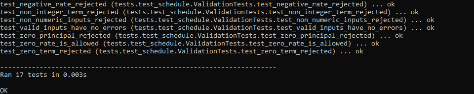
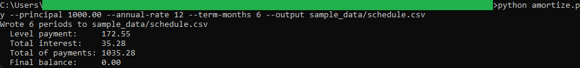
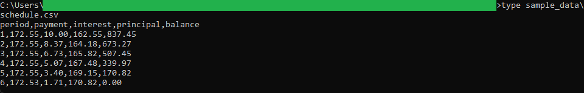
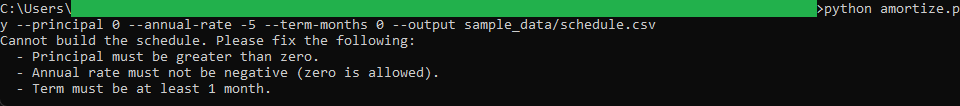

# Amortization Schedule Generator

A Python command-line utility that turns three loan inputs into a full
amortization schedule. Given a principal, an annual interest rate, and a term in
months, it computes the level monthly payment, splits each payment into interest
and principal with a running balance, reconciles the final period so the balance
closes at exactly zero, and writes the schedule to a CSV.

This is the first of the two tools in the
[Loan Servicing Toolkit](../). The CSV it produces is the file the
[Loan Balance Dashboard](../loan-balance-dashboard/) loads in the browser.

## How it is built

The code is split so each part has one job:

- `schedule_logic.py` holds the pure money math: the monthly rate, the level
  payment formula, and the schedule builder. It takes values and returns values,
  with no argument parsing, file access, or printing.
- `schedule_validation.py` holds the input rules. It collects every problem in a
  single pass and returns a list of messages.
- `amortize.py` is a thin command-line wrapper that reads the flags, runs
  validation, calls the logic, writes the CSV, and prints a summary.
- `tests/test_schedule.py` is a `unittest` suite covering the payment formula,
  the hand-checked schedule, the final-period reconciliation, the zero-interest
  and single-period loans, and the validation rules.

All money is handled with `decimal.Decimal` in whole-cent precision using
`ROUND_HALF_UP`, and every amount is written as fixed-point with two decimals, so
nothing ever appears in scientific notation or drifts by a cent.

See [spec.md](spec.md) for the full inputs, validation rules, logic, outputs, and
edge cases.

## Requirements

Python 3.8 or newer. Standard library only, nothing to install.

## Running it

From this folder:

```
python amortize.py --principal 1000.00 --annual-rate 12 --term-months 6 --output sample_data/schedule.csv
```

This writes `sample_data/schedule.csv` and prints:

```
Wrote 6 periods to sample_data/schedule.csv
  Level payment:     172.55
  Total interest:    35.28
  Total of payments: 1035.28
  Final balance:     0.00
```

## Running the tests

```
python -m unittest discover -s tests -t . -v
```

## Worked example

The shipped sample is a `1000.00` loan at `12%` annual over `6` months. The level
payment is `172.55`. The schedule reconciles the final period to `172.53` so the
balance lands on exactly `0.00`:

| Period | Payment | Interest | Principal | Balance |
| ------ | ------- | -------- | --------- | ------- |
| 1 | 172.55 | 10.00 | 162.55 | 837.45 |
| 2 | 172.55 |  8.37 | 164.18 | 673.27 |
| 3 | 172.55 |  6.73 | 165.82 | 507.45 |
| 4 | 172.55 |  5.07 | 167.48 | 339.97 |
| 5 | 172.55 |  3.40 | 169.15 | 170.82 |
| 6 | 172.53 |  1.71 | 170.82 |   0.00 |

Total interest is `35.28` and the total of payments is `1035.28`, which is the
principal plus the interest.

## Rejecting bad input

Every problem is reported at once and no file is written. For example:

```
python amortize.py --principal 0 --annual-rate -5 --term-months 0 --output sample_data/schedule.csv
```

prints:

```
Cannot build the schedule. Please fix the following:
  - Principal must be greater than zero.
  - Annual rate must not be negative (zero is allowed).
  - Term must be at least 1 month.
```

## In action

The test suite, all 17 cases passing:



A run on the sample loan, with the printed summary:



The CSV it writes, with the final period reconciled to a zero balance:



Bad input rejected, with every problem reported at once and no file written:



## Sample data

- `sample_data/schedule.csv`: the output of the worked example above, and the
  file the Loan Balance Dashboard ships and loads.
