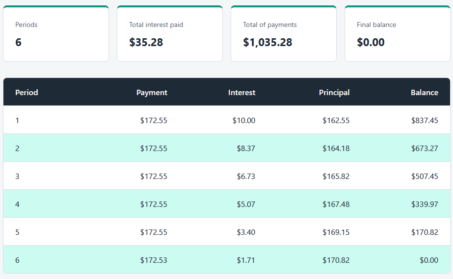
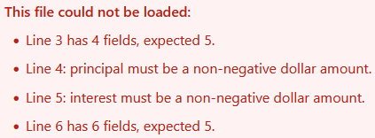

# Loan Balance Dashboard

A single-page browser tool that loads an amortization schedule CSV and shows it
as a clean balance table with a summary line. It reads the file with the
`FileReader` API entirely in the browser, so the data never leaves your machine.

This is the second of the two tools in the
[Loan Servicing Toolkit](../). It loads the CSV written by the
[Amortization Schedule Generator](../amortization-schedule-generator/).

## How it is built

The code is split so each part has one job:

- `balance-logic.js` holds the pure logic: parsing the CSV, converting dollar
  amounts to integer cents, validating every row, totalling the payments and
  interest, and formatting amounts. It has no DOM access, so it can be tested on
  its own.
- `dashboard.js` is a thin wiring layer. It reads the chosen file with
  `FileReader`, hands the text to the logic, and renders the table and summary.
- `index.html` holds the markup, and `styles.css` holds a two-tone palette and an
  8px spacing scale defined as CSS variables.
- `tests.html` runs the logic with assertions and prints PASS or FAIL on the
  page, with no build tooling.

Money is handled in integer cents and formatted with `Intl.NumberFormat`, so
totals stay exact and never show floating-point artifacts.

See [spec.md](spec.md) for the full inputs, validation rules, logic, outputs, and
edge cases.

## Opening it

Double-click `index.html` to open it in your browser. Click **Choose a schedule
CSV** and pick `sample_data/schedule.csv`. The table and summary appear.

To run the tests, double-click `tests.html`. It prints a row per check and a
tally at the top reading ALL PASS when every check passes.

## Worked example

Loading `sample_data/schedule.csv`, the six-period output of the generator's
`1000.00` loan at `12%` over `6` months, shows:

- Total interest paid: `$35.28`
- Total of payments: `$1,035.28`
- Final balance: `$0.00`

These match the generator's printed summary exactly.

## In action

The sample schedule loaded, with the summary line and the full balance table.
The final period reconciles to a `$0.00` balance:

A malformed CSV rejected, with every problem listed and no table rendered:

## Sample data

- `sample_data/schedule.csv`: a valid schedule, the generator's output.
- `sample_data/schedule_invalid.csv`: a deliberately broken file with a short
  row, a non-numeric amount, a negative amount, and an extra-field row, used to
  show the tool rejecting bad data with every reason listed.

## Privacy

The file you choose is read in your browser with the `FileReader` API and is
never uploaded or sent anywhere.
