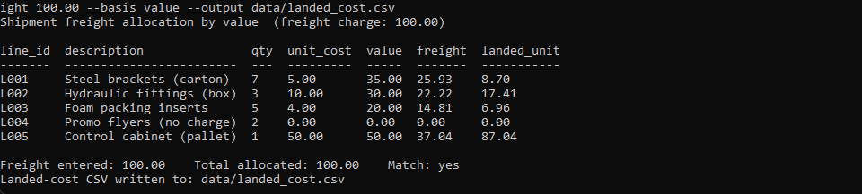
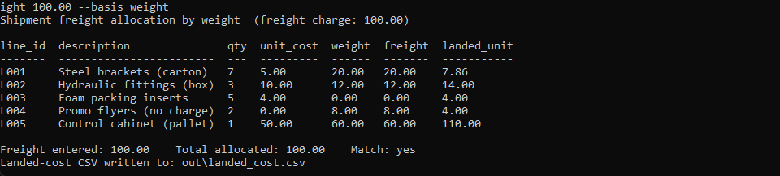
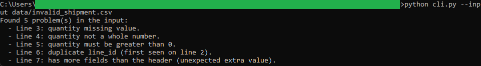

# Freight Cost Allocator

A Python command-line utility that spreads a shipment's total freight charge
across its line items by an agreed basis (weight or value), reconciles the
rounding remainder so the per-line allocations sum to the freight total exactly,
and writes a per-line landed-cost CSV.

This is the first of two tools in the
[freight-allocation-toolkit](../README.md). It produces the landed-cost CSV that
the Shipment Landed-Cost Dashboard loads in the browser.

## What it does

- Reads a shipment line-items CSV (`line_id`, `description`, `quantity`,
  `unit_cost`, `weight`).
- Allocates a freight charge by `weight` or by `value` (`quantity * unit_cost`).
- Uses `decimal.Decimal` with `ROUND_HALF_UP` and the largest-remainder method,
  working in integer cents, so the allocations always sum to the freight total
  with no cent lost or gained.
- Prints a readable table with a reconciling summary line and writes a
  landed-cost CSV.

See [spec.md](spec.md) for the full input, validation, logic, output, and
edge-case detail, including a hand-checked example.

## Layout

| File                        | Role                                              |
|-----------------------------|---------------------------------------------------|
| `allocator_logic.py`        | Pure logic: parsing, validation, allocation       |
| `cli.py`                    | Thin wrapper: arguments, file I/O, table printing |
| `test_allocator_logic.py`   | unittest suite over the pure logic                |
| `data/sample_shipment.csv`  | Synthetic shipment that exercises every branch     |
| `data/invalid_shipment.csv` | Deliberately broken input for testing validation  |
| `data/landed_cost.csv`      | Committed output from one clean run               |

## Requirements

Python 3.8 or newer. Standard library only, nothing to install.

## Run it

From this folder:

    cd 01-freight-cost-allocator

Run the test suite:

    python -m unittest -v

Allocate the sample shipment by value (writes the committed sample output):

    python cli.py --freight 100.00 --basis value --output data/landed_cost.csv

Allocate the same shipment by weight instead:

    python cli.py --freight 100.00 --basis weight

See the validation reject bad data:

    python cli.py --input data/invalid_shipment.csv

## In action

Allocating the sample shipment by value. The two leftover cents from rounding
land on the lines with the largest remainder (L005 and L001), the zero-value
promo line gets nothing, and the total allocated ties back to 100.00 exactly.

The same shipment allocated by weight instead. This basis divides cleanly with
no remainder, and the zero-weight packing line receives nothing.

Running against deliberately broken input. The tool reports every problem at
once, each tagged with its line number, and writes no output.

## Notes

This is a personal portfolio project, one of several I build to model real-world
job descriptions and practice applied problem-solving and foundational software
skills. The tool is deterministic and rule-based.
