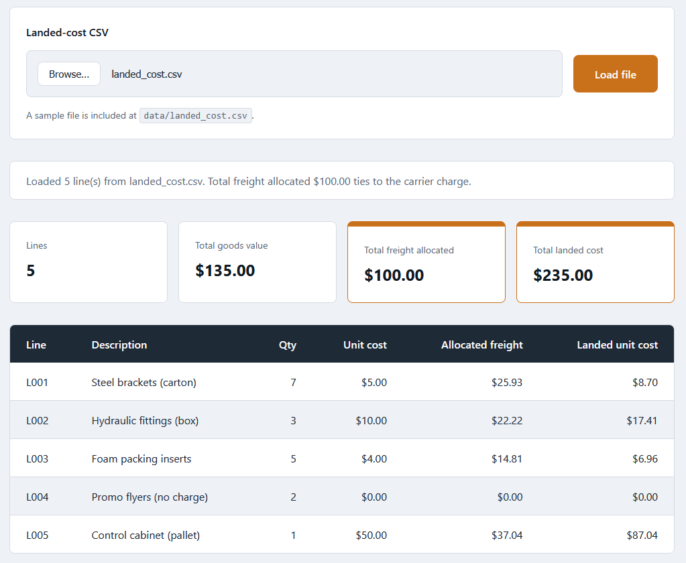
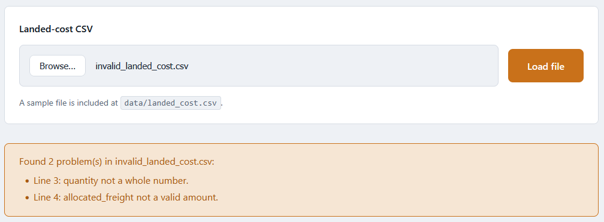

# Shipment Landed-Cost Dashboard

A single-page browser tool that loads the landed-cost CSV from the Freight Cost
Allocator and renders a per-line breakdown with reconciled totals. It runs by
double-clicking the HTML file. No server, no build step, no install. The file is
read in your browser with the `FileReader` API and is never sent anywhere.

This is the second of two tools in the
[freight-allocation-toolkit](../README.md). It consumes the CSV that the
[Freight Cost Allocator](../01-freight-cost-allocator/README.md) produces.

## What it does

- Loads a landed-cost CSV (`line_id`, `description`, `quantity`, `unit_cost`,
  `allocated_freight`, `landed_unit_cost`) chosen from your machine.
- Shows each line's quantity, unit cost, allocated freight, and landed unit cost.
- Shows totals: goods value, total freight allocated, and total landed cost.
- Confirms the total freight allocated ties back to the carrier charge.

All money math is done in integer cents and formatted with `Intl.NumberFormat`,
so amounts never show floating-point artifacts. See [spec.md](spec.md) for the
full input, validation, logic, output, and edge-case detail.

## Layout

| File                  | Role                                                  |
|-----------------------|-------------------------------------------------------|
| `index.html`          | Markup only                                           |
| `styles.css`          | Two-tone palette and 8px spacing scale (CSS variables)|
| `dashboard_logic.js`  | Pure logic: parse, validate, total, format (no DOM)   |
| `app.js`              | Thin DOM wiring: FileReader, render table and totals  |
| `tests.html`          | In-page test harness over the pure logic              |
| `data/landed_cost.csv`| Sample input, the allocator's committed output        |

## Run it

Double-click `index.html` to open it in your browser. Click "Load file" (or pick
a file), choose `data/landed_cost.csv`, and the table and totals appear.

To see the validation, load `data/invalid_landed_cost.csv`. It holds a bad
quantity and a non-numeric freight value, and the tool lists every problem by
line number and draws nothing until the data is clean.

## Run the tests

Double-click `tests.html`. It runs the assertions against `dashboard_logic.js`
and prints a PASS or FAIL line for each, with a passed/failed count at the top.

## In action

The dashboard after loading the allocator's `landed_cost.csv`. Total freight
allocated reads $100.00, tying back to the carrier charge, and total landed cost
is $235.00 (goods value $135.00 plus freight $100.00). The zero-value promo line
shows $0.00 across the row.

Loading a CSV with bad values. The tool lists every problem by line number and
draws no table or totals until the data is clean.

## Notes

This is a personal portfolio project, one of several I build to model real-world
job descriptions and practice applied problem-solving and foundational software
skills. The tool is deterministic and rule-based.
