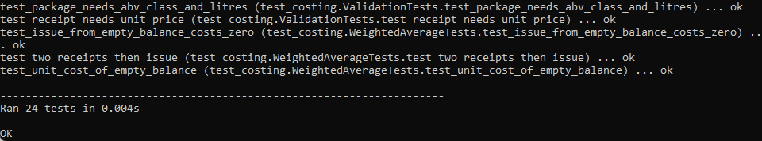
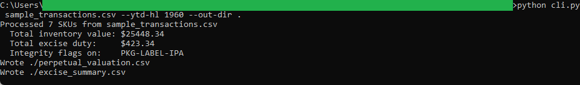
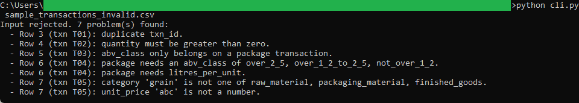

# Inventory Costing Engine

A command-line tool that keeps perpetual weighted-average inventory for a craft
brewery and computes the federal excise duty on the beer it packages. It reads a
transaction CSV and writes two files: a per-SKU valuation and an excise summary.

## How it works
The tool is deterministic and rule-based, with the full rules in
[spec.md](spec.md). It replays each SKU's transactions in order, folding freight
and import duty into the landed cost of every receipt, and valuing issues at the
running weighted-average cost. For each packaging run it converts cases and kegs
to hectolitres and applies the CRA reduced-rate excise brackets, charging the
right rate to each slice of annual production. Money is handled with `decimal.Decimal`
and rounded to the cent. It is command-line Python with the standard library only:
no framework, no build step, and it runs entirely on your machine.

The two output files are what the reconciliation tool in this repo reads next.

## Running it
From the tool folder:

```
cd "C:\Users\jebo\Documents\Claude Code Projects\14-brewery-inventory-costing-toolkit\inventory-costing-engine"
```

Run the test suite:

```
python -m unittest -v
```

Run the engine against the sample data (the brewery is 1,960 hL into the year):

```
python cli.py sample_transactions.csv --ytd-hl 1960 --out-dir .
```

That writes `perpetual_valuation.csv` and `excise_summary.csv` and prints the
totals. To see the validation reject a bad file:

```
python cli.py sample_transactions_invalid.csv
```

It lists every problem it found and writes nothing.

## In action

The test suite covering the costing math, unit conversion, excise brackets, and every validation rule:



A run against the sample month, showing the closing inventory value, the federal excise duty, and the integrity flag:



The validation rejecting a bad file, naming each problem and writing nothing:


