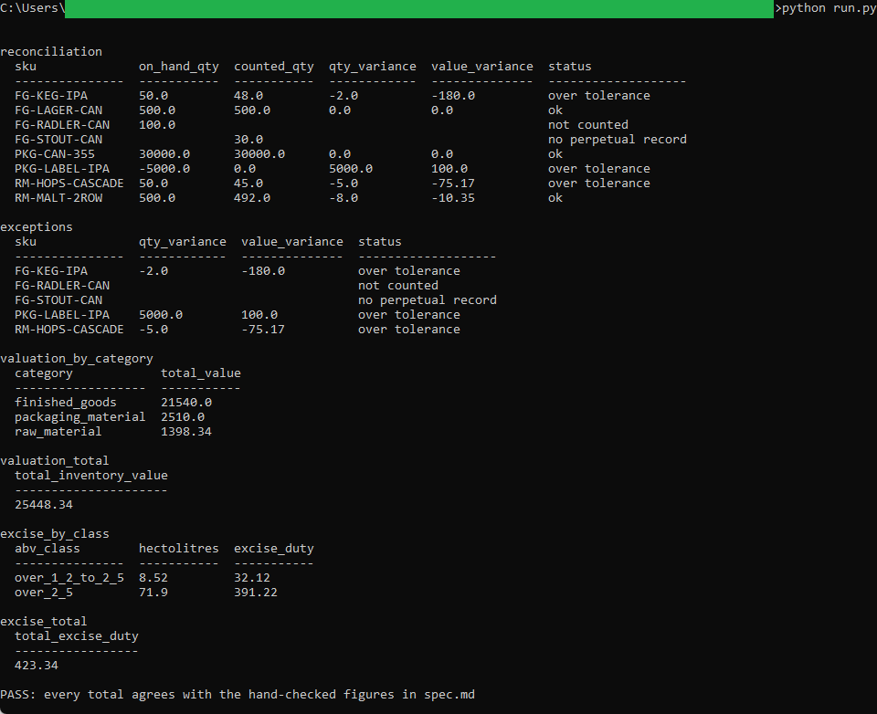

# Month-End Reconciliation

A SQLite tool that reconciles the brewery's perpetual inventory to the physical
count, flags variances over tolerance, and rolls up closing inventory value and
excise duty for month-end.

## How it works
The tool is deterministic and rule-based, with the full rules in [spec.md](spec.md).
`schema.sql` holds the tables and a reconciliation view; `queries.sql` holds the
analytical queries, each commented with the question it answers. A thin Python
runner builds an in-memory database, loads the three CSVs, runs the queries, and
checks every total against the hand-checked figures in the spec. It uses the
standard-library `sqlite3` module, so there is no database server and nothing to
install, and it runs entirely on your machine.

Two of the three inputs, `perpetual_valuation.csv` and `excise_summary.csv`, are
produced by the costing engine in this repo. The copies here are a sample so the
tool runs on its own; regenerate them from the engine to reconcile a new period.

## Running it
From the tool folder:

```
cd "C:\Users\jebo\Documents\Claude Code Projects\14-brewery-inventory-costing-toolkit\month-end-reconciliation"
```

Run the reconciliation and the totals check:

```
python run.py
```

It prints the reconciliation, the exception list, the valuation rollups, the
excise rollups, and a final PASS or FAIL line. To reconcile a fresh period, copy
the latest `perpetual_valuation.csv` and `excise_summary.csv` from the costing
engine into this folder first.

## In action

The reconciliation, the exception list, the valuation and excise rollups, and the final check confirming every total agrees with the costing engine to the cent:


