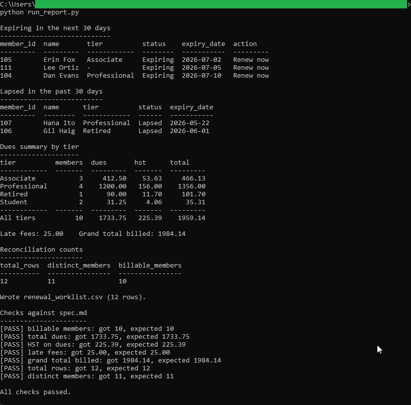

# Membership reporting (SQL)

The saved reports a membership coordinator runs a few times a week: who is
expiring in the next 30 days, who lapsed in the past 30 days, the monthly dues
summary with HST, and the counts for reconciling the database against the Excel
worklist. It also writes the renewal worklist CSV the other two tools read.

## How it works
Deterministic and rule-based, with the full rules in [spec.md](spec.md). The
schema and the reports live in plain `.sql` files. A small Python runner builds
an in-memory SQLite database, loads the synthetic members from
`sample_members.csv`, runs each report, and prints the results. It applies HST
(13%) to dues with `Decimal` rounding and checks the totals against the
hand-checked figures in the spec. Standard library only: no database server, no
build step, and nothing is uploaded.

The reports stay simple on purpose: `SELECT`, `WHERE`, one `JOIN`, `GROUP BY`,
`ORDER BY`, `COUNT`, `SUM`, and a single `CASE`.

## Running it
Standard-library Python 3, no install needed.

```
cd "C:\Users\jebo\Documents\Claude Code Projects\15-membership-services-toolkit\01-membership-reporting-sql"
python run_report.py
```

This prints the two worklists, the dues summary by tier, the reconciliation
counts, and a PASS/FAIL line for each hand-checked figure. It also writes
`renewal_worklist.csv` in this folder, which the Excel and dashboard tools read.

To see the tool reject bad data, open `sample_members.csv`, change a `join_month`
to `abc`, and run it again: the runner stops with a clear error instead of
loading a bad record. Put the value back afterward.

## In action


The runner prints the expiring and lapsed worklists, the dues summary by tier
with HST, and the reconciliation counts, then checks every total against the
spec: total dues 1,733.75, HST 225.39, late fees 25.00, grand total 1,984.14,
all PASS.
