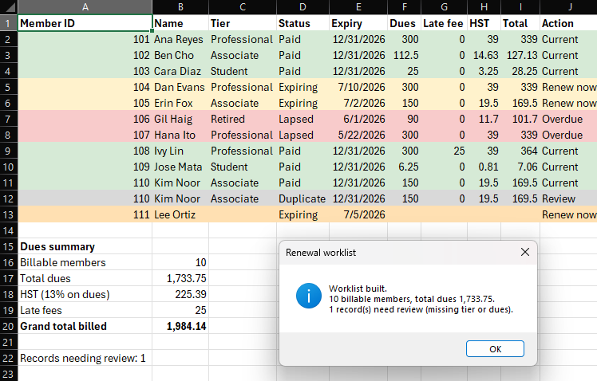
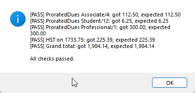
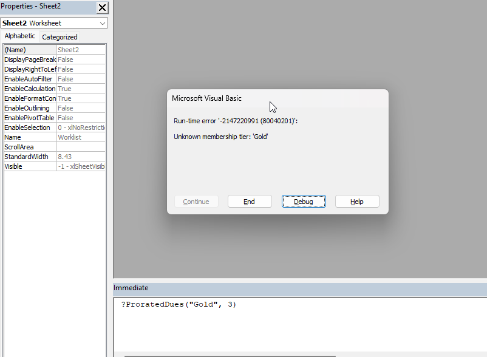

# Renewal worklist (Excel VBA)

An Excel macro that builds the renewal worklist from the CSV the SQL tool writes.
It color-flags every record (expiring, lapsed, paid, and records that need
review) and writes the dues, HST, late-fee, and grand totals the manager reviews.
The totals match the SQL tool to the cent.

## How it works
Deterministic and rule-based, with the full rules in [spec.md](spec.md). The
calculation logic lives in `modCalc.bas` as plain functions that take values and
return values: dues by tier, proration, HST, and the late fee. `RenewalWorklist.bas`
reads the CSV and writes the formatted sheet, keeping the cell-handling separate
from the calculations. Money is rounded half up everywhere so the figures agree
with the SQL and dashboard tools.

The code ships as `.bas` modules to import into a workbook. Nothing leaves your
machine.

## Running it
Import the modules and run the macros in Excel:

1. Open a new workbook and press `Alt+F11` for the VBA editor.
2. `File > Import File`, then import both `modCalc.bas` and `RenewalWorklist.bas`.
3. Save the workbook as a macro-enabled file (`.xlsm`).
4. `Alt+F8` and run `CalcSelfTest` to see the calculation checks pass.
5. `Alt+F8` and run `BuildRenewalWorklist`, then pick `sample_worklist.csv` (a
   copy of the SQL tool's output, included here). The `Worklist` sheet fills in,
   color-flagged, with the dues summary at the bottom: total dues 1,733.75, HST
   225.39, late fees 25.00, grand total 1,984.14.

To see it reject bad data, open the Immediate window (`Ctrl+G`) and run
`?ProratedDues("Gold", 3)`. It raises "Unknown membership tier: 'Gold'" instead
of guessing a number. Full manual test steps, including the expected screenshots,
are in [spec.md](spec.md).

## In action

The macro builds the color-flagged worklist and the dues summary: total dues
1,733.75, HST 225.39, late fees 25.00, grand total 1,984.14, with one record
flagged for review. These match the SQL tool to the cent.

`CalcSelfTest` checks the dues, proration, HST, and grand-total functions against
the spec figures.

An unknown tier is rejected with a clear message instead of a silent zero.
