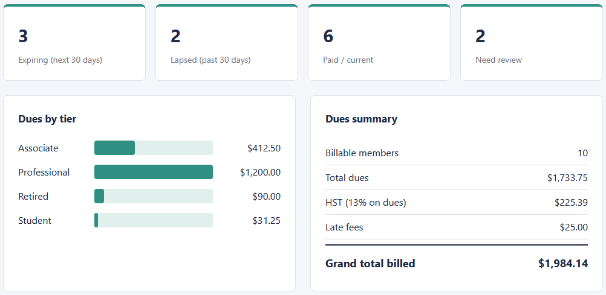
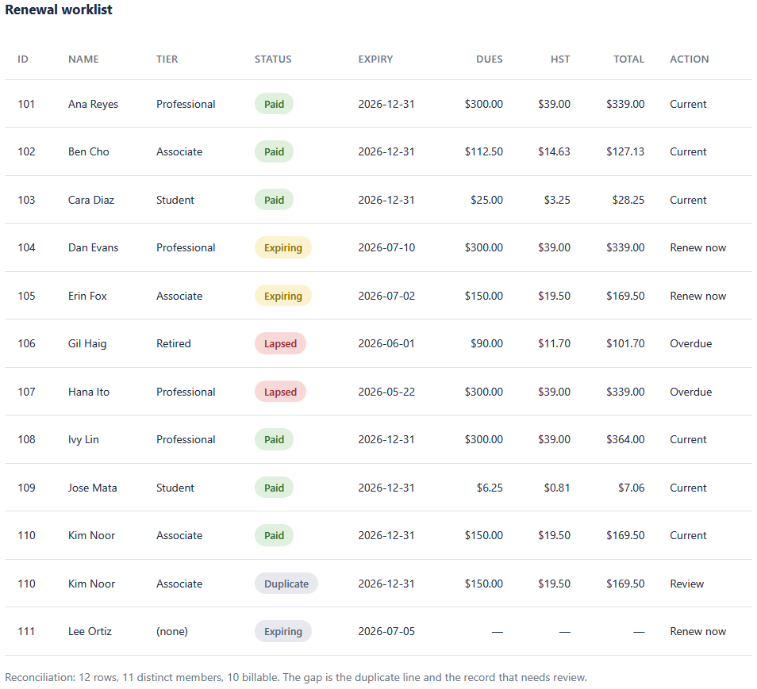

# Renewal dashboard (browser)

A page that shows the renewal worklist at a glance: counts of expiring, lapsed,
paid, and records that need review, a dues-by-tier bar chart, and the
dues/HST/late-fee totals. It reads the CSV the SQL tool writes and reproduces its
figures to the cent.

## How it works
Deterministic and rule-based, with the full rules in [spec.md](spec.md). The
number-crunching lives in `summary.js` as plain functions that take CSV text and
return totals, with money handled in integer cents and rounded half up.
`dashboard.js` only wires those results to the page. Plain HTML, CSS, and vanilla
JavaScript: it opens by double-clicking `index.html`, with no framework, no build
step, and no server. Files are read in the browser and nothing is uploaded.

## Running it
1. Double-click `index.html` to open it in a browser.
2. Click **Load sample data** to see the dashboard with the built-in sample, or
   use the file picker to load a `renewal_worklist.csv` from the SQL tool. Both
   paths run the same code. The summary reads total dues $1,733.75, HST $225.39,
   late fees $25.00, and grand total $1,984.14.
3. Open `tests.html` the same way to see the 18 checks pass.

To see it handle imperfect data, note the "Lee Ortiz" row in the sample: it has
no tier or dues, so it shows with a Review badge and stays out of the totals,
and the duplicate "Kim Noor" line is counted under "Need review" and explained in
the reconciliation note.

## In action

The count cards, the dues-by-tier bars, and the summary panel: total dues
1,733.75, HST 225.39, late fees 25.00, grand total 1,984.14, matching the SQL
tool.

The full worklist with a status badge per row. The incomplete and duplicate
records are flagged, and the reconciliation note explains the row count.
